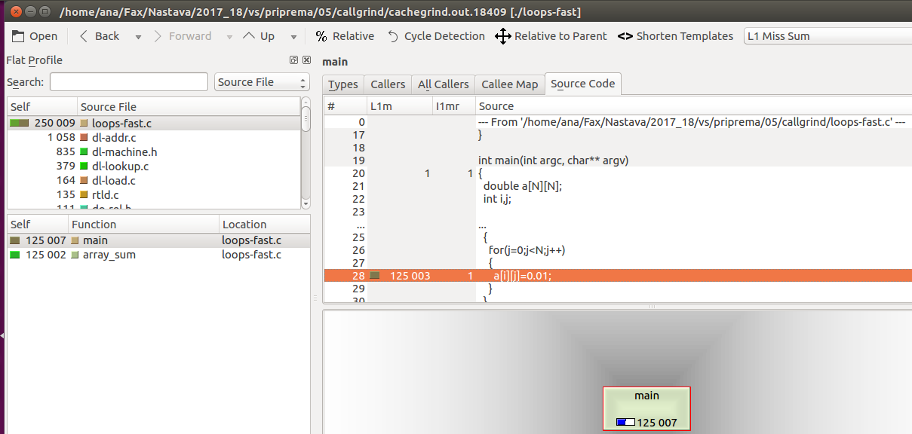
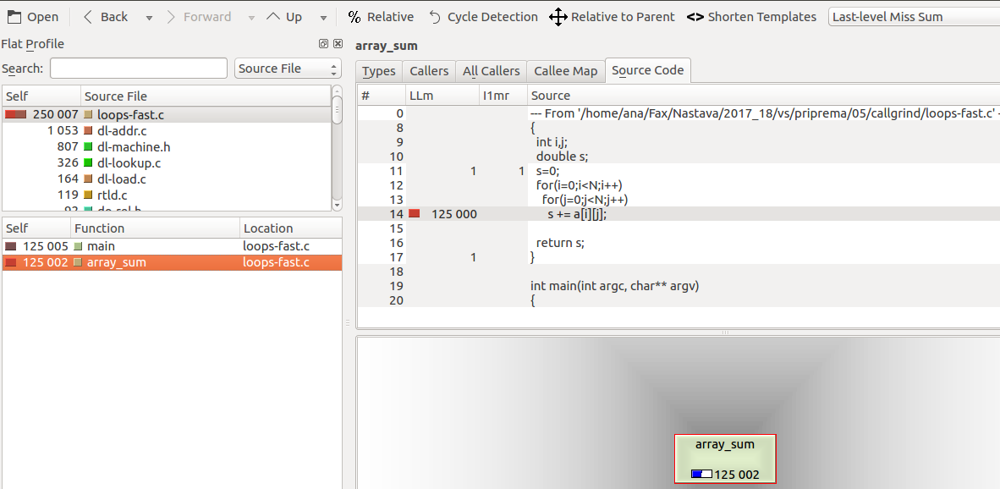
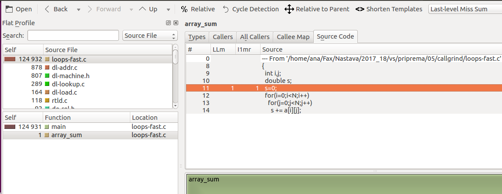
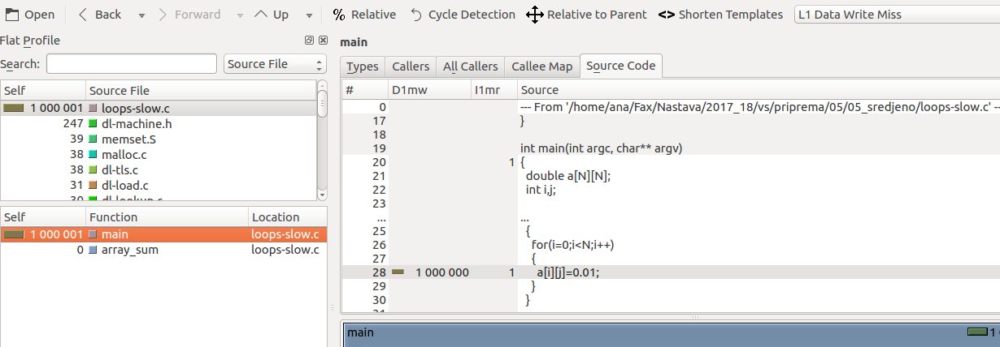
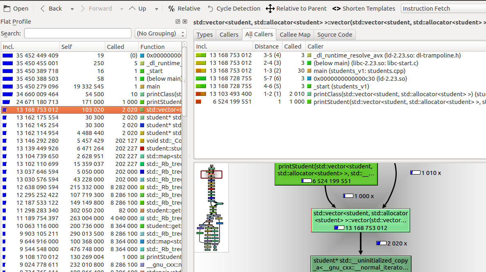
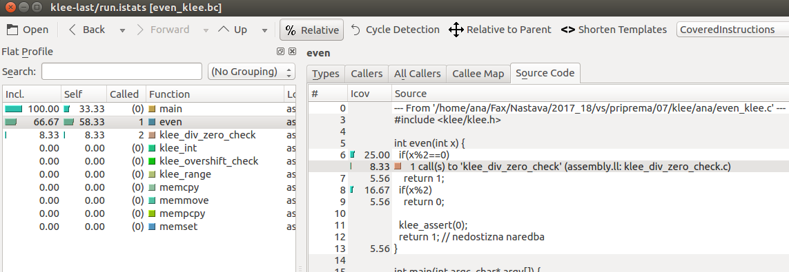
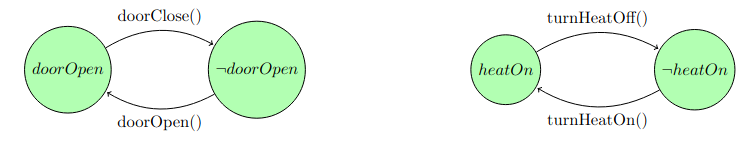
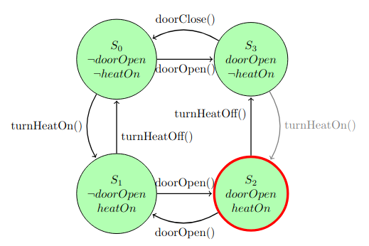
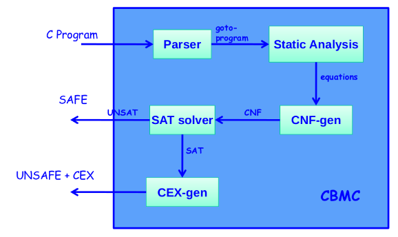

---
title: "Verifikacija softvera - Vežbe"
author: [Ivan Ristović, Ana Vulović]
date: "2022-10-10"
keywords: [Software Verification]
abstract: |

    Kolekcija materijala sa vežbi za kurs [Verifikacija softvera](http://www.verifikacijasoftvera.matf.bg.ac.rs/) na Matematičkom fakultetu, Univerziteta u Beogradu.

    Teme i alati rađeni na vežbama:
    - Debagovanje koristeći alate za debagovanje i razvojna okruženja
        - [`gdb`](https://www.sourceware.org/gdb/) - debagovanje koda na niskom nivou
        - [`QtCreator`](https://doc.qt.io/qtcreator/creator-debugging.html) - debagovanje C/C++ kodova
        <!--- - [`Intellij IDEA`](https://www.jetbrains.com/idea/) - debagovanje Java koda --->
        <!--- - [`Visual Studio`](https://visualstudio.microsoft.com/) - debagovanje C, C++ i C# kodova --->
    - Testiranje jedinica koda
        - Pisanje testabilnog koda
        - [`QtTest`](https://doc.qt.io/qt-6/qttest-index.html)
        <!--- , [`Catch`](https://github.com/catchorg/Catch2) (C, C++) --->
        - [`JUnit`](https://junit.org) (Java)
        - [`xUnit`](https://xunit.net/), [`NUnit`](https://nunit.org/) (C#)
    - Praćenje pokrivenosti koda testovima
        - [`lcov`](https://github.com/linux-test-project/lcov) (C, C++)
        - [`JaCoCo`](https://www.jacoco.org/jacoco/) (Java)
        <!--- - [`dotnet-coverage`](https://learn.microsoft.com/en-us/dotnet/core/additional-tools/dotnet-coverage) (C#) --->
    - Testiranje pomoću objekata imitatora
        - Ručno pisanje imitator klasa (C++)
        - Imitatori baza podataka (C#)
        - [`Moq`](https://github.com/moq) (C#)
    - Fuzz testiranje (libFuzzer)
    - Profajliranje
        - [`Valgrind`](https://valgrind.org/) (memcheck, cachegrind, callgrind, hellgrind, drd)
        - [`perf`](https://perf.wiki.kernel.org/)
        <!--- - [`Intel® VTune™`](https://www.intel.com/content/www/us/en/develop/documentation/vtune-help/top.html) --->
    - Statička analiza
        - [`KLEE`](https://klee.github.io/)
        - [`CBMC`](https://www.cprover.org/cbmc/)
        - [`Clang` statički analizator](https://clang.llvm.org/)
    - Alati i jezici za formalnu verifikaciju softvera
        - [`Dafny`](https://dafny.org/)

...


# Debagovanje

## QtCreator Debugger

QtCreator dolazi sa debugger-om koji predstavlja interfejs između QtCreator-a i native debugger-a (gdb, CDB, LLDB, ...). Moguće je debagovati Qt aplikacije, ali i native C/C++ aplikacije, kačiti se na već pokrenute procese i formirati debug sesije, i mnogo toga.

Više informacija je moguće pronaći u [Qt dokumentaciji](https://doc.qt.io/qtcreator/creator-debugging.html).

### Buffer Overflow primer (QtCreator)

Ukoliko debagujemo Qt aplikacije, dovoljno je pokrenuti aplikaciju u Debug modu. Pokrenuti QtCreator i otvoriti [BufferOverflow.pro](BufferOverflow.pro) projekat. Prilikom otvaranja projekta, QtCreator će otvoriti konfiguracioni dijalog - konfigurisati projekat sa podrazumevanim podešavanjima.

*Napomena:* QtCreator podrazumevano uključuje `clang` statički analizator ukoliko je on dostupan. Iako nije neophodno, ukoliko želite da sami pronađete probleme u izvornom kodu a tek potom proverite svoje pronalaske koristeći `clang`, isključite `clang` analizator u podešavanjima (`Edit -> Preferences -> Analyzer`).

Unutar QtCreator-a vidimo nekoliko pogleda (`Edit`, `Design`, `Debug` itd.). Trebalo bi da je `Edit` pogled već selektovan. Otvoriti `main.c` fajl i prodiskutovati o logici programa i njegovim slabim tačkama. 

Unutar `Project` prozora možemo dodavati ili menjati postojeće konfiguracije za kompilaciju i pokretanje programa. To uključuje i dodavanje argumenata komandne linije (`Run` odeljak). 

Pokrenuti debug sesiju. Isprobati debug akcije za kontrolisanje izvršavanja programa (`Debug` meni u glavnom meniju):
- `Interrupt`
- `Continue`
- `Step over`
- `Step into`
- `Step out`
- `Set/Remove breakpoint`

Možemo testirati ponašanje programa tako što prvo unesemo ispravnu lozinku `MyPassword` a zatim i proizvoljnu neispravnu lozinku (npr. `SomePassword`). Program se naizgled ispravno ponaša ali to ne znači da je u potpunosti ispravan.

Posmatrajući definicije promenljivih `password` i `ok`, možemo zaključiti da će se one na steku naći jedna do druge. Proverimo da li je zaista tako: desnim klikom na promenljive u prozoru za prikaz promenljivih na steku selektovati opciju `Open Memory Editor -> ... at object address ...`. Nastaviti izvršavanje i primetiti inicijalizaciju memorije za promenljivu `ok`. Pošto je promenljiva `password` neposredno pre promenljive `ok` u memoriji, i pošto se sadržaj promenljive `password` unosi sa standardnog ulaza, ukoliko uspemo da pređemo granice promenljive `password` onda možemo upisati proizvoljnu vrednost u promenljivu `ok` (pa i `"yes"`)!

Posmatrajmo isečak koda:
```c
  scanf ("%s", password);
```

`scanf` nam ne garantuje da će učitati najviše `16` karaktera (koliko smo rezervisali za promenljivu `password`). Testirajmo ponašanje za niske dužine veće od 16 karaktera, npr. `WillThisPassNow?yes`. Vidimo da smo dobili privilegije iako lozinka nije ispravna.

Postavimo uslovni _breakpoint_ nakon poziva `scanf`, da se program zaustavi ukoliko se promeni vrednost promenljive `ok`. Desnim klikom na `Breakpoint` i selekcijom opcije `Edit Breakpoint` možemo definisati uslov `ok != "no"` u `Condition` polju. Možemo takođe pratiti inicijalizaciju promenljive `ok` u `Memory Editor`-u. Nakon što se vrednost promeni, možemo je ručno vratiti na `"no"`.

Tok izvršavanja možemo pratiti i preko prikaza steka, odakle možemo videti redosled pozivanja funkcija. Konkretnu liniju u kodu koja je sledeća za izvršavanje, QT obeležava žutom strelicom levo od koda. Ukoliko se dogodi da smo mnogo napredovali i želimo da se pomerimo na neku ranije naredbu, dovoljno je da strelicu prevučemo na naredbu koja nam je potrebna, bez potrebe za ponovnim pokretanjem programa. Za ispekciju asemblerskog koda možemo otvoriti _Disassembler_ prozor.

Ostaje pitanje - šta naš program radi ukoliko je lozinka toliko dugačka da prevazilazi veličinu steka (npr. `ThisPasswordSimplyExceedsMaximumLengthAvailableOnStack`)? Dobićemo poruku `*** stack smashing detected ***`. To je posledica opcije `gcc`-a `-fstack-protector` koja generiše zaštitnu promenljivu koja je se dodeljuje osetljivim funkcijama. Osetljivim se smatraju one funkcije koje koriste dinamičku alokaciju ili imaju bafere veće od `8B`. Zaštitna promenljiva se inicijalizuje pri ulasku u funkciju i proverava se na izlasku. Ukoliko provera ne bude tačna, štampa se prikazana poruka i program prekida sa izvršavanjem. Ukoliko želimo da učinom kod još ranjivijim na ovakve napade, možemo pomenutu zaštitu isključiti opcijom `-fno-stack-protector`. U slučaju Qt projekta potrebno je dodati ovu opciju u `QMAKE_CFLAGS` promenljivu. U definiciji projekta (datoteci ekstenzije `.pro`) uneti sledeći red a zatim pozvati `qmake` i izvršiti ponovno prevoženje projekta:
```
QMAKE CFLAGS += -fno-stack-protector
```

Da bismo sprečili napade prekoračenjem bafera savet je da se primenjuju dobre programerske prakse i da se:
- preoverava upravljanje memorijom tokom programa koristeci neki od alata poput `valgrind memcheck`
- upotrebljava `fgets()` funkcije umesto `gets()` ili `scanf()` koje ne vrše provere granica promenljivih.
- upotrebljava `strncmp()` umesto `strcmp()`, `strncpy()` umesto `strcpy()`, itd.

#### Debagovanje spoljašnje aplikacije kroz QtCreator

Ukoliko pokrenemo prethodni primer izvan QtCretor-a, to ne znači da ne možemo debagovati taj program. Štaviše, moguće je QtCreator debugger zakačiti za bilo koji program koji se izvršava ili će se tek izvršiti. Iz menija `Debug` biramo `Start Debugging`. Na raspolaganju su nam opcije:
- _Attach debugger to started application_ - da bismo debagovali aplikaciju koja je već pokrenuta.
- _Attach debugger to unstarted application_ - da bismo debagovali aplikaciju koja je će biti pokrenuta. Zadaje se
putanja do izvršne verzije programa. Debugger će se aktivirati kada aplikacija bude pokrenuta.
- _Start and Debug External Application_ - slično kao prethodno samo što će se program pokrenuti odmah. Možemo čekirati opciju da se doda tačka prekida na početak `main` funkcije.

_Napomena:_ Ako QtCreator ne uspe da se poveže na proces, moguće je da treba da se dozvoli povezivanje na procese tako što se upiše `0` u fajl `/proc/sys/kernel/yama/ptrace_scope`.

Da bismo imali informacije o linijama izvornog koda koji odgovara programu koji se debaguje, potrebno je da taj program bude preveden sa uključenim debug informacijama (za `gcc` to je opcija `-g`). Inače, debugger će nam prikazivati memoriju kojoj pristupa program.


## gdb

_GNU Debugger_ (gdb) je debugger koji se može koristiti za debagovanje (najčešće) C/C++ programa. Preko gdb je moguće pokrenuti program sa proizvoljnim argumentima komandne linije, posmatrati stanje promenljivih ili registara procesora, pratiti izvršavanje kroz naredbe originalnog ili asembliranog koda, postavljanje bezuslovnih ili uslovnih tačaka prekida i sl. Više o gdb se može pročitati [na ovom linku](https://www.sourceware.org/gdb/).

Koristeći gdb možemo učitati program iz prethodnog primera. 
U slučaju da želimo da ručno prevedemo program, neophodno je da se postaramo da je prosleđen `-g` flag `gcc` kompilatoru:
```sh
$ gcc main.c -g -o BufferOverflow
```

Pošto je QtCreator već preveo ovaj program i u `build-*` direktorijum ostavio izvršivi fajl, možemo ga direktno učitati u gdb:
```sh
$ gdb BufferOverflow
...
Reading symbols from BufferOverflow...
(gdb) 
```
Alternativno, možemo program učitati u već pokrenuti gdb proces:
```sh
$ gdb
...
(gdb) file BufferOverflow
Reading symbols from BufferOverflow...
(gdb)
```

U slučaju da debug simboli nisu prisutni, možemo u definiciji projekta dodati odgovarajući flag (pod `QMAKE_CFLAGS`).

Spisak komandi koje gdb pruža možemo dobiti komandom `help`. Za sve ove naredbe postoje i skraćene varijante - npr. za `running` možemo kucati `run` ili samo `r`.

```sh
(gdb) help
List of classes of commands:

aliases -- User-defined aliases of other commands.
breakpoints -- Making program stop at certain points.
data -- Examining data.
files -- Specifying and examining files.
internals -- Maintenance commands.
obscure -- Obscure features.
running -- Running the program.
stack -- Examining the stack.
status -- Status inquiries.
support -- Support facilities.
text-user-interface -- TUI is the GDB text based interface.
tracepoints -- Tracing of program execution without stopping the program.
user-defined -- User-defined commands.
```

Tačke prekida možemo postaviti komandom `breakpoints`, aktiviramo/deaktiviramo komandama `enable`/`disable`, a brišemo komandom `delete`. Komandom `continue` nastavljamo rad programa do naredne tačke prekida. Tačke prekida mogu biti linije, npr. `main.c:15` ali i funkcije, npr. `main` ili `main.c:grant_privilege`. Postavimo tačku prekida na funkciju `grant_privilege`, kontrolišimo izvršavanje programa naredbama `step` (nalik na _step into_) i `next` (nalik na _step over_):
```txt
(gdb) b main.c:grant_privilege
Breakpoint 1 at 0x1171: file ../01_buffer_overflow/main.c, line 5.
(gdb) r
Starting program: BufferOverflow
Breakpoint 1, grant_privilege () at ../01_buffer_overflow/main.c:5
5       {
(gdb) s
7               char ok[16] = "no";
(gdb) n
9               printf("\n Enter the password : \n");
(gdb) n

 Enter the password :
10              scanf("%s", password);
(gdb) n
MyPassword12        if (strcmp(password, "MyPassword")) {
(gdb) info locals
password = "MyPassword\000\367\377\177\000"
ok = "no", '\000' <repeats 13 times>
(gdb) n
15                      printf("\n Correct Password \n");
(gdb) n

 Correct Password
16                      strcpy(ok, "yes");
(gdb) n
19              if (strcmp(ok, "yes") == 0) {
(gdb) n
23                  printf("\n Root privileges given to the user \n\n");
(gdb) n

 Root privileges given to the user

25      }
(gdb) finish
Run till exit from 
#0  grant_privilege () at ../01_buffer_overflow/main.c:25
main () at ../01_buffer_overflow/main.c:43
43              return 0;
```

Komandom `info` možemo dobiti informacije o lokalnim promenljivim, registrima itd. (npr. `info locals` tj. `info registers`).
Komandom `info breakpoints` možemo videti spisak tačaka prekida.

Alternativno, moguće je iskoristiti drugačiji korisnički interfejs, komandom `tui` npr. `tui enable`. Tako dobijamo pogled na izvorni kod na jednoj polovini korisničkog interfejsa. Komandom `tui reg` možemo dobiti i prikaz registara sa `tui reg all`.

Koristeći gdb možemo dodati i uslovne tačke prekida, npr.: 
```txt
(gdb) b grant_privilege:12 if ok != "no"
```
# Pisanje testabilnog koda

Da bismo efikasno pisali testove jedinica koda, neophodno je da kod pišemo tako da bude pogodan za testiranje, ali i da softver razvijamo tako da je moguće paralelno pisati testove. Jedan način da se obezbedi takav način rada je razvoj vođen testovima (engl. *Test-Driven-Development*, skr. *TDD*). U situacijama kada već imamo dostupan izvorni kod i treba da napišemo testove jedinica koda, treba znati kako pristupiti pisanju testova i kako refaktorisati kod tako da bude pogodan za testiranje. Nekada funkcije koje treba da testiramo nemaju deterministički izlaz tako da ih je nemoguće testirati u izvornom obliku.

U ovom poglavlju će biti reči o tehnikama za pisanje testabilnog i skalabilnog koda. Primeri na kojima će ove tehnike biti prikazane su pisani u raznim programskim jezicima ali su koncepti koje prikazuju univerzalni, kao npr. inverzija zavisnosti, zamena implementacije itd.

## C++ primer - kalkulator

Naš kod za kalkulator je nepodesan za jedinično testiranje jer se mnogo posla zapravo obavlja u main funkciji. Da bismo sve delove testirali moramo kod izdeliti na funkcije koje obavljaju po jednu celinu. Već postoje funkcije za svaku pojedinačnu operaciju koje imaju dva argumenta, njih nećemo dirati. 

U `main` funkciji test podaci se učitavaju sa standardnog ulaza i sve se ispisuje na standardni izlaz. Da bismo mogli u jediničnim testovima da zadajemo svoje ulaze, promenićemo da funkcije ne učitavaju sa `std::cin` već sa proizvoljnog toka tipa `std::istream`, i da ispisuju ne na `std::cout`, već na proizvoljni tok tipa `std::ostream`. Na taj način ćemo izbeći učitavanje sa standardnog ulaza, a moći ćemo da unapred zadamo ulaz na kom se testira.

Iz tog razloga već postojećoj funkciji `showChoices` treba dodati argument `std::ostream & ostr` na koji će ispisivati ponudene opcije umesto na `std::cout`. Vidimo da se u `main` funkciji nakon prikaza opcije očekuje unos izbora operacije i proverava ispravosti unetog podatka. Taj deo objedinjen izdvajamo u posebnu funkciju `readChoice` koja će pozivati funkciju `showChoices` i učitavati opciju sa ulaznog toka sve dok se ne unese jedna od ispravnih cifara. 

Nakon toga bi trebalo da se unesu dva operanda nad kojima će se primeniti izabrana operacija. To se može izdvojiti u posebnu funkciju `readOperands` koja će učitati dva realna broja sa ulaznog toka. Primenu odabrane operacije na unete operande na osnovu izabrane opcije izdvajamo u posebnu funkciju `calculate`. U njoj ćemo proveriti da li je opcija validna, primeniti operaciju i vratiti rezultat. Ukoliko se ne pošalje dobra vrednost argumenta `choice` funkcija bi, npr., mogla da baci izuzetak tipa `std::invalid_argument` ili vrati vrednost `false`. Proveru možemo uraditi i sa `assert(choice >= 1 && choice <= 4);` iz `cassert` zaglavlja. Ukoliko se ne pošalje očekivana vrednost za argument `choice` program će biti prekinut. Ovo nam je način da nametnemo važenje preduslova za funkciju. Istu proveru bismo mogli da stavimo i u `printResults` funkciju. Dobili smo funkcije koje rade nezavisne poslove. Time su potencijalno upotrebljive i za neku dalju upotrebu ili pisanje kompleksnijeg kalkulatora. Sada i `main` funkcija može izgledati jednostavno kao niz poziva ovih funkcija.

## Java OOP primer - Game of Life

Program predstavlja implementaciju poznate ćelijske automatizacije pod imenom [Game of Life](https://en.wikipedia.org/wiki/Conway%27s_Game_of_Life). Početna konfiguracija igre (početno stanje table kao i veličina mreže) su konfigurabilni. Stanje igre se ispisuje na standardni izlaz nakon svake iteracije.

Da bismo pisali testove jedinica koda, moramo razumeti odnose klasa u okviru aplikacije:
- paket `app` sadrži implementaciju `GameOfLife` igre
- paket `model` sadrži implementacije klasa `Cell` i `Grid`, koje se koriste za reprezentaciju stanja igre
    - paket `model.conf` sadrži implementacije početnih stanja igre (nasumičnu i jednu unapred kreiranu sa specifičnim osobinama, pod nazivom `Glider`)

Testovi koje bismo voleli da napišemo bi testirali:
- da li se mreža ispravno kreira na osnovu konfiguracije
- da li se pravila igre ispravno primenjuju iz generacije u generaciju
- da li se stanje igre ispravno ispisuje na standardni izlaz

Testove da li se mreža ispravno kreira na osnovu konfiguracije možemo lako napraviti. `Grid` klasa već implementira sve neophodno. Jedini problem predstavlja to što nemamo način da ručno postavimo konfiguraciju koja će se koristiti kao početna. Možemo testirati nasumičnu konfiguraciju međutim radije bismo da imamo deterministične testove. Takođe, naši testovi bi idealno testirali konfiguraciju u specijalnim slučajevima, npr. ivice mreže, što ne možemo kontrolisati nasumičnom konfiguracijom.  Možemo ručno promeniti stanje klase `Grid` nakon kreiranja ali testovi **nikada** ne treba da zalaze u detalje implementacije klasa, tj. njihova stanja. Kreiranje ručnih determinističkih konfiguracija nam omogućava i testiranje pravila igre - možemo kreirati `Grid` objekat sa specifičnom konfiguracijom namenjenom da testira određeno pravilo igre ili kombinaciju više pravila, pozivajući metod `Grid.advance()` i testirati da li su se ćelije promenile onako kako bi trebalo. Zatim možemo testirati i specijalne slučajeve kao što su ivice mreže kao i situacije u kojima se na jednu ćeliju primenjuje više pravila.

Da bismo implementirali ručne konfiguracije, primetimo da je `model.conf.GliderConfiguration` jedna implementacija ručne konfiguracije. Možemo da implementiramo naše specifične konfiguracije na sličan način, međutim imali bismo ponavljanje koda pošto bi se jedino menjao konstruktor klase. Apstrahujmo `GliderConfiguration` implementaciju - dodajemo klasu `ManualConfiguration` i menjamo klasu `GliderConfiguration` da nasleđuje klasu `ManualConfiguration`. Sada naše test konfiguracije mogu da instanciraju `ManualConfiguration` sa odgovarajućom konfiguracijom mreže, a takođe aplikacija može da se proširi dodavanjem novih predefinisanih konfiguracija.

Slično kao u [kalkulator](../01_cpp_calculator/) primeru, treba apstrahovati rad sa standardnim izlazom kako bismo mogli da testiramo prikaz stanja igre. Prikaz stanja se trenutno vrši u glavnoj klasi aplikacije, što takođe nije optimalno. Dodajmo `views` paket sa implementacijom `View` interfejsa koji predstavlja apstraktnu implementaciju prikaza aplikacije. Sada možemo kreirati implementaciju koja ispisuje stanje igre na proizvoljni izlazni tok (`PrintStreamView`) odnosno `System.out` ukoliko izlazni tok nije naveden. Logiku ispisa stanja igre pomeramo iz `app.GameOfLife` u `view.ConsoleView`. 
## C# - REST API klijent primer

Aplikacija je primer [RESTful API](https://aws.amazon.com/what-is/restful-api/) klijenta koji prikazuje trenutnu temperaturu i dnevnu prognozu tako što kontaktira servis [OpenWeather](https://openweathermap.org/), tačnije njegov [API server](https://openweathermap.org/api) (*Napomena: pokretanje primera zahteva ključ koji aplikacija traži u fajlu `key.txt`*). Detalji funkcionalnosti ovog servisa nisu od značaja za razumevanje ovog primera. Pojednostavljeno, klijent će serveru poslati HTTP zahtev za odgovarajućim resursom (trenutna temperatura, prognoza, i sl.) i server će poslati objekat sa odgovarajućim informacijama serijalizovanim u JSON. Pogledajmo implementaciju:
- prostor imena `Common` sadrži klase koje se koriste za deserijalizaciju odgovora servera
- prostor imena `Services` sadrži klasu `WeatherService` koja će biti meta naših testova
- glavni prostor imena koristi `WeatherService` da prikaže trenutnu temperaturu i prognozu za odgovarajući upit

Da bismo pisali testove za klasu `WeatherService`, pogledajmo njen javni interfejs (to što su neke funkcije asinhrone nema uticaj na suštinu primera):
```cs
bool IsDisabled();
async Task<CompleteWeatherData?> GetCurrentDataAsync(string query);
async Task<Forecast?> GetForecastAsync(string query);
```

Metod `IsDisabled` može lako da se testira kreiranjem servisa bez ključa. Druge metode, međutim, nisu toliko jednostavne pošto u sebi rade više od jednog posla - kreiranje HTTP zahteva, slanje zahteva, primanje odgovora i deserijalizacija odgovora. Ukoliko bismo testirali ove metode bez ikakve izmene, onda bismo stalno slali HTTP zahteve servisu u našim testovima - što je sporo i nepovoljno. Štaviše, nemoguće je ovako testirati ponašanje naše implementacije u slučaju da server vrati nevalidan ili nekompletan odgovor. Čak i da možemo nekako rešiti sve te problema, ne možemo znati unapred koje odgovore servera da očekujemo - temperaturu i prognozu ne možemo znati unapred. Možemo pokrenuti lokalnu instancu OpenWeather servera modifikovanu za naše potrebe ali to nije optimalno rešenje. Oba ova problema (nedeterminističnost rada servisa i testiranje višestrukih funkcionalnosti jednog metoda) možemo rešiti tako što ručno ubrizgamo odgovor servera. Trenutna implementacija nam to ne dozvoljava, tako da hajde da je modifikujemo, ali ujedno i proširimo.

Pre svega, preimenujmo `WeatherService` u `OpenWeatherService` i apstrahujmo interfejs ove klase `IWeatherService`. Kontaktiranje servera možemo apstrahovati u logiku klase `WeatherHttpService`. U našim testovima, možemo koristiti implementaciju nalik na onu u klasi `TestWeatherHttpService`. Ne želimo da `OpenWeatherService` direktno koristi `WeatherHttpService` pošto nam to ne omogućava zamenu implementacije klase `WeatherHttpService` klasom `TestWeatherHttpService` u našim testovima. Stoga kreirajmo interfejs `IWeatherHttpService` koji će implementirati klase `WeatherHttpService` i `TestWeatherHttpService`. Sada klasa `OpenWeatherService` može da ima zavisnost na interfejs u konstruktoru (što dodatno omogućava druge povoljnosti kao što je [ubrizgavanje zavisnosti](https://www.digitalocean.com/community/tutorials/java-dependency-injection-design-pattern-example-tutorial)). 
# Testiranje jedinica koda metodom bele kutije

Jedinični testovi (engl. *Unit tests*) treba da budu kreirani za sve  __javne__ metode klasa, uključujući konstruktore i operatore. Trebalo bi da pokriju sve glavne putanje kroz funkcije, uključujuču različite grane uslova, petlji itd. Jedinični testovi bi trebali da pokriju i trivijalne i granične slučajeve, kao i situacije izvršavanja metoda nad pogrešnim podacima da bi se testiralo i reagovanje na greške.

## C++ - QtTest, gcov, lcov

### Pisanje testova jedinica koda pomoću QtTest radnog okvira

QtCreator kao razvojno okruženje pruža mogućnost pisanja jediničnih testova. To je moguće učiniti pisanjem projekta tipa `Qt Unit Test` na više načina, u zavisnosti od toga da kako želimo da organizujemo stvarni i test projekat.

#### Uključivanjem biblioteke

Prvi način kako možemo kreirati test projekat koji testira već postojeći projekat je tako što kreiramo novi projekat tipa `Qt Unit Test`:
```txt
New Project -> Other Project -> Qt Unit Test
```
Pošto želimo da pišemo testove za već postojeći projekat, treba da dodamo lokaciju projekta opcijom `Add Existing Directory`.

Unutar test projekta će se kreirati klasa koja nasleduje `QObject`. Ispod modifikatora `private Q_SLOTS` pišemo bar jednu test funkciju. Trebalo bi da su nam već ponuđene funkcije npr. `testCase1()`.

Dodatno, postoje i četiri privatne metode koje se ne tretiraju kao test funkcije, ali će ih test radni okvir izvršavati bilo kada inicijalizuje ili čisti za celim testom ili trenutnom test funkcijom:
* `initTestCase()` će biti pozvana pre izvršavanja prve test funkcije
* `cleanupTestCase()` će biti pozvana nakon izvršavanja poslednje test funkcije
* `init()` će biti pozvana pre svakog poziva test funkcije
* `cleanup()` će biti pozvana nakon svakog izvrašavanja test funkcije

Ukoliko se `initTestCase()` ne izvrši uspešno, nijedna test funkcija neće biti izvrašavana. Ako `init()` funkcija ne prode, njena prateća test funkcija se neće izvršiti, ali će se nastaviti sa sledećom.

#### Qt Subdirs projekat
Drugi način da testiramo projekat je da kreiramo nov `Qt Subdirs` projekat u koji ćemo uključiti postojeći i novi `Qt Unit Test` projekat. Ovaj način organizacije je koristan ukoliko pišemo projekat od nule i želimo da usput pišemo i testove.

### Pisanje testova

QtTest radni okvir pruža makroe za testiranje, i neke od njih ćemo koristiti da testiramo naš kalkulator:
- `QCOMPARE`
- `QVERIFY`
- `QVERIFY_EXCEPTION_THROWN`

### Analiza pokrivenosti

Uz `gcc` kompajler dolazi i `gcov` alat za odredivanje pokrivenosti koda prilikom izvršavanja programa (engl. *code coverage*). Koristi se zajedno sa `gcc` kompajlerom da bi se analizirao program i utvrdilo kako se može kreirati efikasniji, brži kod i da bi se testovima pokrili delovi programa.

Alat `gcov` se može koristiti kao alat za profajliranje u cilju otkrivanja dela koda čija bi optimizacija najviše doprinela efikasnosti programa. Korišćenjem `gcov`-a možemo saznati koje su naredbe, linije, grane, funkcije itd. izvršene i koliko puta. Zarad lepše reprezentacije rezultata detekcije pokrivenosti koda izvršavanjem test primera, koristimo alat `lcov`.

Prilikom kompilacije neophodno je koristiti dodatne opcije kompajlera koje omogućavaju snimanje koliko je puta koja linija, grana i funkcija izvršena. Ti podaci se čuvaju u datotekama ekstenzije `.gcno` za svaku datoteku sa izvornim kodom. One će kasnije biti korišćene za kreiranje izveštaja o pokrivenosti koda.
```sh
$ g++ -g -Wall -fprofile-arcs -ftest-coverage -O0 main.cpp -o test
```
Alternativno:
```sh
g++ -g -Wall --coverage -O0 main.cpp -o test
```

Nakon izvršavanja test programa, informacije o pokrivenosti prilikom izvršavanja će biti u sačuvane u datoteci tipa `.gcda`, ponovo za svaku datoteku sa izvornim kodom. Pokrenimo alat `lcov` da bismo dobili čitljiviju reprezentaciju rezultata:
```sh
$ lcov --rc lcov_branch_coverage=1 -c -d . -o coverage-test.info
```
Opcija:
* `--rc lcov_branch_coverage=1` uključuje odredivanje pokrivenosti grana, koje podrazumevano nije uključeno
* `-c` kreiranje pokrivenosti
* `-d .` koristi tekući direktorijum, jer u našem slučaju on sadrži potrebne `.gcda` i `.gcno` datoteke
* `-o coverage-test.info` zadaje naziv izlazne datoteke sa izveštajem koji treba da ima ekstenziju `.info`

Možemo neke datoteke isključiti iz analize pokrivenosti. Na primer, biblioteke jezika koje ne testiramo mogu nam samo zamagliti pokrivenost koja nas zanima - pokrivenost funkcionalnosti koje testiramo.
```sh
$ lcov --rc lcov_branch_coverage=1 \
    -r coverage.info ’/usr/*’ ’/opt/*’ ’*.moc’ \
    -o coverage-filtered.info
```

Opcija `-r coverage.info` uklanja iz prethodno dobijenog izveštaja `coverage.info` izvorne fajlove koji odgovaraju nekom od šablona koji su navedeni kao argumenti opcije.

Alat `lcov` ima podalat `genhtml` koji na osnovu prethodno generisanog izveštaja pravi `.html` datototeke za jednostavniji pregled. Potrebno je izvršiti naredbu:
```sh
$ genhtml --rc lcov_branch_coverage=1 -o Reports coverage-filtered.info
```
Opcija `-o Reports` određuje naziv direktorijuma koji će biti kreiran i popunjen generisanim `.html` dokumentima.

Izveštaj možemo otvoriti u Web pretraživaču, npr. 
```sh
$ firefox Reports/index.html
```
Ukoliko ne obrišemo `.gcda` datoteke od prethodnih pokretanja programa, prikaz pokrivenosti će uključiti sve, zbirno.

### Kreiranje izveštaja uz pomoć skripte

Postupak kreiranja izveštaja, nakon kompilacije programa se može automati zovati pokretanjem bash skripte [`generateCodeCoverageReport.sh`](generateCodeCoverageReport.sh):
```sh
$ ./generateCodeCoverageReport.sh . test data
```

Argumenti:
* `.` - Direktorijum u kom se nalaze potrebne `.gcda` i `.gcno` datoteke i izvršni program. U našem slučaju to je tekući direktorijum.Inače bismo navodili relativnu ili apsolutnu putanju do potrebnog direktorijuma 
* `test` - Drugi argument treba da je naziv izvršne verzije programa koja će se pokretati.
* `data` - Naziv direktorijuma u koji će alati `lcov` i `genhtml `upisivati svoje rezultate. Ukoliko se ne navede, sve će se upisivati u tekući direktorijum skripta. Ukoliko navedeni direktorijum ne postoji, biće kreiran. 

Skript briše `.gcda` datoteke od prethodnih pokretanja programa. Prikazana pokrivenost je samo za poslednje pokretanje programa.

### Integracija pokrivenosti u QtCreator

Ukoliko želimo da kreiramo pokrivenost koda prilikom izvršavanja postojećeg Qt projekta, potrebno je da definiciji projekta (fajl tipa `.pro`) dopišemo:
```sh
QMAKE_CXXFLAGS += -g -Wall -fprofile-arcs -ftest-coverage -O0
QMAKE_LFLAGS += -g -Wall -fprofile-arcs -ftest-coverage -O0

LIBS += \
    -lgcov
```

Opcije `-fprofile-arcs -ftest-coverage` i linkovanje sa `-lgcov` menja opcija kompajlera `--coverage`. Nakon pokretanja projekta, `.gcda` i `.gcno` datoteke i izvršivi program biće u direktorijumu gde se nalaze ostali artifakti prevođenja (podrazumevano u direktorijumu sa prefiksom `build_`). Izveštaj možemo potom napraviti prema ranije prikazanom postupku.

## Java - JUnit, JaCoCo

[JUnit](https://junit.org/) je jedan od najpopularnijih radnih okvira za testiranje jedinica koda u programskom jeziku Java. Neke od osobina JUnit radnog okvira su jednostavnost pisanja testova uz bogat skup anotacija koje opisuju testove, kao i veoma velika podrška za najčešće situacije u procesu pisanja testova kao što su uslovno uključivanje/isključivanje testova na osnovu promenljivih iz okruženja, operativnog sistema, proizvoljnih predikata itd.

JUnit svoje artifakte isporučuje na [Maven Central](https://search.maven.org/) i moguće ga je uključiti u Maven (i Maven-kompatibilne) alate za prevođenje. U ovom primeru ćemo koristiti jedan drugi popularni alat za prevođenje pod imenom [Gradle](https://gradle.org/). Gradle koristi `build.gradle` fajl (slično kao što Maven koristi `pom.xml`) za definiciju projekta i zavisnosti, ali i podešavanja dodataka.

Kreirajmo novi projekat:
```sh
$ gradle init
```

Možemo u `build.gradle` dodati zavisnost za JUnit:
```txt
  | dependencies {
  |    ...
+ |    testImplementation "junit:junit:4.13"
  | }
```

Za praćenje pokrivenosti koda, koristićemo [JaCoCo](https://www.jacoco.org/jacoco/). JaCoCo možemo lako uključiti u projekat dodavanjem niske `'jacoco'` u spisak dodataka za projekat i dodatno konfigurisati izveštaj koji JaCoCo pravi:
```txt
  | plugins {
  |     id 'java'
+ |     id 'jacoco'
  | }
  |
  | ...
  |
+ | jacocoTestReport {
+ |    reports {
+ |        xml.required = false
+ |        csv.required = false
+ |        html.outputLocation = layout.buildDirectory.dir('jacocoHtml')
+ |    }
+ | }
+ |
+ | check.dependsOn jacocoTestReport
```

Nakon ovoga možemo iskoristiti sledeće komande:
- `gradle build` - prevođenje projekta
- `gradle test` - pokretanje testova jedinica koda
- `gradle jacocoTestReport` - kreiranje izveštaja o pokrivenosti

Izveštaji o pokrenutim testovima i statusu izvršavanja se mogu naći u direktorijumu `build/reports/tests/test` u HTML formatu. JaCoCo izveštaj o pokrivenosti se može naći u direktorijumu koji smo naveli u `build.gradle` fajlu - `build/jacocoHtml`, takođe u HTML formatu, kao što smo naveli. 

Pregled nekih od korisnih anotacija JUnit radnog okvira:
- `@Test` - Radni okvir će pokrenuti ovaj metod automatski prilikom pokretanja testova.
- `@TestFactory` - Metod koji generiše testove u vremenu izvršavanja. Najčešće se koristi da pokrene nasumične testove ili testove bazirane na spoljnim podacima.
- `@DisplayName` - Čini izveštaje čitljivijim tako što testovima daje navedeno ime.
- `@BeforeAll`/`@BeforeEach` - Izvršava metod pre svih odnosno svakog testa.
- `@AfterAll`/`@AfterEach` - Izvršava metod posle svih odnosno svakog testa.
- `@Tag` - Dodaje oznaku testu radi kategorisanja testova u svite, npr. `@Tag("fast")` dodaje test u svitu sa oznakom `"fast"`.
- `@Disabled` - Isključuje test metod iz radnog okvira.
- `@Nested` - Koristi se u unutrašnjim klasama najčešće radi definisanja redosleda kojim se pokreću testovi.

Primeri korišćenja JUnit anotacija, test metoda i metoda pretpostavki:

```java
import org.junit.jupiter.api.*;
public class AppTest {
    @BeforeAll
    static void setup(){
        System.out.println("Executes a method Before all tests");
    }
    @BeforeEach
    void setupThis(){
        System.out.println("Executed Before each @Test method " + 
                           "in the current test class");
    }
    @AfterEach
    void tearThis(){
        System.out.println("Executed After each @Test method " + 
                           "in the current test class");
    }
    @AfterAll
    static void tear(){
        System.out.println("Executes a method After all tests");
    }
}
```

```java
Assertions.assertAll("heading", 
    () -> assertTrue(true), 
    () -> assertEquals("expected", objectUnderTest.getSomething()
);
```

```java
@TestFactory
Stream dynamicTests(MyContext ctx) {
    // Generates tests for every line in the file
    return Files.lines(ctx.testDataFilePath)
                .map(l -> dynamicTest("Test: " + l, 
                                      () -> assertTrue(runTest(l))
                );
}
```

```java
@Test
void exampleTest() {
    Assertions.assertTrue(trueBool);
    Assertions.assertFalse(falseBool);
    Assertions.assertNotNull(notNullString);
    Assertions.assertNull(notNullString);
    Assertions.assertNotSame(originalObject, otherObject);
    Assertions.assertEquals(4, 4);
    Assertions.assertNotEquals(3, 2);
    Assertions.assertArrayEquals(
        new int[] { 1, 2, 3 },
        new int[] { 1, 2, 3 }, 
        "Array Equal Test"
    );
    Iterable<Integer> listOne = new ArrayList<>(Arrays.asList(1,2,3,4));
    Iterable<Integer> listTwo = new ArrayList<>(Arrays.asList(1,2,3,4));
    Assertions.assertIterableEquals(listOne, listTwo);
    Assertions.assertTimeout(Duration.ofMillis(100), () -> {
        Thread.sleep(50);
        return "result";
    });
    Throwable exception = Assertions.assertThrows(
        IllegalArgumentException.class, 
        () -> throw new IllegalArgumentException("error message");
    );
    Assertions.fail("not found good reason to pass");
}
```

```java
@Test
void testAssumption() {
    System.setProperty("prop", "foo");
    Assumptions.assumeTrue("foo".equals(System.getProperty("prop")));
}
```

```java
@Test
@EnabledForJreRange(min = JRE.JAVA_8, max = JRE.JAVA_11)
public void test1()
{
    System.out.println("Will run only on JRE between 8 and 11");
}

@Test
@EnabledOnJre({JRE.JAVA_8, JRE.JAVA_11})
public void test2()
{
    System.out.println("Will run only on JRE 8 and 11");
}

@Test
@DisabledForJreRange(min = JRE.JAVA_8, max = JRE.JAVA_11)
public void test3()
{
    System.out.println("Will NOT run on JRE between 8 and 11");
}

@Test
@DisabledOnJre({JRE.JAVA_8, JRE.JAVA_11})
public void test4()
{
    System.out.println("Will NOT run on JRE 8 and 11");
}
```

```java
@Test
@EnabledOnOs({OS.LINUX, OS.WINDOWS})
void onLinuxOrWindows() {
    System.out.println("Will run on Linux or Windows.");
}

@Test
@DisabledOnOs({OS.WINDOWS, OS.SOLARIS, OS.MAC})
void notOnWindowsOrSolarisOrMac() {
    System.out.println("Won't run on Windows, Solaris or MAC!");
}
```

```java
@Test
@EnabledIf("myCustomPredicate")
void enabled() {
    assertTrue(true);
}

@Test
@DisabledIf("myCustomPredicate")
void disabled() {
    assertTrue(true);
}

boolean myCustomPredicate() {
    return true;
}
```

```java
@Test
@EnabledIfEnvironmentVariable(named = "ENV", matches = ".*oracle.*")
public void executeOnlyInDevEnvironment() {
    return true;
}

@Test
@DisabledIfEnvironmentVariable(named = "ENV", matches = ".*mysql.*")
public void disabledOnProdEnvironment() {
    return true;
}

@Test
@EnabledIfSystemProperty(named = "my.property", matches = "prod*")
public void onlyIfMyPropertyStartsWithProd() {
    return true;
}
```
## C# (.NET) - xUnit, NUnit

U okviru [.NET ekosistema](https://dotnet.microsoft.com/) postoji bogat skup radnih okvira za testiranje jedinica koda. Neki od njih olakšavaju repetitivno pisanje testova ubrizgavanjem vrednosti u šablone testova (tzv. _teorije_), ili pružaju interfejs za pisanje testova navođenjem ograničenja. Primeri ovakvih radnih okvira koje ćemo razmatrati su [xUnit](https://xunit.net/) i [NUnit](https://nunit.org/). Oba radna okvira podržavaju sve jezike u okviru .NET ekosistema (C#, F#, VB.NET, ...).

### xUnit

Osim jednostavnog interfejsa za pisanje testova nalik na JUnit u programskom jeziku Java, gde se testovi markiraju odgovarajućim anotacijama (što je i slučaj u xUnit radnom okviru markiranjem metoda atributom `[Fact]` [^1]), jedna od najpopularnijih osobina xUnit radnog okvira je mogućnost pisanja _teorija_ - šablona za testove. Umesto da pišemo isti skup pod-testova iznova i iznova za različite podatke (ili umesto da ih izdvajamo u funkcije), možemo zakačiti atribut [^1] `[Theory]`, a unutar atributa `[InlineData]` definisati podatke koji će biti ulaz za test:

[^1]: Atributi u programskom jeziku C# su donekle ekvivalentni anotacijama u programskom jeziku Java. Za razumevanje primera nije neophodno duboko poznavanje koncepta atributa.

```cs
public class ParameterizedTests
{
    public bool SampleAssert1(int a, int b, int c, int d)
    {
        return (a + b) == (c + d);
    }

    public bool SampleAssert2(int a, int b, int c, int d)
    {
        return (a + c) == (b + d);
    }

    // Regular xUnit test case
    // Sub-optimal (repeated asserts)
    [Fact]
    public void SampleFact()
    {
        Assert.True(SampleAssert1(4, 4, 4, 4));
        Assert.True(SampleAssert2(4, 4, 4, 4));

        Assert.True(SampleAssert1(3, 2, 2, 3));
        Assert.True(SampleAssert2(3, 2, 2, 3));
        
        Assert.True(SampleAssert1(7, 0, 0, 7));
        Assert.True(SampleAssert2(7, 0, 0, 7));
        
        Assert.True(SampleAssert1(0, 7, 7, 0));
        Assert.True(SampleAssert2(0, 7, 7, 0));
    }

    // Regular xUnit test case
    // No repeated asserts but requires a local method
    [Fact]
    public void SampleFact()
    {
        Assert.True(PerformAsserts(4, 4, 4, 4));
        Assert.True(PerformAsserts(3, 2, 2, 3));
        Assert.True(PerformAsserts(7, 0, 0, 7));
        Assert.True(PerformAsserts(0, 7, 7, 0));

        void PerformAsserts(int a, int b, int c, int d) 
        {
            Assert.True(SampleAssert1(a, b, c, d));
            Assert.True(SampleAssert2(a, b, c, d));
        }
    }

    // Using Theory and InlineData
    // Optimal solution, replaces above patterns
    [Theory]
    [InlineData(4, 4, 4, 4)]
    [InlineData(3, 2, 2, 3)]
    [InlineData(7, 0, 0, 7)]
    [InlineData(0, 7, 7, 0)]
    public void SampleTheory(int a, int b, int c, int d)
    {
        Assert.True(SampleAssert1(a, b, c, d));
        Assert.True(SampleAssert2(a, b, c, d));
    }

    // There exist special "InlineData" variants, for example "SqlServerData"
    [Theory]
    [SqlServerData("(local)", 
                   "TestDatabase", 
                   "select FirstName, LastName from Users")]
    public void SqlServerTests(string FirstName, string LastName)
    {
        Assert.Equal("Peter Beardsley", $"{FirstName} {LastName}");
    }
}
```

Druga popularna odlika xUnit radnog okvira je jednostavna izolacija test metoda. To se postiže kreiranjem zasebne instance test klase za svaki test metod. Za razliku od drugih popularnih radnih okvira, xUnit ne daje interfejs za markiranje metoda sa ciljem pokretanja tog metoda pre ili posle jednog ili svih testova, već se na osnovu izolacije testova po instanci klase, piše čitljiviji kod koji u konstruktoru i destruktoru klase vrši odgovarajuću pripremu odnosno čišćenje pre odnosno posle pokretanja testova.

Primeri korišćenja xUnit radnog okvira su preuzeti iz zvaničnog repozitorijuma sa primerima i mogu se naći kao git podmodul u okviru repozitorijuma sa materijalima.

### NUnit

Glavna odlika NUnit radnog okvira je model ogranićenja (constraint model). Takav model u radnom okviru pruža samo jedan metod za implementaciju testova. Logika potrebna za testiranje se kodira u objektu ograničenja koji se prosleđuje toj metodi:

```cs
Assert.That(myString, Is.EqualTo("Hello"));
Assert.That(myString, Is.Not.EqualTo("Bello"));
``` 

Primeri korišćenja NUnit radnog okvira su preuzeti iz zvaničnog repozitorijuma sa primerima i mogu se naći kao git podmodul u okviru repozitorijuma sa materijalima.

# Testiranje pomoću objekata imitatora (engl. Mock testing)

Prilikom pisanja jediničnih testova fokusiramo se samo na jednu funkciju
i ispitujemo njeno ponašanje u kontrolisanom okruženju. Sadržaj testa je uvek skup inicijalizacija okruženja, pokretanje funkcije koju testiramo i zatim poredenje dobijenog i očekivanog rezultata. Nekada je kod takav da je nemoguće napraviti kontrolisano okruženje za testiranje, npr. korišćenje sistemskih poziva, podataka iz baze podataka, mrežna komunikacija i sl. U tim situacijama pribegava se pisanju klasa koje imitiraju realne objekte u svrhu testiranja. 

Na primer, funkcija može da odbrađuje podatke iz datoteke i uzima naziv datoteke kao ulazni parametar. Superiornije rešenje je prepraviti funkciju tako da radi sa ulaznim tokom do fajla koji treba da obradi. Funkcija potom neće raditi sve stvari kao ranije - otvarati datoteku i obradivati podatke. 

U jediničnom testu, objekti imitatori mogu da imitiraju ponašanje kompleksnog stvarnog objekta. Vrlo su korisni u situacijama kada stvarni objekat nije praktično ili je nemoguće uklopiti u jedinični test. Objekat imitator se obično koristi ukoliko stvarni objekat ima neki od narednih karakteristika:
- obezbeđuje nedeterministički rezultat (npr. trenutno vreme, trenutnu temperaturu, ...)
- ima stanja koja je teško kreirati ili reprodukovati, (npr. greška u mrežnoj komunikaciji)
- spor je (npr. baza podataka, koja bi pre svakog testa morala biti inicijalizovana)
- ne postoji još uvek, ili može promeniti ponašanje u budućnosti
- morao bi da dobije nove informacije i metode da bismo mogli da ga koristimo za testiranje, a inače mu nisu potrebne

Objekti imitatori treba da imaju isti interfejs kao stvarni objekti koje imitiraju. Tako omogućavaju da objekat koji ih koristi ne pravi razliku izmedu stvarnog ili imitator objekta. Mnogi radni okviri za objekte imitatore omogućavaju da se samo naglasi objekti koje klase se imitiraju i potom da programer zada koji metodi se pozivaju na objektu imitatoru, kojim redom i sa kojim parametrima, kao i koja vrednost se očekuje kao povratna. Na taj način se mogu imitirati ponašanja kompleksnih objekata (npr. socket) i omogućiti da programer testira da li se objekat ponaša korektno sa svim različitim stanjima. To je daleko jednostavniji postupak nego izazivanje svih situacija na stvarnom
objektu.

Rad sa objektima imitatorima obično obuhvata sledeće korake:
- kreiranje interfejsa za klasu koju bi trebalo testirali
- kreiranje klase imitatora ručno ili pomoću nekog radnog okvira:
    - C++ - `FakeIt`, `CppUMock` (unutar `CppUnit`), `GoogleMock`
    - Java - `Mockito`, `JMock`, `EasyMock`, `PowerMock`
    - .NET - `Moq`
- priprema koda koji će se testirati na objektu imitatoru;
- pisanje testa koji će koristiti objekat imitator umesto stvarnog objekta

Unutar testa je potrebno:
– kreirati instancu objekta klase imitatora
– podesiti ponašanje i očekivanja od objekta imitatora
– pokrenuti kod koji će koristiti objekat imitator
– po izvršavanju, porediti dobijene i očekivane vrednosti (ovaj korak obično izvršava radni okvir prilikom uništavanja objekta imitatora)
## C++ - ručno kreiranje objekata imitatora

Dobili smo zadatak da u igru koju razvijamo dodamo novu funkcionalnost koja meri koliko je igrač aktivno igrao igru. Vreme provedeno u glavnom meniju i pauze ne treba da se uključe u vreme igranja. U tu svrhu kreiramo jednostavnu klasu `play_time` koja ima metode za pokretanje i zaustavljanje sesije i vraća ukupno vreme igranja.

Testiranje ove jednostavne klase zahteva par koraka:
1. kreiranje instance klase `play_time`
2. započinjanje sesije
3. uspavljivanje programa na neko vreme
4. zaustavljanje sesije
5. pozivanje metoda za dobijanje ukupno vreme igranja
6. poređenje dobijene vrednosti sa vremenom uspavljivanja programa

Problem je u tome što program treba da spava neko vreme. Nije test sam po sebi problem, klasa `play_time` koja zavisi od sistemskog sata. Rešenje je da generalizujemo konstruktor klase i da eksplicitno naglasimo zavisnost klase od sistemskog sata. Sve dok `play_time` dobija trenutno vreme nekako, pravi izvor nam nije presudno bitan.

Kreirajmo interfejs `second_clock`. Menjamo konstruktor klase `play_time` tako da kao argument dobija instancu `second_clock` interfejsa. Time je svakom jasno da naša klasa zavisi od sata. Menjamo i metode za pokretanje i zaustavljanje sesije, jer sada treba da zavise od parametra klase, sata. 

Kreirajmo klasu `system_clock` koja će implementirati već kreiran interfejs `second_clock`. Kada želimo da objekat klase `play_time` koristi sistemski sat, konstruktoru ćemo slati objekat klase `system_clock`.

Kreirajmo sada klasu imitatora `mock_clock` koja će da odgovara ponašanju sata bez baterija. Uvek će pokazivati podešeno vreme. Implementiramo konstruktor, metode `get` i `set` za postavljanje vremena.

Prilikom testiranja, koristimo instancu `mock_clock` prilikom konstrukcije instance klase `play_time`. Umesto da uspavamo program, pomerićemo vreme na satu za neki interval i očekujemo da isti interval vrati i metoda `played_time`.
## C# - Moq

[Moq](https://github.com/moq/) (izgovara se _Mock-you_ ili jednostavno _Mok_) je vodeći radni okvir za pisanje objekata imitatora u .NET ekosistemu. Dizajniran je da bude veoma praktičan i bezbedan. Neke od osobina:
- Jako tipiziran (ne koriste se niske za definisanje očekivanja, povratne vrednosti metoda su specifični tipovi a ne opšti `object` tip)
- Jednostavni idiomi - konstrukcija imitatora, podešavanje ponašanja imitatora, očekivanja
- Granularna kontrola ponašanja imitatora
- Imitira i interfejse i klase
- Presretanje događaja nad imitatorima

U fajlu `MockExamples.cs` imamo definicije nekoliko interfejsa i klasa:
- `IBookService` - predstavlja interfejs servisa koji koristimo da dovučemo informacije o knjigama na osnovu kategorije ili ISBN
- `IEmailSender` - predstvlja interfejs servisa koji koristimo da pošaljemo e-mail
- `AccountsService` - koristi navedene servise
- `SampleAccountsServiceTests` - testovi za `AccountsService`

Pošto `IBookService` može na proizvoljan način da dovlači informacije o knjigama (REST-ful API, baza podataka itd.), jasno je da ne želimo da je testiramo direktno. Štaviše, naši testovi se tiču `AccountsService` klase, a ne klasa koje ona koristi, dakle podrazumevamo da se implementacije `IBookService` i `IEmailSender` ispravno ponašaju. Tu pretpostavku implementiramo pomoću objekata imitatora.

Posmatrajmo klasu `SampleAccountsServiceTests`. Naredni primer prikazuje jednostavan idiom za korišćenje Moq radnog okvira:
```cs
public void GetAllBooksForCategory_returns_list_of_available_books()
{
    // 1
    var bookServiceStub = new Mock<IBookService>();
    
    // 2
    bookServiceStub
        .Setup(x => x.GetBooksForCategory("UnitTesting"))
        .Returns(new List<string> {
            "The Art of Unit Testing",
            "Test-Driven Development",
            "Working Effectively with Legacy Code"
        });
    
    // 3
    var accountService = new AccountService(bookServiceStub.Object, null);
    var result = accountService.GetAllBooksForCategory("UnitTesting");
    
    // 4
    Assert.Equal(3, result.Count());
}
```

Sličan imitator možemo napisati i za `IEmailService`, ukoliko želimo da testiramo metod `SendEmail`:
```cs
public void SendEmail_sends_email_with_correct_content()
{
    // 1
    var emailSenderMock = new Mock<IEmailSender>();
    
    // 2
    var accountService = new AccountService(null, emailSenderMock.Object);
    // 3
    
    accountService.SendEmail("test@gmail.com", "Test - Driven Development");
    // 4
    emailSenderMock.Verify(
        x => x.SendEmail(
            "test@gmail.com", 
            "Awesome Book", 
            $"Hi,\n\nThis book is awesome: Test - Driven Development"
        ),
        Times.Once
    );
}
```

Moguće je modelirati višestruke pozive. U primeru koji sledi zadajemo povratne vrednosti za prva četiri poziva metoda `GetISBNFor`, poziv metoda `GetBooksForCategory` podešavamo tako da baca izuzetak:
```cs
bookServiceStub
    .SetupSequence(x => x.GetISBNFor(It.IsAny<string>()))
    .Returns("0-9020-7656-6")   //returned on 1st call
    .Returns("0-9180-6396-5")   //returned on 2nd call
    .Returns("0-3860-1173-7")   //returned on 3rd call
    .Returns("0-5570-1450-6")   //returned on 4th call
    ;
    
bookServiceStub
    .Setup(x => x.GetBooksForCategory(It.IsAny<string>()))
    .Throws<InvalidOperationException>();
```

Za poznavaoce asinhronog šablona zasnovanog na zadacima (engl. [Task-Based Asynchronous Pattern, skr. TAP](https://learn.microsoft.com/en-us/dotnet/standard/asynchronous-programming-patterns/task-based-asynchronous-pattern-tap)) u programskom jeziku C#, mogu od značaja biti i asinhroni primeri korišćenja Moq radnog okvira:
```cs
httpClientMock
    .Setup(x => x.GetAsync(It.IsAny<string>()))
    .ReturnsAsync(true);
```

## C# - "imitatori" baza podataka

Objekti imitatori, iako korisni, ne mogu zameniti ponašanje pravih sistema za upravljanje bazama podataka. Iako je testove potrebno izvršiti nad produkcijskom bazom podataka pre isporučivanja aplikacije, neefikasno je te testove pokretati tokom razvoja aplikacije. Želeli bismo da testove pokrenemo u okruženju što sličnijem pravoj bazi podataka, ali ne bismo da gubimo na efikasnosti - potrebno je bazu pripremiti za svaki test posebno, što uključuje veliki broj upita. S druge strane, možda smo već napisali imitatore i zadovoljni smo ponašanjem naših servisa, ali bismo da testiramo logiku ostvarivanja odnosno raskidanja veze sa bazom. U ovakvim slučajevima, ali i mnogim drugim, izvršavanje testova nad "pravom" bazom podataka je nešto što bismo voleli da imamo. Međutim, voleli bismo da to sve bude transparentno i da ne zahteva nikakve izmene u kodu, ali i takođe dovoljno efikasno tako da ne odlazi dosta vremena na izvršavanje testova.

Objektno-relacioni maperi (engl. Object Relational Mappers, skr. ORM) se često koriste radi apstrahovanja specifilnosti konkretnog sistema za upravljanje bazama podataka. Neki poznati ORM radni okviri su [Hibernate](https://hibernate.org/) (Java), [Entity Framework](https://learn.microsoft.com/en-us/ef/) (.NET). U ovom primeru ćemo iskoristiti pogodnosti koje Entity Framework i SUBP [SQLite](https://www.sqlite.org/) pružaju, kako bismo testove izvršili nad privremenom bazom podataka lociranoj u radnoj memoriji.

Postoje sistemi za upravljanje bazama podataka koji mogu da operišu sa privremenim bazama podataka skladištenim u radnoj memoriji. Jedan od takvih SUBP je [SQLite](https://www.sqlite.org/), koji pruža tzv. *in-memory database provider* upravo za ove svrhe. SQLite čuva baze podataka u fajlovima na fajl sistemu. Da bismo kreirali bazu podataka u memoriji, potrebno je da u nisku za konekciju na bazu ubacimo `:memory:` na mesto gde bi inače išla putanja do fajla na fajl sistemu gde bi se baza čuvala. Privremena baza živi u radnoj memoriji sve dok postoji otvorena veza ka njoj, drugim rečima raskid veze povlači brisanje baze podataka - što je idealno za naše testove jer svakako bismo da testove pokrećemo u izolovanom okruženju.

Klasa `SampleDbContext` predstavlja kontekst veze s bazom podataka. Taj kontekst u sebi ima svojstva tipa `DbSet<T>` koja će se mapirati u odgovarajuće tabele. Pošto koristimo Entity Framework, možemo ga konfigurisati tako da, na osnovu konfiguracije koju korisnik navodi, koristimo odgovarajući zadnji deo (engl. back-end) koji će komunicirati sa odgovarajućim SUBP. Recimo da želimo da podržimo naredne SUBP:
```cs
public enum Provider
{
    Sqlite = 0,
    PostgreSql = 1,
    SqlServer = 2,
    SqliteInMemory = 3
}
```

Prilikom konfigurisanja EF radnog okvira, možemo odabrati odgovarajući zadnji deo:
```cs
switch (this.Provider) {
    case Provider.PostgreSql:
        optionsBuilder.UseNpgsql(this.ConnectionString);
        break;
    case Provider.Sqlite:
    case Provider.SqliteInMemory:
        optionsBuilder.UseSqlite(this.ConnectionString);
        break;
    case Provider.SqlServer:
        optionsBuilder.UseSqlServer(this.ConnectionString);
        break;
    default:
        throw new NotSupportedException("Provider not supported!");
}
```

Možemo implementirati provajder baze za testove tako što prosledimo odgovarajuču nisku za konekciju ka bazi podataka:
```cs
public class TestDbProvider
{
    public readonly string ConnectionString { get; }
    public readonly SqliteConnection DatabaseConnection { get; }

    public TestDbProvider()
    {
        ConnectionString = "DataSource=:memory:;foreign keys=true;";
        DatabaseConnection = new SqliteConnection(ConnectionString);
    }

    private void CreateContext() 
    {
        var options = new DbContextOptionsBuilder<SampleDbContext>()
            .UseSqlite(DatabaseConnection)
            .Options;

        return new SampleDbContext(
            SampleDbContext.Provider.SqliteInMemory, 
            ConnectionString, 
            options
        );
    }

    // ...
}
```

Za izvršavanje testova je neophodno da: 
- ostvarimo konekciju ka bazi
- ubacimo podatke u bazu (pošto se baza uvek briše nakon raskidanja konekcije)
- odradimo logiku koju test treba da proveri
- proverimo rezultat
- raskinemo vezu sa bazom

Da bismo smanjili ponavljanje koda, dodaćemo metod `SetupAlterAndVerify` koji će da primi funkcije:
- `void Setup(SampleDbContext ctx)` - priprema bazu podataka za test
- `void Alter(SampleDbContext ctx)` - izvršava logiku koju test treba da proveri
- `void Verify(SampleDbContext ctx)` - testira rezultujuće stanje baze podataka
```cs

public void SetupAlterAndVerify(
    Action<SampleDbContext>? setup,
    Action<SampleDbContext>? alter,
    Action<SampleDbContext>? verify)
{
    DatabaseConnection.Open();
    try {
        this.CreateDatabase();
        this.SeedDatabase();

        if (setup is not null) {
            using SampleDbContext context = this.CreateContext();
            setup(context);
            context.SaveChanges();
        }

        if (alter is not null) {
            using SampleDbContext context = this.CreateContext();
            alter(context);
            context.SaveChanges();
        }

        if (verify is not null) {
            using SampleDbContext context = this.CreateContext();
            verify(context);
        }
    } finally {
        DatabaseConnection.Close();
    }
}
```

Primetimo da, iako kontekst kreiramo više puta, veza ka bazi i dalje ostaje aktivna dok se ne pozove `DatabaseConnection.Close()` metod. Kreiranje zasebnih konteksta je poželjno pošto bismo da sačuvamo stanje baze nakon svakog koraka (setup, alter, verify). Tip `Action<T1, T2, ..., Tn>` u programskom jeziku C# predstavlja funkciju: `void f(T1, T2, ... Tn)`. Oznaka `?` je skraćenica za tip `Nullable<T>` koji predstavlja opcioni tip. Drugim rečima, metodi `SetupAlterAndVerify` prosleđujemo opcione akcije, i možemo da odlučimo da naš test ne mora da ima neku od njih (tako što prosledimo `null`, stoga provere u telu funkcije pre poziva funkcija `setup`, `alter` i `verify`). Ključna reč `using` je deo upravljanja resursa nad objektima koji implementiraju `IDisposable` interfejs u programskom jeziku C#, sa ciljem da se automatski počisti objekat nakon što kontrola toka izađe iz opsega u kojem je vidljiv (nešto nalik na _try-with-resources_ šablon u programskom jeziku Java). Drugim rečima, automatski će se pozvati metod `IDisposable.Dispose()` nad kontekstom koji je definisan naredbom koja je kvalifikovana ključnom rečju `using` (interfejs `IDisposable` je implementiran u natklasi klase `SampleDbContext` koja dolazi iz EF radnog okvira).

Testove onda možemo veoma jednostavno pisati:
```cs
[Test]
public void SampleTest()
{
    this.DbProvider.SetupAlterAndVerify(
        setup:  ctx => ctx.Students.Clear(),
        alter:  ctx => Service.PerformLogic(ctx.Students),
        verify: ctx => Assert.That(ctx.Students, Is.Not.Empty)
    );
}
```

Za poznavaoce asinhronog šablona zasnovanog na zadacima (engl. [Task-Based Asynchronous Pattern, skr. TAP](https://learn.microsoft.com/en-us/dotnet/standard/asynchronous-programming-patterns/task-based-asynchronous-pattern-tap)) u programskom jeziku C#, mogu od značaja biti i asinhrona varijanta metoda `SetupAlterAndVerify`:
```cs
public async Task SetupAlterAndVerifyAsync(
    Func<SampleDbContext, Task>? setup,
    Func<SampleDbContext, Task>? alter,
    Func<SampleDbContext, Task>? verify)
{
    DatabaseConnection.Open();
    try {
        this.CreateDatabase();
        this.SeedDatabase();

        if (setup is not null) {
            await using SampleDbContext context = this.CreateContext();
            await setup(context);
            await context.SaveChangesAsync();
        }

        if (alter is not null) {
            await using SampleDbContext context = this.CreateContext();
            await alter(context);
            await context.SaveChangesAsync();
        }

        if (verify is not null) {
            await using SampleDbContext context = this.CreateContext();
            await verify(context);
        }
    } finally {
        DatabaseConnection.Close();
    }
}
```

# "Fuzz" testiranje

Jedna od tehnika pronalaženja grešaka u programu koja se pokaza vrlo
efikasna je tehnika *fuzz testiranja* (eng. *fuzzing*). Prilikom takvog
testiranja, programu se šalju neočekivani i loši ulazni podaci, u cilju
otkrivanja ulaza koji izaziva greške. Da bi se kreirali fuzz testovi,
standardni fuzzer alati će ili mutirati postojeće testove ili generisati
testove na osnovu definisane gramatike ili skupa pravila. Još efikasniji
način je fuzz testiranje vođeno pokrivenošću kôda (eng. *coverage guided
fuzzing*). Prate se putanje prilikom izvršavanja da bi se generisali još
efikasniji testovi u cilju postizanja maksimalne pokrivenosti kôda, tako
da svaka grana u kôdu bude pokrivena. Tako rade postojeći alati za fuzz
testiranje, kao što su American Fuzzy Lop (AFL), LLVM libFuzzer i
HonggFuzz.

U najjednostavnijim slučajevima potrebno je da izolujemo funkcionalnost
koju bismo da testiramo i ispišemo par pratećih linija kôda i
kompajliramo i pokremo fuzzer. Fuzzer će izvršiti hiljade ili desetine
hiljada testova po sekundi i sačuvaće one intersantne koji povećavaju
pokrivenosti ili izazivaju određeno ponašanje.

Prvi korak u upotrebi *libFuzzer*-a na nekoj biblioteci koju bi trebalo
testirati je kreiranje funkcije koja se u literaturi zove *fuzz target*.
Ta funkcija prihvata niz bajtova i na njih primenjuje neko funkcije iz
biblioteke koju testiramo.

```cpp
extern "C" int LLVMFuzzerTestOneInput(const uint8_t *Data, size_t Size) {
    DoSomethingInterestingWithMyAPI(Data, Size);
    return 0;  // vrednosti osim 0 i -1 su rezervisane
}
```

Ova funkcija ne zavisi ni u kojoj meri od *libFuzzer*-a, pa ju je moguće
i poželjno koristiti i sa drugim alatima za fuzz testiranje npr. AFL i/ili Radamsa.

Važne činjenice o fuzz funkciji (fuzz target):

-   Alat za fuzz testiranje će izvršiti ovu funkciju mnogo puta sa
    različitim ulazima u okviru istog procesa.

-   Mora tolerisati sve vrste ulaznih podataka (prazne, velike, loše
    formatirane, itd.)

-   Ni za jedan ulaz se ne sme pozivati `exit()`.

-   Može koristiti niti, ali idealno bi bilo da sve niti budu spojene na
    kraju funkcije.

-   Mora biti deterministička, koliko god je moguće. Nedeterminizam, kao
    što su nasumične odluke nezavisne od ulaznih bajtova, učiniće fuzz
    testiranje neefikasnim.

-   Mora biti brza. Pokušajte zaobići kubne i veće složenosti, logovanje
    ili preveliko trošenje memorije.

-   Idealno bi bilo da ne modifikuje nijedno globalno stanje (iako to
    nije strogo neophodno).

-   Obično je što uža funkcija to bolja, u smislu, ako funkcija može da
    parsira više formata ulaza, treba je izdeliti na nekoliko fuzz
    funkcija, po jedna po formatu.

*LibFuzzer* koristi sanitajzer za pokrivenost kôda kojim se
instumentalizuje kôd da bi fuzzer mogao da dobija informacije o
pokriventosti koje navode dalje fuzz testiranje. Može se podešavati
opcijom `-fsanitize-coverage` *clang* kompajlera.

Trebalo bi uključiti još neki od sanitajzera, koji mogu pomoći u
otkrivanju grešaka prilikom izvršavanja programa:

- **AddressSanitizer (ASAN)** detektuje grešeke sa memorijom, uključuje se opcijom `-fsanitize=address`.

- **UndefinedBehaviorSanitizer (UBSAN)** detektuje upotrebu različitih mogućnosti C/C++ koje su eksplicitno izdvojene jer uzrokuju nedefinisano ponašanje. Uključiti opcijom `-fsanitize=undefined` `-fno-sanitize-recover=undefined` ili nekom drugom *UBSAN* proverom, npr. `-fsanitize=signed-integer-overflow` `-fno-sanitize-recover=undefined`. Može se kombinovati sa *ASAN* u istom prevođenju.

- **MemorySanitizer (MSAN)** detektuje upotrebu neinicijalizovanih vrednosti, kôd čije ponašanje zavisi od sadržaja neinicijalizovane memorijske lokacije. Uključuje se opcijom `-fsanitize=memory`. *MSAN* se ne sme kombinovati sa drugim sanitajzerima i treba ga koristiti u zasebnom prevođenju.

## Korpus

Fuzzeri, kao *libFuzzer*, koji koriste pokrivenost kôda za generisanje
testova, oslanjaju se na korpus prethodno datih testova za test koji se
testira. Korpus treba da bude idealno odemerena kolekcija validnih i
nevalidnih ulaznih podataka. Fuzzer generiše nasumičnim mutacijama nove
testove od datih iz trenutnog korpusa. Ako mutacija aktivira izvršavanje
prethodno nepokrivene putanje u kôdu koji se testira, tada se mutacija
čuva kao nov test u korpus i služi za buduće varijacije.

*LibFuzzer* može da radi bez inicijalnog test primera, ali će biti manje
efikasan ako bibilioteka koja se testira prihvata kompleksne i
struktuirane ulaze. Korpus može da posluži i za proveru, da li svi
ranije pronađeni testovi i dalje rade bez problema kada se propuste kroz
kôd.

Ako imamo veliki korpus, bilo da je dobijen faz testiranje ili
drugačije, ukoliko želimo da ga smanjimo tako da zadržimo pokrivenost,
to možemo uraditi upotrebom opcije `-merge=1`.
```sh
$ mkdir NEW_CORPUS_DIR  # Store minimized corpus here.
$ ./my_fuzzer -merge=1 NEW_CORPUS_DIR FULL_CORPUS_DIR
```

Ista opcija se može koristiti da se doda još testova u postojeći korpus.
Samo oni testovi koji povećavaju pokrivenost će biti dodati u prvi
navedeni korpus.

```sh
$ ./my_fuzzer -merge=1 CURRENT_CORPUS_DIR NEW_POTENTIALLY_INTERESTING_INPUTS_DIR
```

Da bi se pokrenuo fuzzer sa korpusom testova, prvo treba kreirati
direktorijum sa inicijalnim test primerima i potom ga pokrenuti:
```sh
$ mkdir CORPUS_DIR
$ cp /some/input/samples/* CORPUS_DIR
$ ./my_fuzzer CORPUS_DIR  # -max_len=1000 -jobs=20 ...
```
Novi testovi biće dodavani u direktorijum korpusa.

Podrazumevano ponašanje je da fazer nastavlja da radi beskonačno ili bar
dok greška nije pronađena. Svaki pad ili greška koju detektuje
sanitajzer biće prijavljeni, fazer zaustavljen i test primer koji je
prouzrokovao grešku biće sačuvan u datoteku (obično, `crash-<sha1>`,
`leak-<sha1>` ili `timeout-<sha1>`).

## Primer rada libFuzzer-a

Primer `fuzz_me.cpp` prevodimo korišćenjem *clang*-a:
```sh
$ clang++  -fsanitize=fuzzer,address fuzz_me.cpp -o fuzz_me
```

Kreiramo direktorijum u koji će nam se čuvati generisani testovi i pokrećemo program:
```sh
$ mkdir testovi
$ ./fuzz_me testovi/
```

Testovi se generišu variranjem postojećih iz direktorijuma testovi
ukoliko ih ima. Novi testovi se dodaju u korpus samo ukoliko povećavaju
pokrivenost kôda nakon svih već ranije generisanih testova. Ukoliko
želimo da nam se generišu testovi samo od ASCII karaktera prilikom
pozivanja programa treba proslediti i opciju `-only_ascii=1`, 0 je
podrazumevana.

```sh
$ ./fuzz_me -only_ascii=1 testovi/
```

Testovi se generišu u direktrijum, nama se prikazuje na ekran sledeći
izlaz:
```txt
INFO: Seed: 2050712183
INFO: Loaded 1 modules (7 guards): [0x77be60, 0x77be7c),
INFO: -max_len is not provided; libFuzzer will not generate inputs larger than 4096 bytes
INFO: A corpus is not provided, starting from an empty corpus
#0      READ units: 1
#2      INITED cov: 3 ft: 3 corp: 1/1b exec/s: 0 rss: 30Mb
#5      NEW    cov: 4 ft: 4 corp: 2/4b exec/s: 0 rss: 31Mb L: 3 MS: 3 CopyPart-ChangeBit-InsertByte-
#1114   NEW    cov: 5 ft: 5 corp: 3/122b exec/s: 0 rss: 33Mb L: 118 MS: 2 ShuffleBytes-InsertRepeatedBytes-
#176228 NEW    cov: 6 ft: 6 corp: 4/242b exec/s: 0 rss: 235Mb L: 120 MS: 1 CMP- DE: "U\x00"-
#555573 NEW    cov: 7 ft: 7 corp: 5/366b exec/s: 555573 rss: 401Mb L: 124 MS: 1 CMP- DE: "Z\x00\x00\x00"-
#1048576        pulse  cov: 7 ft: 7 corp: 5/366b exec/s: 524288 rss: 409Mb
#2097152        pulse  cov: 7 ft: 7 corp: 5/366b exec/s: 419430 rss: 409Mb
=================================================================
==26069==ERROR: AddressSanitizer: heap-buffer-overflow on address 0x602000023bb3 at pc 0x000000539e73 bp 0x7fff6c301bc0 sp 0x7fff6c301bb8
READ of size 1 at 0x602000023bb3 thread T0
.....
==26069==ABORTING
MS: 2 ChangeBinInt-CrossOver-; base unit: 1162a64ba4eb59dab49cfb3a8bb87abe708c3bb1
0x46,0x55,0x5a,
FUZ
artifact_prefix='./'; Test unit written to ./crash-0eb8e4ed029b774d80f2b66408203801cb982a60
Base64: RlVa
```

Opcijom `-max-len=N` možemo postaviti maksimalnu dužinu ulaza na neku
drugu veličinu. Poruku
`INFO: A corpus is not provided, starting from an empty corpus` označava
da smo počeli sa praznim korpusom, kao što i jesmo. `READ` prati broj
pročitanih testova iz korpusa, svaki novo dodati test je obelezen sa
`NEW`. Broj na početku linije predstavlja redni broj generisanog testa.
Ako je `NEW` u nastavku onda je i dodat u korpus, ako stoji `pulse`,
tada je taj red ispisan samo zbog programera da bude obavešten da fuzzer
i dalje radi. Vidimo da je fuzzer generisao 2097152 testova pre nego što
je naišao na greku koja mu je prekinula rad. Dogodilo se prekoračenje
memorije na hipu i generisan nam je izveštaj o prekidu rada
`./crash-0eb8e4ed029b774d80f2b66408203801cb982a60` sa sve ulazom koji je
grešku izazvao `FUZ`.

Pojašnjenje kôdova događaja i prateće statistike:
- `READ` - Fuzzer je pročitao sve od datih testova iz direktorijuma sa
    korpusima.

- `INITED` - Fuzzer je završio inicijalizaciju, što uključuje izvršavanje svakog inicijalnog testa kroz kôd koji se testira.

- `NEW` - Fuzzer je kreirao nov test koji pokriva do sad ne pokrivene delove kôda koji se testira. Ovaj test će biti sačuvan u direktorijumu glavnog korpusa.

- `REDUCE` - Fuzzer je pronašao bolji (kraći) test koji izaziva prethodno otkriveno ponašanje. Može se isključiti opcijom `-reduce_inputs=0`.

- `pulse` - Fuzzer je generisao `2n` testotva. Poruka se generiše periodično da bi se korisnik uverio da fuzzer i dalje radi.

- `DONE` - Fuzzer je završio sa radom jer je došao da limita broja iteracija (zadaje se opcijom `-runs`) ili vremenskog limita (zadaje se opcijom `-max_total_time`).

- `RELOAD` - Fuzzer periodično ponovno učitava testove iz direktorijuma sa korpusom. Ovo omogućava fuzzeru da uzme u obzir testove koji su
otkriveni drugim procesima fuzzera, prilikom paralelnog fuzz testiranja.

Svaka izlazna linija sadrži i izveštaj sa sledećim statistikama, kada
nisu 0:

- `cov:` Ukupan broj blokova kôda ili ivica pokrivenih izvršavanjem trenutnog korpusa.

- `ft:` *libFuzzer* koristi različite signale da proceni pokrivenost kôda: pokrivenost ivica, brojače ivica, profajleri vrednosti, indirektne parove pozivaoc/pozvani, itd. Ovi signali su kombinovani i obeleženi sa `(ft:)`.

- `corp:` Broj testova u trenutnom korpusu u memoriji i njegova veličina u B.

- `lim:` Trenutni limit u dužini novih ulaznih podataka u korpusu. Povećava se tokom vremena, dok ne dostigne maksimalnu dužinu. Ona se može zadati opcijom `-max_len`.

- `exec/s:` Broj iteracija fuzzera u sekundi.

- `rss:` Trenutno iskorišćeno memorije.

Za nove (NEW) događaje, izlazna linija sadrži i informacije:

- `L:` Veličina novog testa u bajtovima.

- `MS: <n> <ops>` Broj i lista operacija mutacija koje su korišćene da bi se generisao nov ulaz.

# Profajliranje

_Profajliranje_ je vrsta dinamičke analize programa (program se analizira tokom izvršavanja) koja se sprovodi kako bi se izmerila, npr. količina memorije koju program zauzima, vreme koje program provodi u određenim funkcijama, iskorišćenost keša itd. Programi koji vrše profajliranje se zovu _profajleri_. Na ovom kursu će biti reči o popularnim profajlerima, njihovim prednosima i manama, uz primere upotrebe.

Profajliranje bi trebalo da nam da jasnu informaciju o tome da li imamo značajna uska grla u kodu. Ako primetimo da neka funkcija uzima 60% vremena izvršavanja, onda je ona glavni kandidat za optimizaciju. Sa druge strane, ako nemamo nijednu funkciju koja troši više od par procenata vremena onda treba pažnju usmeriti na druge pristupe poboljšanja performansi aplikacije (brži hardver, bolja arhitektura/dizajn aplikacije, paralelizacija) ili  ́ce biti potrebno da se optimizuje mnogo koda da bi se napravila ve ́ca razlika. 

Profajleri mogu obezbediti informaciju o tome koliko je vremena potrošeno u svakoj funkciji i u pozivima drugih funkcija, pa i koliko je potrošeno u svakoj liniji koda. Te informacije se, za neke alate kao što su Cachegrind i Callgrind koji generišu izlaz koji ima dosta zajedničkog, mogu prikazati bilo kroz alate koje Valgrind pruža ili kroz specijalizovane alate kao što je _Kcachegrind_.

## Valgrind

[Valgrind](https://valgrind.org/) je platforma za pravljenje alata za dinamičku analizu mašinskog koda, snimljenog ili kao objektni modul (nepovezan) ili kao izvršivi program (povezan). Postoje Valgrind alati koji mogu automatski da detektuju probleme sa memorijom i procesima. 

Valgrind se može koristiti i kao alat za pravljenje novih alata. Valgrind distribucija, između ostalih, uključuje sledeće alate: detektor memorijskih grešaka (Memcheck), detektor grešaka u višenitnim programima (Hellgrind i DRD), optimizator keš memorije i skokova (Cachegrind), generator grafa skrivene memorije i predikcije skoka (Callgrind) i optimizator korišćenja dinamičke memorije (Massif).

### Struktura i upotreba Valgrind alata

Alat Valgrind se sastoji od alata za dinamičku analizu koda koji se kreira kao dodatak pisan u C programskom jeziku na jezgro Valgrinda. Jezgro Valgrinda omogućuje izvršavanje klijentskog programa, kao i snimanje izveštaja koji su nastali prilikom analize samog programa. Alati Valgrinda koriste metodu bojenja vrednosti. Oni svaki registar i memorijsku vrednost boje (zamenjuju) sa vrednošću koja govori nešto dodatno o originalnoj vrednosti. Proces rada svakog alata Valgrinda je u osnovi isti.

Valgrind deli originalni kod u sekvence koje se nazivaju osnovni blokovi. Osnovni blok je pravolinijska sekvenca mašinskog koda, na čiji se početak skače, a koja se završava skokom, pozivom funkcije ili povratkom u funkciju pozivaoca. Svaki kod programa koji se analizira ponovo se prevodi na zahtev, pojedinačno po osnovnim blokovima, neposredno pre izvršavanja samog bloka. Veličina osnovnog bloka je ograničena na maksimalno šezdeset mašinskih instrukcija.

Alat analizira dobijen kod i vrši translaciju - proces koji se sastoji od sledećih koraka:
1. Disasembliranje (razgradnja) - prevodenje mašinskog koda u ekvivalentni interni skup instrukcija koje se nazivaju međukod instrukcije. U ovoj fazi međukod je predstavljen stablom. Ova faza je zavisna od arhitekture na kojoj se program izvršava.
2. Optimizacija 1 - prva faza optimizacije linearizuje prethodno izgradeni međukod. Primenjuju se neke standardne optimizacije programskih prevodilaca kao što su uklanjanje redudantnog koda, eliminacija podizraza itd.
3. Instrumentacija - Blok međukoda se prosleduje alatu, koji može proizvoljno da ga transformiše. Prilikom instrumentacije alat u zadati blok dodaje dodatne međukod operacije, kojima proverava ispravnost rada programa. Treba napomenuti da ubačene instrukcije ne narušavaju konzistentno izvršavanje originalnog koda.
4. Optimizacija 2 - jednostavnija faza optimizacije od prve. Uključuje izračunavanje matematičkih izraza koji se mogu izvršiti pre faze izvršavanja i uklanjanje mrtvog koda.
5. Izgradnja stabla - linearizovani međukod se konvertuje natrag u stablo radi lakšeg izbora instrukcija.
6. Odabir instrukcija - Stablo međukoda se konvertuje u listu instrukcija koje koriste virtualne registre. Ova faza se takode razlikuje u zavisnosti od arhitetkure na kojoj se izvršava.
7. Alokacija registara - zamena virtualnih registara stvarnim. Po potrebi se uvode prebacivanja u memoriju. Ne zavisi od platforme. Koristi se poziv funkcija koje pronalaze iz kojih se registara vrši čitanje i u koje se vrši upis.
8. Asembliranje - kodiranje izabranih instrukcija na odgovarajući način i smeštaju u blok memorije. Ova faza se
takode razlikuje u zavisnosti od arhitekture na koji se izršava. 

Jezgro Valgrinda troši najviše vremena na sam proces pravljenja, pronalaženja i izvršavanja translacije (originalni kod se nikad ne izvršava). Treba napomenuti da sve ove korake osim instrumentacije izvršava jezgro Valgrinda dok samu instrumentaciju izvršava odredeni alat koji smo koristili za analizu izvornog koda. 

Sve međukod instrukcije, originalne i dodate translacijom, prevode se u mašinske reči ciljne platforme i snimaju u prevedeni osnovni blok. Alat u originalni kod umeće operacije u svrhu instrumentalizacije, zatim se takav kod prevodi. 

Prilikom analize programa alatom Valgrind izvršavanje programa traje 20-100 puta duže nego inače. Analiza prevedenog programa Valgrindom, vrši sledećom naredbom:
```sh
valgrind --tool=alat [argumenti alata] ./a.out [argumenti za a.out]
```
ili pokretanjem Valgrind memory analizer-a iz QtCreator-a za aktivan projekat.

Ukoliko se ne zada vrednost argumenta `--tool` podrazumeva se `memcheck`.

Prve tri linije izlazne poruke štampaju se prilikom pokretanja bilo kog alata koji je u sklopu Valgrinda. U nastavku se prikazuju poruke o greškama koje je alat pronašao u programu. Zatim sledi izlaz samog programa, praćen sumiranim izveštajem o greškama.

Nekada informacija koja se dobije o grešci nije dovoljno detaljna da se u hiljadama linija koda nade pravo mesto. Da bismo u okviru poruke o grešci imali i informaciju o liniji koda u kojoj je detektovana potrebno je da program prevedemo sa debug simbolima (opcija `-g` za `gcc`). Da se ne bi dogodilo da se ne prijavljuje tačna linija u kojoj je detektovana greška preporučuje se da se isključe optimizacije (opcija `-O0` za `gcc`).
### Memcheck

Memcheck detektuje memorijske greške korisničkog programa. Kako ne vrši analizu izvornog koda već mašinskog, Memcheck ima mogućnost analize programa pisanom u bilo kom programskom jeziku. Za programe pisane u jezicima C i C++ detektuje sledeće probleme:
- Korišćenje nedefinisanih vrednosti, vrednosti koje nisu inicijalizovane ili koje su izvedene od drugih nedefinisanih.
vrednosti. Problem se detektuje tek kada su upotrebljene.
- Čitanje ili pisanje u nedopuštenu memoriju na hipu, steku, bilo da je potkoračenje ili prekoračenje dozvoljene
memorije ili pristupanje već oslobodenoj memoriji.
- Neispravno oslobadanje memorije na hipu, npr. duplo oslobadanje memorije na hipu ili neupareno korišćenje funkcija `malloc/new/new[]` i `free/delete/delete[]`.
- Poklapanje argumenata `src` i `dest` funkcije `memcpy` i njoj sličnim.
- Prosledivanje loših vrednosti za veličinu memorijskog prostora funkcijama za alokaciju memorije, npr. negativnih.
- Curenje memorije, npr. gubitak pokazivača na alociran prostor.

#### Korišćenje nedefinisanih vrednosti

Program `01_uninitialized.c` koristi nedefinisanu promenljivu `x`. Prevedimo kod i pokrenimo `memcheck`:
```sh
$ gcc -g -O0 -Wall 01_uninitialized.c -o 1
$ valgrind ./1
```

Nedefinisana promenljiva može više puta da se kopira. Memcheck prati i beleži podatke o tome, ali ne prijavljuje grešku. U slučaju da se nedefinisane vrednosti koriste tako da od te vrednosti zavisi dalji tok programa ili ako je potrebno prikazati vrednosti nedefinisane promeljive, Memcheck prijavljuje grešku.

```txt
==11003== Memcheck, a memory error detector
==11003== Copyright (C) 2002-2017, and GNU GPL’d, by Julian Seward et al.
==11003== Using Valgrind-3.14.0 and LibVEX; rerun with -h for copyright info
==11003== Command: ./1
==11003==
==11003== Conditional jump or move depends on uninitialised value(s)
==11003== at 0x48DEE40: __vfprintf_internal (vfprintf-internal.c:1644)
==11003== by 0x48C98D7: printf (printf.c:33)
==11003== by 0x109162: main (01_uninitialized.c:7)
==11003==
==11003== Use of uninitialised value of size 8
==11003== at 0x48C332E: _itoa_word (_itoa.c:179)
==11003== by 0x48DE9EF: __vfprintf_internal (vfprintf-internal.c:1644)
==11003== by 0x48C98D7: printf (printf.c:33)
==11003== by 0x109162: main (01_uninitialized.c:7)
==11003==
==11003== Conditional jump or move depends on uninitialised value(s)
==11003== at 0x48C3339: _itoa_word (_itoa.c:179)
==11003== by 0x48DE9EF: __vfprintf_internal (vfprintf-internal.c:1644)
==11003== by 0x48C98D7: printf (printf.c:33)
==11003== by 0x109162: main (01_uninitialized.c:7)
==11003==
==11003== Conditional jump or move depends on uninitialised value(s)
==11003== at 0x48DF48B: __vfprintf_internal (vfprintf-internal.c:1644)
==11003== by 0x48C98D7: printf (printf.c:33)
==11003== by 0x109162: main (01_uninitialized.c:7)
==11003==
==11003== Conditional jump or move depends on uninitialised value(s)
==11003== at 0x48DEB5A: __vfprintf_internal (vfprintf-internal.c:1644)
==11003== by 0x48C98D7: printf (printf.c:33)
==11003== by 0x109162: main (01_uninitialized.c:7)
==11003==
x = -16778112
==11003== Conditional jump or move depends on uninitialised value(s)
==11003== at 0x48DEE40: __vfprintf_internal (vfprintf-internal.c:1644)
==11003== by 0x48C98D7: printf (printf.c:33)
==11003== by 0x109189: main (01_uninitialized.c:10)
==11003==
==11003== Use of uninitialised value of size 8
==11003== at 0x48C332E: _itoa_word (_itoa.c:179)
3
==11003== by 0x48DE9EF: __vfprintf_internal (vfprintf-internal.c:1644)
==11003== by 0x48C98D7: printf (printf.c:33)
==11003== by 0x109189: main (01_uninitialized.c:10)
==11003==
==11003== Conditional jump or move depends on uninitialised value(s)
==11003== at 0x48C3339: _itoa_word (_itoa.c:179)
==11003== by 0x48DE9EF: __vfprintf_internal (vfprintf-internal.c:1644)
==11003== by 0x48C98D7: printf (printf.c:33)
==11003== by 0x109189: main (01_uninitialized.c:10)
==11003==
==11003== Conditional jump or move depends on uninitialised value(s)
==11003== at 0x48DF48B: __vfprintf_internal (vfprintf-internal.c:1644)
==11003== by 0x48C98D7: printf (printf.c:33)
==11003== by 0x109189: main (01_uninitialized.c:10)
==11003==
==11003== Conditional jump or move depends on uninitialised value(s)
==11003== at 0x48DEB5A: __vfprintf_internal (vfprintf-internal.c:1644)
==11003== by 0x48C98D7: printf (printf.c:33)
==11003== by 0x109189: main (01_uninitialized.c:10)
==11003==
t = 0
==11003==
==11003== HEAP SUMMARY:
==11003== in use at exit: 4 bytes in 1 blocks
==11003== total heap usage: 2 allocs, 1 frees, 1,028 bytes allocated
==11003==
==11003== LEAK SUMMARY:
==11003== definitely lost: 4 bytes in 1 blocks
==11003== indirectly lost: 0 bytes in 0 blocks
==11003== possibly lost: 0 bytes in 0 blocks
==11003== still reachable: 0 bytes in 0 blocks
==11003== suppressed: 0 bytes in 0 blocks
==11003== Rerun with --leak-check=full to see details of leaked memory
==11003==
==11003== For counts of detected and suppressed errors, rerun with: -v
==11003== Use --track-origins=yes to see where uninitialised values come from
==11003== ERROR SUMMARY: 24 errors from 10 contexts (suppressed: 0 from 0)
```

Da bi nam bilo lakše da pronademo glavni izvor greške sa korišćenjem nedefinisanih promenljivih koristimo opciju `--track-origins=yes`.

```sh
$ valgrind --track-origins=yes ./1
```

Tada uz poruku o upotrebi neinicijalizovane promenljive dobijamo i informaciju o liniji u kojoj je deklarisana:
```txt
==18060== Conditional jump or move depends on uninitialised value(s)
==18060== at 0x48DEE40: __vfprintf_internal (vfprintf-internal.c:1644)
==18060== by 0x48C98D7: printf (printf.c:33)
==18060== by 0x109162: main (01_uninitialized.c:7)
==18060== Uninitialised value was created by a stack allocation
==18060== at 0x109145: main (01_uninitialized.c:5)
==18060==
==18060== Use of uninitialised value of size 8
==18060== at 0x48C332E: _itoa_word (_itoa.c:179)
==18060== by 0x48DE9EF: __vfprintf_internal (vfprintf-internal.c:1644)
==18060== by 0x48C98D7: printf (printf.c:33)
==18060== by 0x109162: main (01_uninitialized.c:7)
==18060== Uninitialised value was created by a stack allocation
==18060== at 0x109145: main (01_uninitialized.c:5)
```

Primetimo da nemamo grešku da je promenljiva `y` inicijalizovana neinicijalizovanom promenljivom `x`. Tada se samo obelezava da ni `y` nije inicijalizovana. Tek prilikom prve upotrebe promenljive `y` biće detektovana greška, čiji uzrok je neinicijalizovano `x`.
#### Prosleđivanje sistemskim pozivima neinicijalizovane ili neadresirane vrednosti

Memcheck prati sve parametre sistemskih poziva. Proverava svaki pojedinačno, bez obzira da li je inicijalizovan ili ne. Ukoliko sistemski poziv treba da čita iz prosledenog bafera, Memcheck proverava da li je ceo bafer adresiran i inicijalizovan. Ako sistemski poziv treba da piše u memoriju, proverava se da li je adresirana. Posle sistemskog poziva Memcheck ažurira svoje informacije o praćenju stanja memorije tako da one precizno opisuju promene koje su nastale izvršavanjem sistemskog poziva.

Program `02_undefined.c` sadrži dva sistemska poziva sa neinicijalizovanim parametrima. Memcheck je detektovao prvu grešku u prosledivanju neinicijalizovanog parametra `arr` sistemskom pozivu `write()`. Druga je u tome što sistemski poziv `read()` dobija neadresiran prostor. Tre ća greška je u tome što se sistemskom pozivu `exit()` prosleduje nedefinisan argument. Prikazane su nam i linije u samom programu koje sadrže detektovane greške.

```sh
$ valgrind --track-origins=yes ./02_undefined.out
```

```txt
==3422== Memcheck, a memory error detector
==3422== Copyright (C) 2002-2017, and GNU GPL’d, by Julian Seward et al.
==3422== Using Valgrind-3.14.0 and LibVEX; rerun with -h for copyright info
==3422== Command: ./a.out
==3422==
==3422== Syscall param write(buf) points to uninitialised byte(s)
==3422== at 0x4978024: write (write.c:26)
==3422== by 0x10919E: main (02_undefined.c:9)
==3422== Address 0x4a59040 is 0 bytes inside a block of size 10 alloc’d
==3422== at 0x483874F: malloc (in /usr/lib/x86_64-linux-gnu/valgrind/vgpreload_memcheck-amd64-linux.so)
==3422== by 0x109176: main (02_undefined.c:6)
==3422== Uninitialised value was created by a heap allocation
==3422== at 0x483874F: malloc (in /usr/lib/x86_64-linux-gnu/valgrind/vgpreload_memcheck-amd64-linux.so)
==3422== by 0x109176: main (02_undefined.c:6)
==3422==
==3422== Syscall param read(buf) contains uninitialised byte(s)
==3422== at 0x4977F81: read (read.c:26)
==3422== by 0x1091B4: main (02_undefined.c:10)
==3422== Uninitialised value was created by a stack allocation
==3422== at 0x109165: main (02_undefined.c:5)
==3422==
==3422== Syscall param read(buf) points to unaddressable byte(s)
==3422== at 0x4977F81: read (read.c:26)
==3422== by 0x1091B4: main (02_undefined.c:10)
==3422== Address 0x0 is not stack’d, malloc’d or (recently) free’d
==3422==
==3422== Syscall param exit_group(status) contains uninitialised byte(s)
==3422== at 0x494C926: _Exit (_exit.c:31)
==3422== by 0x48B23A9: __run_exit_handlers (exit.c:132)
==3422== by 0x48B23D9: exit (exit.c:139)
==3422== by 0x1091C1: main (02_undefined.c:11)
==3422== Uninitialised value was created by a heap allocation
==3422== at 0x483874F: malloc (in /usr/lib/x86_64-linux-gnu/valgrind/vgpreload_memcheck-amd64-linux.so)
==3422== by 0x109184: main (02_undefined.c:8)
5
==3422==
==3422==
==3422== HEAP SUMMARY:
==3422== in use at exit: 14 bytes in 2 blocks
==3422== total heap usage: 2 allocs, 0 frees, 14 bytes allocated
==3422==
==3422== LEAK SUMMARY:
==3422== definitely lost: 0 bytes in 0 blocks
==3422== indirectly lost: 0 bytes in 0 blocks
==3422== possibly lost: 0 bytes in 0 blocks
==3422== still reachable: 14 bytes in 2 blocks
==3422== suppressed: 0 bytes in 0 blocks
==3422== Rerun with --leak-check=full to see details of leaked memory
==3422==
==3422== For counts of detected and suppressed errors, rerun with: -v
==3422== ERROR SUMMARY: 4 errors from 4 contexts (suppressed: 0 from 0)
```

Takođe, Memcheck prilikom izvršavanja beleži podatke o svim dinamički alociranim blokovima memorija. Po završetku programa, ima sve informacije o neoslobodenim memorijskim blokovima. Opcijom `--leak-check=yes` za svaki neosloboden blok se odreduje da li mu je moguće pristupiti preko pokazivača (still reachable) ili ne (definitely lost).

Opcijama `--leak-check=full --show-leak-kinds=all` tražimo da nam se prikaže detaljan izveštaj o svakom definitivno ili potencijalno izgubljenom bloku, kao i o tome gde je alociran u delu sa izveštajem sa hipa - `HEAP SUMMARY`.

```txt
==3439== HEAP SUMMARY:
==3439== in use at exit: 14 bytes in 2 blocks
==3439== total heap usage: 2 allocs, 0 frees, 14 bytes allocated
==3439==
==3439== 4 bytes in 1 blocks are still reachable in loss record 1 of 2
==3439== at 0x483874F: malloc (in /usr/lib/x86_64-linux-gnu/valgrind/vgpreload_memcheck-amd64-linux.so)
==3439== by 0x109184: main (02_undefined.c:8)
==3439==
==3439== 10 bytes in 1 blocks are still reachable in loss record 2 of 2
==3439== at 0x483874F: malloc (in /usr/lib/x86_64-linux-gnu/valgrind/vgpreload_memcheck-amd64-linux.so)
==3439== by 0x109176: main (02_undefined.c:6)
==3439==
==3439== LEAK SUMMARY:
==3439== definitely lost: 0 bytes in 0 blocks
==3439== indirectly lost: 0 bytes in 0 blocks
==3439== possibly lost: 0 bytes in 0 blocks
==3439== still reachable: 14 bytes in 2 blocks
==3439== suppressed: 0 bytes in 0 blocks
```
#### Nedopušteno oslobadanje memorije

Memcheck prati svaku alokaciju memorije pozivom funkcija kao što su `malloc` i `calloc`, ali i alokacije uzrokovane konstrukcijom objekata (`new`). Iz tog razloga tačno zna da li je argument funkcije `free`, odnosno `delete`, ispravan ili ne. U sledećem programu isti blok dinamički alocirane memorije se oslobada dva puta. Memcheck prijavljuje tu grešku a potom detektuje i drugu grešku prilikom pokušaja oslobadanje bloka memorije sa adrese koja nije na hipu.

```sh
$ valgrind --show-leak-kinds=all --leak-check=full --track-origins=yes ./03_malloc.out
```

```txt
==3914== Memcheck, a memory error detector
==3914== Copyright (C) 2002-2017, and GNU GPL’d, by Julian Seward et al.
==3914== Using Valgrind-3.14.0 and LibVEX; rerun with -h for copyright info
==3914== Command: ./3
==3914==
==3914== Invalid free() / delete / delete[] / realloc()
==3914== at 0x483997B: free (in /usr/lib/x86_64-linux-gnu/valgrind/vgpreload_memcheck-amd64-linux.so)
==3914== by 0x10919F: main (03_malloc.c:11)
==3914== Address 0x4a590a0 is 0 bytes inside a block of size 12 free’d
==3914== at 0x483997B: free (in /usr/lib/x86_64-linux-gnu/valgrind/vgpreload_memcheck-amd64-linux.so)
==3914== by 0x109193: main (03_malloc.c:10)
==3914== Block was alloc’d at
==3914== at 0x483874F: malloc (in /usr/lib/x86_64-linux-gnu/valgrind/vgpreload_memcheck-amd64-linux.so)
==3914== by 0x109183: main (03_malloc.c:9)
==3914==
==3914== Invalid free() / delete / delete[] / realloc()
==3914== at 0x483997B: free (in /usr/lib/x86_64-linux-gnu/valgrind/vgpreload_memcheck-amd64-linux.so)
==3914== by 0x1091B3: main (03_malloc.c:14)
==3914== Address 0x1ffefffd0f is on thread 1’s stack
==3914== in frame #1, created by main (03_malloc.c:5)
```

I u ovom programu imamo i pored svega curenje memorije jer 19B bivaju alocirani i potom pokazivač `p` dobije
vrednost adrese novog prostora. Pokretanjem sa opcijama `--leak-check=full` i `--show-leak-kinds=all` dobijamo
informaciju da imamo 19B koji su sasvim izgubljeni jer smo izgubili adresu alociranog bloka na hipu.

```txt
==3914== HEAP SUMMARY:
==3914== in use at exit: 19 bytes in 1 blocks
==3914== total heap usage: 2 allocs, 3 frees, 31 bytes allocated
==3914==
==3914== 19 bytes in 1 blocks are definitely lost in loss record 1 of 1
==3914== at 0x483874F: malloc (in /usr/lib/x86_64-linux-gnu/valgrind/vgpreload_memcheck-amd64-linux.so)
==3914== by 0x109175: main (03_malloc.c:8)
==3914==
==3914== LEAK SUMMARY:
==3914== definitely lost: 19 bytes in 1 blocks
==3914== indirectly lost: 0 bytes in 0 blocks
==3914== possibly lost: 0 bytes in 0 blocks
==3914== still reachable: 0 bytes in 0 blocks
==3914== suppressed: 0 bytes in 0 blocks
==3914==
==3914== For counts of detected and suppressed errors, rerun with: -v
==3914== ERROR SUMMARY: 3 errors from 3 contexts (suppressed: 0 from 0)
```
#### Nekorektno oslobađanje memorije

U primeru `04_new_delete.cpp` se ne upotrebljavaju odgovaraju ́ce funkcije za oslobadanje dinamiˇcki alocirane memorije. Pokrenimo Memcheck:

```sh
$ valgrind --track-origins=yes ./04_new_delete.out
```

```txt
==4011== Memcheck, a memory error detector
==4011== Copyright (C) 2002-2017, and GNU GPL’d, by Julian Seward et al.
==4011== Using Valgrind-3.14.0 and LibVEX; rerun with -h for copyright info
==4011== Command: ./4
==4011==
==4011== Invalid free() / delete / delete[] / realloc()
==4011== at 0x483997B: free (in /usr/lib/x86_64-linux-gnu/valgrind/vgpreload_memcheck-amd64-linux.so)
==4011== by 0x1091AD: main (04_new_delete.cpp:10)
==4011== Address 0x4db6c88 is 8 bytes inside a block of size 168 alloc’d
==4011== at 0x48394DF: operator new[](unsigned long) (in /usr/lib/x86_64-linux-gnu/valgrind/vgpreload_m
==4011== by 0x10916B: main (04_new_delete.cpp:8)
==4011==
==4011==
==4011== HEAP SUMMARY:
==4011== in use at exit: 168 bytes in 1 blocks
==4011== total heap usage: 2 allocs, 2 frees, 72,872 bytes allocated
==4011==
==4011== LEAK SUMMARY:
==4011== definitely lost: 168 bytes in 1 blocks
==4011== indirectly lost: 0 bytes in 0 blocks
==4011== possibly lost: 0 bytes in 0 blocks
==4011== still reachable: 0 bytes in 0 blocks
==4011== suppressed: 0 bytes in 0 blocks
==4011== Rerun with --leak-check=full to see details of leaked memory
==4011==
==4011== For counts of detected and suppressed errors, rerun with: -v
==4011== ERROR SUMMARY: 1 errors from 1 contexts (suppressed: 0 from 0)
```
#### Delimično preklapanje izvorne i ciljne memorije

Program `05_overlap.c` prepisuje nisku u lokaciju koja se preklapa sa onom odakle se prepisuje. Ako unesemo reč `Da`, neće se detektovati gredška, jer prilikom izvrdšavanja za unetu reč neće biti preklapanja. Ponovo pokrenimo program i unesimo reč `dobro`. Memcheck detektuje problem preklapanja memorijskih lokacija sa koje se kopira i one na koju se kopira.

```txt
==16178== Source and destination overlap in memcpy(0x5204041, 0x5204040, 5)
==16178== at 0x4C32513: memcpy@@GLIBC_2.14 (in /usr/lib/valgrind/vgpreload_memcheck-amd64-linux.so)
==16178== by 0x400617: main (05_overlap.c:9)
```

Ukoliko se unese kraća reč od 3 slova ovo će biti jedina gredška koju imamo. Ukoliko unesemo dužu reč na ulazu, `printf` će nam prijaviti pristup neinicilizovanoj vrednosti.
#### Detekcija neispravnog argumenta pri alokaciji memorije 

Memcheck može da detekuje grešku slanja negativnog argumenta za veličinu alociranog prostora. Program `06_fishy_arguments.c` ilustruje tu grešku. Ukoliko se program pokrene za negativne brojeve neće se ništa desiti jer petlja u tom slučaju neće imati ni jednu iteraciju, pa neće biti ni poziva `malloc` funkcije. Pozivi sa `n < 27` neće biti problematični - sve će se lepo alocirati i osloboditi. Imaćemo samo prijavljeno upozorenje: 
```txt
(Warning: set address range perms: large range)
```

Ovo znači da se velikom bloku memorije menjaju prava pristupa. To upozorenje je namenjeno zapravo najviše Valgrind developerima i možemo ga ignorisati jer će memorija biti alocirana. Ukoliko pokrenemo ponovo Valgrind i za `n` unesemo `28`, dobićemo grešku jer smo prekoračili opseg `int` domena.

```txt
sada je i = 26 allocated = 1073741824
==5105== Warning: set address range perms: large range [0x59c89028, 0x99c89058) (noaccess)
sada je i = 27 allocated = -2147483648B
==5105== Argument ’size’ of function malloc has a fishy (possibly negative) value: -2147483648
==5105== at 0x483874F: malloc (in /usr/lib/x86_64-linux-gnu/valgrind/vgpreload_memcheck-amd64-linux.so)
==5105== by 0x109219: main (06_fishy_arguments.c:20)
==5105==
Realloc failed!
```

### Massif

Massif je profajer hip memorije - beleži iskorišćen prostor i dodatne bajtove koji se zauzimaju radi poravnanja i vodenja evidencije bajtova u upotrebi. Može da meri i zauzeće memorije na steku, ali to ne radi bez uključivanja dodatne opcije (`--stacks=yes`) jer dosta usporava rad alata. 

Profajliranje hip memorije nam može pomoći da eventalno smanjimo korišćenu memoriju i da otkrijemo neka curenja memorije koja se ne mogu prepoznati Memcheck -om. Prevashodno kad memorija nije još uvek izgubljena, imamo pokazivač, ali nije u upotrebi. Kod takvih programa nepotrebno se povećava memorija koja se koristi tokom vremena. Massif nam može reći i koliko memorije na hipu program koristi i tačnu liniju koda koja je zaslužna za njegovu alokaciju.

Kao i pri upotrebi drugih Valgrind alata, program prevodimo sa informacijama debug sombolima (opcija `-g`). Optimizacija neće uticati na količinu upotrebljene memorije. Massif svoj izveštaj upisuje u datoteku `massif.out.<pid>`, gde je `<pid>` ID procesa. Ukoliko želimo da se upiše u drugu datoteku koristimo opciju `--massif-out-file` i navedemo naziv izlazne datoteke. Informacije iz izveštaja prikazujemo programom `ms_print` prosledujući mu datoteku sa izveštajem.

`ms_print` proizvodi graf koji prikazuje zauzeće memorije tokom izvršavanja programa, kao i detaljnije informacije o različitim tačkama programa koje su odgovorne za alokaciju/dealokaciju memorije. Vrednosti na y osi predstavljaju presek stanja iskorišćenosti memorije u odredenom vremenskom trenutku. Na x osi, Massif podrazumevano koristi broj izvršenih instrukcija kao jedinicu vremena. To se može promeneti opcijom `--time-unit=B` da nam jedinica vremena bude broj bajtova alociran/dealociran na hipu.

Massif pravi preseke stanja iskorišćenosti memorije za svaku alokaciju i dealokaciju hipa, ali ako se program duže izvršava Massif ređe pravi preseke. Kada dostigne maksimalni broj preseka on odbaci oko pola ranijih preseka. Podrazumevan broj preseka koje čuva je 100, ali se to može promeniti opcijom `--max-snapshots`. Detaljnije obradeni preseci su na grafu predstavljeni simbolom `@`. Podrazumevano detaljnije obraduje svaki deseti presek, ali se i to može promeniti opcijom `--detailed-freq`.

```sh
$ valgrind --tool=massif ./massif_example.out
```

Na grafu je simbolom `#` predstavljen još jedan detaljan presek koji je obraden i ujedno je i presek sa najvećim iskorišćenjem memorije. Odredivanje preseka sa najvećim iskorišćenjem memorije nije uvek tačno jer Massif uzima u obzir samo preseke kod kojih se desila dealokacija. Time se izbegava mnogo nepotrebnih pravljenja preseka za najveću iskorišćenost memorije, npr. u slučaju da program iz više navrata alocira dosta memorije, i svaki put to je nova najveća iskorišćenost memorije. Takode, ako program nikada ne dealocira memoriju, nećemo ni imati ovakav presek. Takode ako program i dealocira memoriju ali kasnije alocira još veći blok koji kasnije ne oslobodi, imaćemo presek sa najvećom iskorišćenosti memorije, ali će on biti dosta niži od stvarnog.

Alat Massif meri samo hip memoriju, tj. onu koju smo alocirali funkcijama `malloc`, `calloc`, `realloc`, `memalign`, `new`, `new[]`. Ne meri memoriju alociranu sistemskim pozivima kao što su `mmap`, `mremap`, `brk`. Ukoliko nam je od značaja merenje celokupne alocirane memorije, potrebno je uključiti opciju `--pages-as-heap=yes`. Sa ovom opcijom Massif neće profajlirati hip memoriju, već stranice u memoriji.
### Cachegrind

Merenje performansi keša je postalo važno jer se eksponencijalno pove ́ćava razlika u brzini RAM memorije i performansi procesora. Uloga keša je da premosti tu razliku u brzini. Da bismo utvrdili koliko je keš sposoban da to učini prate se pogodci (_hits_) i promašaji (_misses_) keša. Jedan od koraka za poboljšanje je da se smanji broj promašaja na najvišim nivoima keša.

Cachegrind je alat koji omogućava softversko profajliranje keš memorije tako što simulira i prati pristup keš memoriji mašine na kojoj se program, koji se analizira, izvršava. Može se koristiti i za profajliranje izvršavanja grana, korišćenjem opcije `--branch-sim=yes`. Cachegrind simulira memoriju mašine, koja ima prvi nivo keš memorije podeljene u dve odvojene nezavisne sekcije:
**I1** - sekcija keš memorije u koju se smeštaju instrukcije
**D1** - sekcija keš memorije u koju se smeštaju podaci

Drugi nivo keš memorije koju Cachegrind simulira je objedinjen - **LL**, skraćeno od eng. _last level_. Ovaj način konfiguracije odgovara mnogim modernim mašinama. Postoje mašine koje imaju i tri ili četiri nivoa keš memorije. U tom slučaju, Cachegrind simulira pristup prvom i poslednjem nivou. Generalno gledano, Cachegrind simulira I1, D1 i LL (poslednji nivo keš memorije). Cachegrind prikuplja sledeće statističke podatke o programu koji analizira:
- O čitanjima instrukcija iz keš memorije:
    - **Ir** - ukupan broj izvršenih instrukcija
    - **I1mr** - broj promašaja čitanja instrukcija iz keš memorije nivoa I1
    - **ILmr** - broj promašaja čitanja instrukcija iz keš memorije nivoa LL
- O čitanjima brze memorije:
    - **Dr** - ukupan broj čitanja memorije
    - **D1mr** - broj promašaja čitanja nivoa keš memorije D1
    - **DLmr** - broj promašaja čitanja nivoa keš memorije LL
- O pisanjima u brzu memoriju:
    - **Dw** - ukupan broj pisanja u memoriji
    - **D1mw** - broj promašaja pisanja u nivo keš memorije D1
    - **DLmw** - broj promašaja pisanja u nivo keš memorije LL
- O izvršavanju grana:
    - **Bc** - broj uslovno izvršenih grana
    - **Bcm** - broj promašaja uslovno izvršenih grana
    - **Bi** - broj indirektno izvršenih grana
    - **Bim** - broj promašaja indirektno izvršenih grana

Broj pristupa D1 delu keš memorije je jednak zbiru statistika D1mr i D1mw. Ukupan broj pristupa LL nivou jednak je zbiru ILmr, DLmr i DLmw. Primeri u C/C++ koji proizvode indirektno grananje su pozivi funkcija preko pokazivača na funkcije ili pozivi virtuelnih funkcija i `switch` naredbe. Uslovne grananje se generše `if` naredbama i uslovnim ternarnim operatorom
`?:`.

Statistika se prikuplja na nivou celog programa, kao i pojedinačno na nivou funkcija. Na modernim mašinama L1 promašaj košta oko 10 procesorskih ciklusa, LL promašaj košta oko 200 procesorskih ciklusa, a promašaji uslovno i indirektno izvršene grane od 10 do 30 procesorskih ciklusa. Detaljno profajliranje upotrebe keš memorije može pomoći u poboljšanju performansi programa. Izvršavanjem komande `lscpu` na Linux sistemima, dobićemo informacije o veličini keša na mašini na kojoj radimo.

Program koji želimo da analiziramo propuštamo kroz Cachegrind navodeći opciju `--tool=cachegrind`. Za razliku od ostalih Valgrind alata želimo uključenu optimizaciju, tako da ne koristimo opciju `-O0` prilikom prevođenja programa. Kompilacija treba da bude sa optimizacijom, jer nema smisla ovako profajlirati kod koji je drugačiji od onoga koji će se normalno izvršavati. Na standardni izlaz se ispisuju sumarne informacije na nivou celog programa, dok se detaljne informacije upisuju u `cachegrind.out.<pid>` datoteku, gde `<pid>` predstavlja ID procesa. Alat grupiše sve troškove po datotekama i funkcijama kojima ti troškovi pripadaju.

Detaljniji izveštaj možemo videti iz iste datoteke korišćenjem alata `cg_annotate`. Ukoliko imamo izveštaje iz više pokretanja Cachgrind-a za isti program, možemo ih sumirati u jednu datoteku korišćenjem alata `cg_merge` i njegov izlaz kasnije pregledati alatom `cg_annotate`. Moguće je i praviti razliku izmedu više izveštaja Cachgrind-a pomoću alata `cg_diff` i njegov izlaz, slično, otvoriti pomoću `cg_annotate`. Ukoliko modifikujemo kod, to nam može biti od korisiti da pratimo kako modifikacija utiče na performanse programa. Programom `cg_annotate` podrazumevano se prikazuje izveštaj sumiran po funkcijama.

Ako kolona sadrži samo tačkicu, to označava da funkcija ne sadrži instrukcije koje bi prouzrokovale taj dogadaj. Ukoliko u koloni za ime funkcije stoji `???`, to znači da nije bilo moguće odrediti ime na osnovu simbola za debagovanje. Ukoliko većina redova sadrži `???` za ime funkcije program verovatno nije preveden sa debug simbolima (opcija `-g`).

Ukoliko želimo da vidimo izveštaj o broju promašaja po linijama koda, potrebno je da prosledimo izvorne datoteke programu `cg_annotate` ili da uključimo opciju `--auto=yes` kada će se anotirati svaki izvorni kod koji se može naći.

Daleko preglednije je gledati izveštaj pomoću alata KCachgrind.

Cachegrind nam može otkriti gde imamo usko grlo u programu, ali nam ne može reći kako da ga popravimo. Potrebno je napomenuti da su rezultati vrlo osetljivi. Promena veličine izvršnog program ili neke od deljenih biblioteka koje koristi, pa čak i promena dužine imena datoteka, može izmeniti rezultate. Varijacije će biti male, ali svakako ne treba očekivati potpuno ponovljive rezultate ako se program promeni.

Na novijim GNU/Linux distribucijama se prilikom ponovnih pokretanja istog programa deljene biblioteke se učitavaju na različite lokacije, iz bezbednosnih razloga. To takode može uticati na varijacije u rezultatima različitog profajliranja istog programa.

Dakle, ne treba se uzdati da su podaci veoma precizni, ali su svakako korisni.
#### Primer: Petlje

Matrica se popunjava u `main` funkciji, a čita u funkciji `array_sum`.
Iz konzole izvršavamo komandu:
```sh
$ valgrind --tool=cachegrind ./loops-fast
$ kcachegrind cachegrind.out.*
```

Na ekranu vidimo izveštaj na nivou celog programa i vidimo da program ima preko 125 000 promašaja prilikom čitanja podataka sa D1 i LL nivoa keša.



Istaknute su nam konkretne linije u kojima je bilo promašaja, zajedno sa brojem promašaja. Uočavamo da imamo
po 125 000 promašaja obe petlje, i u main i u array sum funkciji.



Cela matrica ima `1000 x 1000 x 8B = 8MB`. Veličina keša [^1], npr:
```txt
L1d cache:               32K      
L1i cache:               32K
L2 cache:               256K
L3 cache:              6144K   ---> LL
```

[^1]: Veličina keša i linije na konkretnom procesoru se može saznati izvršavanjem: 
```sh
$ getconf -a | grep CACHE
```

Svakako premali za celu matricu, pa se zbog toga i dogadaju promašaji. Ukoliko bi LL keš bio dovoljno veliki (>8MB)
u funkciji array sum ne bismo imali promašaje na LL nivou, jer se cela matrica učita u keš pre poziva funkcije u petlji
u main funkciji.

Ponovo pokrećemo program, ali ovaj put Cachegrind -u zadajemo 16MB za veličinu LL keša:
```sh
$ valgrind --tool=cachegrind --LL=16777216,8,64 ./loops-fast
```

Izveštaj možemo iz konzole čitati komandom
```sh
$ cg_annotate --auto=yes cachegrind.out.*
```

```txt
--------------------------------------------------------------------------------
I1 cache:         32768 B, 64 B, 8-way associative
D1 cache:         32768 B, 64 B, 8-way associative
LL cache:         16777216 B, 64 B, 2-way associative
Command:          ./loops-fast
Data file:        cachegrind.out.26469
Events recorded:  Ir I1mr ILmr Dr D1mr DLmr Dw D1mw DLmw
Events shown:     Ir I1mr ILmr Dr D1mr DLmr Dw D1mw DLmw
Event sort order: Ir I1mr ILmr Dr D1mr DLmr Dw D1mw DLmw
Thresholds:       0.1 100 100 100 100 100 100 100 100
Include dirs:    
User annotated:  
Auto-annotation:  on

--------------------------------------------------------------------------------
       Ir  I1mr  ILmr        Dr    D1mr  DLmr        Dw    D1mw    DLmw
--------------------------------------------------------------------------------
9,170,730 1,068 1,053 2,040,968 127,541 1,976 1,012,294 125,603 125,487  PROGRAM TOTALS

--------------------------------------------------------------------------------
       Ir I1mr ILmr        Dr    D1mr DLmr        Dw    D1mw    DLmw  file:function
--------------------------------------------------------------------------------
5,004,015    2    2 1,000,004       3    1 1,000,002 125,002 124,928  /home/ana/Fax/Nastava/2017_18/vs/priprema/05/callgrind/loops-fast.c:main
4,004,004    1    1 1,000,001 125,001    0         0       0       0  /home/ana/Fax/Nastava/2017_18/vs/priprema/05/callgrind/loops-fast.c:array_sum
   56,470    9    9    13,757   1,047  868        17       2       1  /build/glibc-Cl5G7W/glibc-2.23/elf/dl-addr.c:_dl_addr
   21,444   20   20     7,663     187  133     3,329      11       6  /build/glibc-Cl5G7W/glibc-2.23/elf/dl-lookup.c:do_lookup_x
   17,173   10   10     3,626      92   80     1,993      12       8  /build/glibc-Cl5G7W/glibc-2.23/elf/dl-lookup.c:_dl_lookup_symbol_x
   16,311   20   20     3,949     555  535     2,048     243     235  /build/glibc-Cl5G7W/glibc-2.23/elf/../sysdeps/x86_64/dl-machine.h:_dl_relocate_object

--------------------------------------------------------------------------------
-- Auto-annotated source: /home/ana/Fax/Nastava/2017_18/vs/priprema/05/callgrind/loops-fast.c
--------------------------------------------------------------------------------
       Ir I1mr ILmr        Dr    D1mr DLmr        Dw    D1mw    DLmw

-- line 3 ----------------------------------------
        .    .    .         .       .    .         .       .       .  #define N 1000
        .    .    .         .       .    .         .       .       .  
        .    .    .         .       .    .         .       .       .  double array_sum(double[N][N]);
        .    .    .         .       .    .         .       .       .  
        .    .    .         .       .    .         .       .       .  double array_sum(double a[N][N])
        .    .    .         .       .    .         .       .       .  {
        .    .    .         .       .    .         .       .       .    int i,j;
        .    .    .         .       .    .         .       .       .    double s;
    2,003    1    1         0       0    0         0       0       0    s=0;
    2,000    0    0         0       0    0         0       0       0    for(i=0;i<N;i++)
2,000,000    0    0         0       0    0         0       0       0      for(j=0;j<N;j++)
2,000,000    0    0 1,000,000 125,000    0         0       0       0        s += a[i][j];
        .    .    .         .       .    .         .       .       .    
        .    .    .         .       .    .         .       .       .    return s;
        1    0    0         1       1    0         0       0       0  }
        .    .    .         .       .    .         .       .       .  
        .    .    .         .       .    .         .       .       .  int main(int argc, char** argv)
    2,007    1    1         1       0    0         1       0       0  {
        .    .    .         .       .    .         .       .       .    double a[N][N];
        .    .    .         .       .    .         .       .       .    int i,j;
        .    .    .         .       .    .         .       .       .    
    2,000    0    0         0       0    0         0       0       0    for(i=0;i<N;i++)
        .    .    .         .       .    .         .       .       .    {
2,000,000    0    0         0       0    0         0       0       0      for(j=0;j<N;j++)
        .    .    .         .       .    .         .       .       .      {
3,000,000    1    1 1,000,000       1    1 1,000,000 125,001 124,928        a[i][j]=0.01;
        .    .    .         .       .    .         .       .       .      }
        .    .    .         .       .    .         .       .       .    }
        .    .    .         .       .    .         .       .       .    
        .    .    .         .       .    .         .       .       .    /* this is just to prevent the compiler
        .    .    .         .       .    .         .       .       .       from optimizing the upper loop away */
        2    0    0         0       0    0         1       1       0    printf("sum = %10.3f\n",array_sum(a));
        .    .    .         .       .    .         .       .       .    
        .    .    .         .       .    .         .       .       .    return 0;
        6    0    0         3       2    0         0       0       0  }

--------------------------------------------------------------------------------
The following files chosen for auto-annotation could not be found:
--------------------------------------------------------------------------------
  /build/glibc-Cl5G7W/glibc-2.23/elf/dl-lookup.c
  /build/glibc-Cl5G7W/glibc-2.23/elf/../sysdeps/x86_64/dl-machine.h
  /build/glibc-Cl5G7W/glibc-2.23/elf/dl-addr.c

--------------------------------------------------------------------------------
Ir I1mr ILmr Dr D1mr DLmr Dw D1mw DLmw
--------------------------------------------------------------------------------
98    0    0 98   98    0 99  100  100  percentage of events annotated
```

ili otvaranjem u KCachegrind -u.




U programu `loops_slow` se elementima matrice ne pristupa po vrstama već po kolonama.
```sh
$ valgrind --tool=cachegrind ./loops-slow
```

Prilikom učitavanja podataka u keš, učitavaju se zajedno podaci koji su blizu u memoriji pod pretpostavkom da će biti uskoro upotrebljeni. Tako se učitava pored jednog elementa vrste i oni koji su za njim u vrsti jer nam je matrica tako alocirana. U petlji u main funkciji pristupamo jednom elementu, a potom narednom elementu iz iste kolone. Ta dva elementa, za dovoljno veliku matricu ne moraju biti zajedno učitani u keš. Ukoliko je D1 keš veličine 32KB i ako je veličina linije keša 64B, tj. 8 double vrednosti, imamo 512 linija keša. Prilikom pristupanja elementu `a[0][0]`, potrebno ga je dovući u keš D1. Sa njim će u D1 biti učitano i narednih 7, do `a[0][7]`. U narednom koraku nam treba element `a[1][0]` i njega nema u kešu, imamo još jedan promašaj. Možemo imati najviše 512 linija istovremeno prisutnih u kešu stoga posle prvog elementa 512. vrste, moraće da se izbacuju najranije učitane linije, da bi se napravio prostor za nove podatke [^2]. Iz tog razloga imamo 1000000 promašaja na D1 prilikom pisanja u matricu. Nijedan element matrice nije u D1 kešu u trenutku kada je potreban.

[^2]: Pretpostavljamo da je politika zamene linija keša takva da se najranije ubačene linije izbace prve.



Ukoliko povećamo D1 keš na 64KB, imaćemo sličnu situaciju kao sa prethodnim programom sa ∼125000 promašaja prilikom pisanja na kešu D1.

```sh
$ valgrind --tool=cachegrind --D1=65536,8,64 ./loops-slow
```

Sa toliko velikim D1 kešom možemo imati 1024 linije u jednom trenutku, pa je onda nakon prvih 1000 promašaja za prvi element svake vrste, istovremeno u D1 keš učitano prvih 8 kolona matrice, pa za narednih 7 kolona nećemo imati promašaje. Dakle, otprilike svaka 8 kolona će generisati novih 1000 promašaja. Iz tog razloga imamo oko 125000
promašaja prilikom pisanja na D1. Programu `loops_fast` je dovoljan duplo manji D1 keš za iste performanse.

#### Primer: Množenje matrica

Programi: `matrix_slowest`, `matrix_slower`, `matrix_medium` i `matrix_mediumish`, implementiraju množenje matrica.

`matrix_slowest` program rešava problem naivno primenjujući formulu. Uzrok sporosti izvršavanja tog programa leži u velikom broju promašaja u kešu. Oni nastaju kao posledica toga što je potrebno `i`-tu vrstu matrice `A` pomnožiti skalarno sa `j`-tom kolonom matrice `B`, a elementi kolone se ne nalaze na sukcesivnim adresama u memoriji.

Podesimo `N` na `10` i profajliramo Cachegrind-om. Primećujemo da imamo malo promašaja, najviše na D1.

```txt
==20967== Cachegrind, a cache and branch-prediction profiler
==20967== Copyright (C) 2002-2015, and GNU GPL’d, by Nicholas Nethercote et al.
==20967== Using Valgrind-3.11.0 and LibVEX; rerun with -h for copyright info
==20967== Command: ./matrix_slow
==20967==
--20967-- warning: L3 cache found, using its data for the LL simulation.
==20967==
==20967== I refs: 2,186,832
==20967== I1 misses: 1,530
==20967== LLi misses: 1,455
==20967== I1 miss rate: 0.07%
==20967== LLi miss rate: 0.07%
==20967==
==20967== D refs: 732,348 (537,801 rd + 194,547 wr)
==20967== D1 misses: 15,790 ( 13,572 rd + 2,218 wr)
==20967== LLd misses: 9,191 ( 7,761 rd + 1,430 wr)
==20967== D1 miss rate: 2.2% ( 2.5% + 1.1% )
==20967== LLd miss rate: 1.3% ( 1.4% + 0.7% )
==20967==
==20967== LL refs: 17,320 ( 15,102 rd + 2,218 wr)
==20967== LL misses: 10,646 ( 9,216 rd + 1,430 wr)
==20967== LL miss rate: 0.4% ( 0.3% + 0.7% )
```

Probajmo da profajliramo program za daleko veće `N`, tako da matrica ne može stati u na keš. Tri matrice 1000x1000 `float` brojeva su dovoljno velike da ne bi bile zajedno u kešu.

Broj promašaja u `main` funkciji bi mogao da se smanji razdvajanjem obrade svake matrice u zasebnu petlju, a ne da se sve 3 matrice inicijalizuju u jednoj dvostrukoj petlji.

Izvršavati svaki program i meriti vreme:
```sh
$ time ./matrix_slowest
$ time valgrind --tool=cachegrind ./matrix_slowest
```
i primetiti koliko puta Valgrind usporava rad programa.

Probati da se zamene neki redosledi petlji, npr, po `col` i `row`, i ispratiti broj promašaja u kešu.
### Callgrind

Callgrind je alat koji generiše listu poziva funkcija korisničkog programa u vidu grafa. U osnovnim podešavanjima sakupljeni podaci sastoje se od broja izvršenih instrukcija, njihov odnos sa linijom u izvršnom kodu, odnos pozivaoc/pozvan izmedu funkcija, kao i broj takvih poziva.

Podaci koji se analiziraju i nakon završetka rada programa i alata zapisuju u datoteku `callgrind.out.<pid>`, gde `<pid>` predstavlja identifikator procesa. Program `callgrind_annotate` na osnovu generisanog izveštaja prikazuje listu funkcija. Za grafičku vizuelizaciju preporučeno je koristiti alate kao npr. KCachegrind, koji olakšava navigaciju ukoliko Callgrind napravi veliku količinu podataka.

Program `callgrind_control` omogućava interaktivnu kontrolu i  nadgledanje programa prilikom izvršavanja. Mogu se dobiti informacije o stanju na steku, može se takode u svakom trenutku generisati profil.

Alat Cachegrind sakuplja podatke, odnosno broji dogadaje koji se dešavaju direktno u jednoj funkciji. Ovaj mehanizam sakupljanja podataka se naziva ekskluzivnim. Ovu funkcionalnost proširuje tako što propagira cenu funkcije preko njenih granica. Na primer, ako funkcija `foo` poziva funkciju `bar`, cena funkcije `bar` se dodaje funkciji `foo`. Kada se ovaj mehanizam primeni na celu funkciju, dobija se slika takozvanih inkluzivnih poziva, gde cena svake funkcije uključuje i cene svih funkcija koje ona poziva, direktno ili indirektno.

Zahvaljujući grafu poziva, može da se odredi, počevši od `main` funkcije, koja funkcija ima najveću cenu poziva. Pozivaoc/pozvan cena je izuzetno korisna za profilisanje funkcija koje imaju više poziva iz raznih funkcija, i gde imamo priliku optimizacije našeg programa menjajući kod u funkciji koja je pozivaoc, tačnije redukovanjem broja poziva.

Dodatno može da vrši analizu upotrebe keš memorije i profajliranje grana programa slično kao kod Cachegrind-a. Za takvo profajliranje potrebno je uključiti opcije `--cache-sim=yes` i `--branch-sim=yes`. Stoga Callgrind možemo smatrati i proširenjem Cachegrind -a.
#### Primer: Studenti

Program učitava imena i prezimena studenata iz datoteke `students.txt` i predmete iz datoteke `subjects.txt` i potom ispisuje informacije o studentima i prosečnim ocenama, po predmetu i u globalu. Ukupno 100 studenata sa po 100 ocena iz svakog od 40 predmeta. Spiskovi sa studentskim rezultatima ispisuju se 10 puta. Analiziramo program Callgrind-om:
```sh
$ valgrind --tool=callgrind --cache-sim=yes ./students.out
```

Otvaramo izveštaj u KCachgrind-u. Gledamo sa leve strane broj pozivanja svake funkcije i broj instrukcija koji je zahtevalo njeno izvršavanje, samostalno i uključujući izvršavanja drugih funkcija koje je pozivala. Sa desne strane moˇzemo izabrati prikaz mape poziva i sa izborom _All Callers_, videćemo koje su sve funkcije pozivale funkciju od interesa.



Nas zanima zašto se funkcija iz standardne biblioteke toliko puta poziva, 2020 puta. Ako iz alata pogledamo izvorni kod videćemo da se u pri samom početku funkcije `printClass` konstruktor kopije za `std::vector` poziva 10 puta. To je baš broj koliko puta generišemo izveštaj i broj poziva ove funkcije. Problem je što se ceo vektor studenata u funkciju prenosi po vrednosti, a ne po referenci i prilikom svakog poziva vrši se kreiranje kopije za konkretan poziv. Izmenimo kod i primetno ćemo ubrzati izvršavanje programa.
#### Primer: Prosti brojevi

Program koristi ne tako jeftinu bibliotečku funkciju `sqrt`.
- Izmeniti funkciju tako da se ne koristi promenljiva limit već da se u uslov for petlje stavi poziv funkcije `sqrt`. Kako to utiče na broj instrukcija programa?
- Izmenom programa da umesto upotrebe `sqrt` imamo u petlji izlazak ukoliko `i*i > x` stvari se ne popravljaju. Funkcija se poziva 1000000 puta i pre svake naredne iteracije petlje proverava se uslov ostanka u petlji. Koliko god da je brže množenje od korenovanja, pomnoženo sa nekoliko miliona, čak ima i veći broj instrukcija nego funkcija koja koristi korenovanje.
- Izmeniti uslov petlje na `i < x/2`. Izmeniti petlju tako da se pre petlje proverava za parne brojeve, a posle u petlji da se iterira samo po neparnim brojevima.
- Sklopiti najefikasniju implementaciju.
#### Primer: Pretraga niski

Program pretražuje nisku `txt` tražeći podnisku `pat`. U programu se 10 puta vrši pretraga iste niske i iste podniske
koristeći 3 različita algoritma. Pomoću Callgrind-a možemo utvrditi koji od algoritama najviše instrukcija izvršava.
#### Primer: Sortiranje

Program izvršava funkcije koje implementiraju različite algoritme sortiranja, na rastu će ili opadajuće sortiranom nizu ili nasumice generisanom nizu celih brojeva. U zavisnosti od izbora ulaznog niza neki algoritmi se pokazuju daleko bolje od očekivanog.

### Helgrind / DRD

Helgrind je alat u sklopu programskog paketa Valgrind koji otkriva
greške sinhronizacije prilikom upotrebe modela niti `POSIX`.

Glavne apstrakcije modela `POSIX` niti su: grupa niti koji deli
zajednički adresni prostor, formiranje niti, čekanje na završetak
izvršavanja funkcije niti, izlaz iz funkcije niti, muteks objekti,
uslovne promenljive, čitaj-piši zaključavanje i semafori.

Problemi poput ovih imaju kao rezultat nereproduktivne, vremenski
zavisne padove, mrtve petlje i druga loša ponašanja programa koja se
mogu teško otkriti drugim sredstvima. *Helgrind* je svestan svih
apstrakcija niti i prati njihove efekte. Najbolje radi ukoliko program
koristi isključivo `POSIX` niti. Moguće ga je koristiti i za programe
koji koriste druge standarde za niti, ali je neophodno opisati
*Helgrind*-u njihovo ponašanje korišćenjem `ANNOTATE_*` makroa
definisanih u `helgrind.h` zaglavlju).

*DRD* je *Valgrind*-ov alat za detekciju grešaka u *C* i *C++*
programima koji koriste više niti. Alat radi za svaki program koji
koristi niti POSIX standarda ili koji koriste koncepte koji su
nadograđeni na ovaj standard.

|                              | Helgrind | DRD |
|------------------------------|----------|-----|
| Mrtve petlje                 | DA       | NE  |
| Trka za podacima             | DA       | DA  |
| Nepravilno korišćenje API-ja | DA       | DA  |
| Zadržavanje podataka         | NE       | DA  |

Alati *DRD* i *Helgrind* ne koriste iste algoritme za otkrivanje
grešaka, samim tim ne otkrivaju iste tipove grešaka, iako imaju veliki
broj poklapanja. Helgrind proizvodi izlaze koji su lakši za
interpretaciju, dok *DRD* ima bolje performanse.

#### Loša upotreba intefejsa za programiranje `POSIX` niti

Mnoge implementacije interfejsa su optimizovane radi kraćeg vremena
izvršavanja. Takve implementacije se neće buniti na određene greške (ako
muteks otključa neka druga nit, a ne ona koja ga je zaključala).

Greške koje Helgrind i DRD pronalaze su:

-   Greške u otključavanju muteksa - kada je muteks nevažeći, nije
    zaključan ili je zaključan od strane druge niti;

-   Greške u radu sa zaključanim muteksom - uništavanje nevažećeg ili
    zaključanog muteksa, rekurzivno zaključavanje nerekurzivnog muteksa,
    dealokacija memorije koja sadrži zaključan muteks;

-   Prosleđivanje muteksa kao argumenta funkcije koja očekuje kao
    argument `reader-writer lock` i obrnuto;

-   Greške sa `pthread barrier` - nevažeća ili dupla inicijalizacija,
    uništavanje `pthread barrier` koji nikada nije inicijalizovan ili
    koga niti čekaju ili čekanje na objekat koji nije nikada
    inicijalizovan;

-   Greške prilikom korišćenja funkcije `pthread_cond_wait` -
    prosleđivanje nezaključanog, nevažećeg ili muteksa koga je
    zaključala druga nit;

-   `Pthread` funkcija vrati kôd greške koji je potrebno dodatno
    obraditi;

-   Greška kada se nit uništi, a još drži zaključanu promenljivu;

-   Nekonzistentne veze između uslovnih promenljivih i njihovih
    odgovarajućih muteksa.

Ovakve greške mogu da dovedu do nedefinisanog ponašanja programa i do
pojave grešaka u programima koje je kasnije veoma teško otkriti.
*Helgrind* presreće pozive ka funkcijama biblioteke `pthread`, i zbog
toga je u mogućnosti da otkrije veliki broj grešaka. Za sve `pthread`
funkcije koje *Helgrind* presreće, generiše se podatak o grešci ako
funkcija vrati kôd greške, iako *Helgrind* nije našao greške u kôdu.
Provere koje se odnose na mutekse se takođe primenjuju i na
`reader-writer lock`. Prijavljena greška prikazuje i primarno stanje
steka koje pokazuje gde je detektovana greška. Takođe, ukoliko je moguće
ispisuje se i broj linije u samom kôdu gde se greška nalazi. Ukoliko se
greška odnosi na muteks, *Helgrind* će prikazati i gde je prvi put
detektovao problematični muteks.

Primer `01_bad.unlock.c` prikazuje ovakav tip grešaka. Prevodimo program sa opcijom `-pthread` pošto koristimo POSIX niti i pokrećemo Helgrind:
```sh
$ valgrind –tool=helgrind -v –log-file=bl.log ./bad_unlock.out
```
Opcijom `–log-file=bl.log` zadajemo da nam se izveštaj upiše u datoteku `bl.log`. Vidimo da nam je prijavljen veliki broj grešaka:

```txt
==24477== ---Thread-Announcement------------------------------------------
==24477==
==24477== Thread #1 is the program's root thread
==24477==
==24477== ----------------------------------------------------------------
==24477==
==24477== Thread #1 unlocked a not-locked lock at 0xFFEFFF720
==24477==    at 0x4C326B4: ??? (in /usr/lib/valgrind/vgpreload_helgrind-amd64-linux.so)
==24477==    by 0x4008DE: nearly_main (01_bad_unlock.c:27)
==24477==    by 0x40096D: main (01_bad_unlock.c:49)
==24477==  Lock at 0xFFEFFF720 was first observed
==24477==    at 0x4C360BA: pthread_mutex_init (in /usr/lib/valgrind/vgpreload_helgrind-amd64-linux.so)
==24477==    by 0x4008B1: nearly_main (01_bad_unlock.c:23)
==24477==    by 0x40096D: main (01_bad_unlock.c:49)
==24477==  Location 0xffefff720 is 0 bytes inside local var "mx1"
==24477==  declared at 01_bad_unlock.c:18, in frame #1 of thread 1
```

Prijavljena nam je greška u da imamo u 27. liniji otključavanje
nezaključanog muteksa. Poruka *was first observed* nam dodatno
objašnjava gde je taj muteks prvi put primećen od strane *Helgrind*-a.

```txt
==24477== Thread #2 unlocked lock at 0xFFEFFF750 currently held by thread #1
==24477==    at 0x4C326B4: ??? (in /usr/lib/valgrind/vgpreload_helgrind-amd64-linux.so)
==24477==    by 0x40084D: child_fn (01_bad_unlock.c:11)
==24477==    by 0x4C34DB6: ??? (in /usr/lib/valgrind/vgpreload_helgrind-amd64-linux.so)
==24477==    by 0x4E476B9: start_thread (pthread_create.c:333)
==24477==  Lock at 0xFFEFFF750 was first observed
==24477==    at 0x4C360BA: pthread_mutex_init (in /usr/lib/valgrind/vgpreload_helgrind-amd64-linux.so)
==24477==    by 0x4008F2: nearly_main (01_bad_unlock.c:31)
==24477==    by 0x40096D: main (01_bad_unlock.c:49)
==24477==  Location 0xffefff750 is 0 bytes inside local var "mx2"
==24477==  declared at 01_bad_unlock.c:18, in frame #2 of thread 1
```

Prijavljen nam je pokušaj da nit koja nije zaključala muteks pokušava da
ga otključa naredbom u liniji 11.

```txt
==24477== Thread #1 unlocked an invalid lock at 0xFFEFFF848
==24477==    at 0x4C326B4: ??? (in /usr/lib/valgrind/vgpreload_helgrind-amd64-linux.so)
==24477==    by 0x40094D: nearly_main (01_bad_unlock.c:41)
==24477==    by 0x40096D: main (01_bad_unlock.c:49)
==24477==
==24477== ----------------------------------------------------------------
==24477==
==24477== Thread #1's call to pthread_mutex_unlock failed
==24477==    with error code 22 (EINVAL: Invalid argument)
==24477==    at 0x4C327DA: ??? (in /usr/lib/valgrind/vgpreload_helgrind-amd64-linux.so)
==24477==    by 0x40094D: nearly_main (01_bad_unlock.c:41)
==24477==    by 0x40096D: main (01_bad_unlock.c:49)
```

Greška je u pokušaju otključavanja promenljive koja nije muteks.

```txt
==24477== Thread #1 unlocked a not-locked lock at 0xFFEFFF720
==24477==    at 0x4C326B4: ??? (in /usr/lib/valgrind/vgpreload_helgrind-amd64-linux.so)
==24477==    by 0x4008DE: nearly_main (01_bad_unlock.c:27)
==24477==    by 0x400990: main (01_bad_unlock.c:50)
==24477==  Lock at 0xFFEFFF720 was first observed
==24477==    at 0x4C360BA: pthread_mutex_init (in /usr/lib/valgrind/vgpreload_helgrind-amd64-linux.so)
==24477==    by 0x4008B1: nearly_main (01_bad_unlock.c:23)
==24477==    by 0x40096D: main (01_bad_unlock.c:49)
==24477==  Location 0xffefff720 is 0 bytes inside local var "mx1"
==24477==  declared at 01_bad_unlock.c:18, in frame #1 of thread 1
```

Greška je u tome što se u liniji 27 otključava već otključani muteks.

```txt
==24477== Thread #1: Attempt to re-lock a non-recursive lock I already hold
==24477==    at 0x4C320F4: ??? (in /usr/lib/valgrind/vgpreload_helgrind-amd64-linux.so)
==24477==    by 0x400901: nearly_main (01_bad_unlock.c:32)
==24477==    by 0x400990: main (01_bad_unlock.c:50)
==24477==  Lock was previously acquired
==24477==    at 0x4C321BC: ??? (in /usr/lib/valgrind/vgpreload_helgrind-amd64-linux.so)
==24477==    by 0x400901: nearly_main (01_bad_unlock.c:32)
==24477==    by 0x40096D: main (01_bad_unlock.c:49)
```

Prijavljuje nam da ponovno zaključavamo muteks koji je nit već ranije
zaključala u liniji 32 funkcije `nearly_main` iz 49. linije `main` fje.
Ponovno zaključavanje je nastalo u u liniji 32 funkcije  `nearly_main`
iz 50. linije `main` funkcije, jer se tada ponovo poziva funkcija
`nearly_main`. Problematični muteks je ostao zaključan iz prethodnog
izvšavanja funkcije. Ako na kraju funkcije otključamo muteks `mx2`, rešićemo i ovaj i naredni problem.

```txt
==24477== Thread #1: Exiting thread still holds 1 lock
==24477==    at 0x5129748: _Exit (_exit.c:31)
==24477==    by 0x5096FAA: __run_exit_handlers (exit.c:97)
==24477==    by 0x5097044: exit (exit.c:104)
==24477==    by 0x507D836: (below main) (libc-start.c:325)
```

Greška je što nit završava sa radom, ali nije otključala sve katance
koje je držala.

Ispravimo greške jednu po jednu sve dok nam *Helgrind* prijavljuje
nešto. Sada pokrećemo program kroz *Valgrind* sa alatom *drd*.

```sh
$ valgrind --tool=drd ./bad_unlock.out
```

```txt
==8394== drd, a thread error detector
==8394== Copyright (C) 2006-2015, and GNU GPL'd, by Bart Van Assche.
==8394== Using Valgrind-3.11.0 and LibVEX; rerun with -h for copyright info
==8394== Command: ./bad_unlock.out
==8394==
---------------------
==8394== Mutex reinitialization: mutex 0xffefff570, recursion count 0, owner 1.
==8394==    at 0x4C36719: pthread_mutex_init (in /usr/lib/valgrind/vgpreload_drd-amd64-linux.so)
==8394==    by 0x4008A1: nearly_main (01_bad_unlock_fixed.c:23)
==8394==    by 0x40096B: main (01_bad_unlock_fixed.c:51)
==8394== mutex 0xffefff570 was first observed at:
==8394==    at 0x4C36719: pthread_mutex_init (in /usr/lib/valgrind/vgpreload_drd-amd64-linux.so)
==8394==    by 0x4008A1: nearly_main (01_bad_unlock_fixed.c:23)
==8394==    by 0x400948: main (01_bad_unlock_fixed.c:50)
==8394==
==8394== Mutex reinitialization: mutex 0xffefff5a0, recursion count 0, owner 1.
==8394==    at 0x4C36719: pthread_mutex_init (in /usr/lib/valgrind/vgpreload_drd-amd64-linux.so)
==8394==    by 0x4008D3: nearly_main (01_bad_unlock_fixed.c:31)
==8394==    by 0x40096B: main (01_bad_unlock_fixed.c:51)
==8394== mutex 0xffefff5a0 was first observed at:
==8394==    at 0x4C36719: pthread_mutex_init (in /usr/lib/valgrind/vgpreload_drd-amd64-linux.so)
==8394==    by 0x4008D3: nearly_main (01_bad_unlock_fixed.c:31)
==8394==    by 0x400948: main (01_bad_unlock_fixed.c:50)
==8394==
==8394==
==8394== For counts of detected and suppressed errors, rerun with: -v
==8394== ERROR SUMMARY: 2 errors from 2 contexts (suppressed: 14 from 6)
```

Prijavljuje nam da imamo reinicijalizovane mutekse. Prema dokumentaciji
reinicijalizovanje inicijalizovanog muteksa ima nedefinisano ponašanje i
stoga nam se prijavljuje greška. Muteksi iako su deklarisani u telu
funkcije, ne ponašaju se kao obične lokalne promenljive. Dodajemo na
kraj funkcije `nearly_main` sledeće naredbe:
```c
pthread_mutex_destroy(&mx1);
pthread_mutex_destroy(&mx2);
```

Pokretanje program kroz *Valgrind* sa alatom *drd* ovaj put prolazi bez
greške.
#### Potencijalno blokiranje niti

*Helgrind* prati redosled kojim niti zaključava promenljive. Na ovaj
način *Helgrind* detektuje potencijalne delove kôda koji mogu dovesti do
blokiranja niti. Na ovaj način je moguće detektovati greške koje se nisu
javile tokom samog procesa testiranja programa, već se javljaju kasnije
tokom njegovog korišćenja.

Ilustracija ovakvog problema:

-   Pretpostavimo da je potrebno zaključati dve promenljive `M1` i `M2`
    da bi se pristupilo deljenom objekatu `O`

-   Zatim da dve niti `T1` i `T2` žele da pristupe deljenoj promenljivoj
    `O`. Do blokoranja niti dolazi kada nit `T1` zaključa `M1` , a u
    istom trenutku `T2` zaključa `M2`. Nakon toga nit `T1` ostane
    blokirana jer čeka da se otključa `M2` , a nit `T2` ostane blokirana
    jer čeka da se otključa `T1`.

*Helgrind* kreira graf koji predstavlja sve promenljive koje se mogu
zaključati, a koje je otkrio u prošlosti. Kada nit naiđe na novu
promenljivu koju zaključava, graf se osveži i proverava se da li graf
sadrži krug u kome se nalaze zaključane promenljive. Postojanje kruga u
kome se nalaze zaključane promenljive je znak da je moguće da će se niti
nekada u toku izvršavanja blokirati. Ako postoje više od dve zaključane
promenljive u krugu problem je još ozbiljniji. Alat *DRD* ne otkriva
ovaj tip grešaka.

Primer `02_dining_philosophers_deadlock` ilustruje deadlock scenario:
```txt
==15457== Thread #6: lock order "0x6010E0 before 0x6012C0" violated
==15457==
==15457== Observed (incorrect) order is: acquisition of lock at 0x6012C0
==15457==    at 0x4C321BC: ??? (in /usr/lib/valgrind/vgpreload_helgrind-amd64-linux.so)
==15457==    by 0x40090D: dine(void*) (02_dinning_philosophers_deadlock.cpp:26)
==15457==    by 0x4C34DB6: ??? (in /usr/lib/valgrind/vgpreload_helgrind-amd64-linux.so)
==15457==    by 0x4E476B9: start_thread (pthread_create.c:333)
==15457==
==15457==  followed by a later acquisition of lock at 0x6010E0
==15457==    at 0x4C321BC: ??? (in /usr/lib/valgrind/vgpreload_helgrind-amd64-linux.so)
==15457==    by 0x400937: dine(void*) (02_dinning_philosophers_deadlock.cpp:27)
==15457==    by 0x4C34DB6: ??? (in /usr/lib/valgrind/vgpreload_helgrind-amd64-linux.so)
==15457==    by 0x4E476B9: start_thread (pthread_create.c:333)
==15457==
==15457==  Lock at 0x6010E0 was first observed
==15457==    at 0x4C360BA: pthread_mutex_init (in /usr/lib/valgrind/vgpreload_helgrind-amd64-linux.so)
==15457==    by 0x400A0E: main (02_dinning_philosophers_deadlock.cpp:48)
==15457==  Address 0x6010e0 is 0 bytes inside data symbol "_ZL4chop"
==15457==
==15457==  Lock at 0x6012C0 was first observed
==15457==    at 0x4C360BA: pthread_mutex_init (in /usr/lib/valgrind/vgpreload_helgrind-amd64-linux.so)
==15457==    by 0x400A0E: main (02_dinning_philosophers_deadlock.cpp:48)
==15457==  Address 0x6012c0 is 480 bytes inside data symbol "_ZL4chop"
```

Ne treba ignorisati činjenicu da nam *Helgrind* prijavljuje narušavanje
relacije, čak iako vidimo da se program lepo završava. Ako svaki filozof
samo jednom ruča, može se dogoditi da nemamo zaključavanje, ali ako
povećamo broj iteracija petlje na 1000 i da svaki filozof želi 1000 puta
ručati, stvari se komplikuju.

Problem se rešava uvođenjem uređenja nad izborom viljuške, jer se tada
nameće i relacija *„desilo se pre"*. Staviti raspored da filozof uvek
bira prvo manju viljušku, pa zatim veću po rednom broju. Kako se sada
ponaša program?

Program `03_deadlock.c` ostaje zaglavljen u mrtvoj petlji i program se ne završava. Otvorimo kôd i primetimo da se u funkcijama `run1` i `run2` uspavljuje program na 10ms između dva zaključavanja muteksa, `mx1` i `mx2` i pre otključavanja. Stavimo te redove pod komentare, privremeno. Nakon toga, pokretanje programa se uspešno završava. Sada, pokrenimo program kroz *Valgrind* sa alatom *Helgrind*. Prijaviće nam poruku, sa narušenim redosledom zaključavanja muteksa, i kao tako, prijavljuje nam mogućnost da imamo mrtvu petlju.

#### Trka za podacima

Trka za podacima *(eng. Data race)* može da se javi usled nedostatka
adekvatnog zaključavanja ili sinhronizacije. Pristup podacima bez
adekvatnog zaključavanja ili sinhronizacije se odnosi na problem kada
dve ili više niti pristupaju deljenom podatku bez sinhronizacije. Na
ovaj način je moguće da dve ili više niti u istom trenutku pristupe
deljenom objektu.

Algoritam detekcije pristupa promenljivoj bez sinhronizacije u okviru
alata *Helgrind* implementira *„desilo se pre"* relaciju *(eng.
„happens-before" relation)*. Na primer, kao u gore pokazanom programu,
nit roditelj kreira nit dete. Zatim obe menjaju vrednost promenljive
`var`, a zatim nit roditelja čeka da nit deteta izvrši svoju funkciju.
Ovaj program nije dobro napisan jer ne možemo sa sigurnošću da znamo
koja je vrednost promenljive `var` prilikom štampanja iste. Ako je nit
roditelja brža od niti deteta, onda će biti štampana vrednost 10, u
suprotnom će biti 20. Brzina izvršavanja niti roditelja i deteta je
nešto na šta programer nema uticaja. Rešenje ovog problema je u
zaključavanju promenljive `var`. Na primer, možemo da pošaljemo poruku
iz niti roditelj nakon što ona promeni vrednost promenljive `var`, a nit
dete neće promeniti vrednost promenljive `var` dok ne dobije poruku. Na
ovaj način smo sigurni da će program ispisati vrednost 10. Razmena
poruka kreira *„desilo se pre"* zavisnost između dve dodele vrednost:
`var = 20;` se događa pre `var = 10;`. Takođe, sada više nemamo pristup
promenljivoj bez sinhronizacije. Nije obavezno da šaljemo poruku iz niti
roditelj. Možemo poslati poruku iz niti dete nakon što ona izvrši svoju
dodelu. Na ovaj način smo sigurni da će se ispisati vrednost 20.

Alat *Helgrind* radi na istom ovom principu. On prati svaki pristup
memorijskoj lokaciji. Ako se lokacija, u ovom primeru `var`, pristupa iz
dve niti, Helgrind proverava da li su ti pristupi povezani sa *„desilo
se pre"* vezom. Ako nisu, alat prijavljuje grešku o pristupu
promenljivoj bez sinhronizacije. Ako je pristup deljenoj promenljivoj iz
dve ili više programerske niti povezan sa *„desilo se pre"* relacijom,
znači da postoji sinhronizacioni lanac između programskih niti koje
obezbeđuje da se sam pristup odvija po tačno određenom redosledu, bez
obzira na stvarne stope napretka pojedinačnih niti.

Standardne primitive `pthread` niti kreiraju *„desilo se pre"* relaciju:

-   Ako je muteks otključan od strane niti `T1` , a kasnije ili odmah
    zaključan od strane niti `T2` , onda se sav pristup memoriji iz niti
    `T1` pre otključavanja muteksa dešava pre nego onih pristupa iz niti
    `T2` nakon njenog zaključavanja muteksa.

-   Ista ideja se odnosi i na `reader-writer` zaključavanje
    promenljivih.

-   Ako je kondiciona promenljiva signalizirana u funkciji niti `T1` i
    ako druga nit `T2` čeka na taj signal, da bi nastavila sa radom,
    onda se memorijski pristup u `T1` dešava pre signalizacije, dok nit
    `T2` vrši pristup memoriji nakon što izađe iz stanja čekanja na
    signal koji šalje nit `T1`.

-   Ako nit `T2` nastavlja sa izvršavanjem nakon što nit `T1` oslobodi
    semafor, onda kažemo da postoji *„desilo se pre"* relacija između
    programskih niti `T1` i `T2`.

*Helgrind* presreće sve gore navedene događaje i kreira graf koji
predstavlja sve *„desilo se pre"* relacije u programu. Takođe, on prati
sve pristupe memoriji u programu. Ako postoji pristup nekoj memorijskoj
lokaciji u programu od strane dve niti i *Helgrind* ne može da nađe
putanju kroz graf od jednog pristupa do drugog, generiše podatak o
grešci u programu koji analizira. *Helgrind* ne proverava da li postoji
pristup memorijskoj lokaciji bez sinhronizacije ukoliko se svi pristupi
toj lokaciji odnose na čitanje sadržaja te lokacije. Dva pristupa
memorijskoj lokaciji su u *„desilo se pre"* relaciji, i ako postoji
proizvoljno dugačak lanac sinhronizacije događaja između ta dva
pristupa. Ako nit `T1` pristupa lokaciji `M`, zatim signalizira nit `T2`
, koja kasnije signalizira nit `T3` koja pristupa lokaciji `M`, kažemo
da su ova dva pristupa između niti `T1` i `T3` u *„desilo se pre"*
relaciji, iako između njih ne postoji direktna veza.

Pokrenimo Helgrind:
```txt
==972== Thread #1 is the program's root thread
==972==
==972== ---Thread-Announcement------------------------------------------
==972==
==972== Thread #2 was created
==972==    at 0x51643DE: clone (clone.S:74)
==972==    by 0x4E46149: create_thread (createthread.c:102)
==972==    by 0x4E47E83: pthread_create@@GLIBC_2.2.5 (pthread_create.c:679)
==972==    by 0x4C34BB7: ??? (in /usr/lib/valgrind/vgpreload_helgrind-amd64-linux.so)
==972==    by 0x400705: main (simpleDataRace.c:12)
==972==
==972== ----------------------------------------------------------------
==972==
==972== Possible data race during read of size 4 at 0x60104C by thread #1
==972== Locks held: none
==972==    at 0x400706: main (simpleDataRace.c:13)
==972==
==972== This conflicts with a previous write of size 4 by thread #2
==972== Locks held: none
==972==    at 0x4006C7: child_fn (simpleDataRace.c:6)
==972==    by 0x4C34DB6: ??? (in /usr/lib/valgrind/vgpreload_helgrind-amd64-linux.so)
==972==    by 0x4E476B9: start_thread (pthread_create.c:333)
==972==  Location 0x60104c is 0 bytes inside global var "var"
==972==  declared at simpleDataRace.c:3
==972==
--972-- warning: evaluate_Dwarf3_Expr: unhandled DW_OP_ 0xf2
==972== ----------------------------------------------------------------
==972==
==972== Possible data race during write of size 4 at 0x60104C by thread #1
==972== Locks held: none
==972==    at 0x40070F: main (simpleDataRace.c:13)
==972==
==972== This conflicts with a previous write of size 4 by thread #2
==972== Locks held: none
==972==    at 0x4006C7: child_fn (simpleDataRace.c:6)
==972==    by 0x4C34DB6: ??? (in /usr/lib/valgrind/vgpreload_helgrind-amd64-linux.so)
==972==    by 0x4E476B9: start_thread (pthread_create.c:333)
==972==  Location 0x60104c is 0 bytes inside global var "var"
==972==  declared at simpleDataRace.c:3
```

*Helgrind* algoritam za detekciju pristupa memoriji bez sinhronizacije
od prikupljeni informacija  najpre ispisuje podatke gde su niti koje
uzrokuju grešku napravljene. Glavni podatak o grešci počinje sa
*„Possible data race during read"*. Zatim se ispisuje adresa gde se
nesinhronizovan pristup memoriji dešava, kao i veličina memorije kojoj
se pristupa. Prikazuje stek za obe niti, nit roditelja i nit deteta. U
nastavku Helgrind ispisuje gde druga nit pristupa istoj lokaciji. Na
kraju, *Helgrind* pokrenut sa opcijom `–read-var-info=yes` ispisuje i
samo ime promenljive kojoj se pristupa, kao i gde u programu je ta
promenljiva deklarisana. Na obe lokacija pristupa promenljivoj
*Helgrind* ispisuje i sva zaključavanja koja postoje u tom trenutku, ali
ovde ih nema ni na jednom mestu. Takva informacija je uglavnom korisna
da se zaključi koja nit nije uspela da zaključa željeni objekat.\
Kad imamo 2 poziva na steku kako naći uzrok trke za podacima?\
Kao prvo, ispitati lokacije na koje se referiše u svakom steku. Trebalo
bi da oba pokazuju na pristup istoj lokaciji, tj. promenljivoj. Potom
treba utvrditi kako tu lokaciju obezbediti. Ukoliko je već bilo
planirano da bude zaštićena muteksom, treba zaključati i otključati
muteks na obe tačke pristupa, čak i ako je na jednom mestu planirano
samo čitanje. *Helgrind* u momentu pristupa ispisuje i sve katance koje
u tom trenutku drži nit koja pristupa lokaciji. Ukoliko smo zaboravili
da zaključamo, tako možemo primetiti.

Možda je namera bila da se lokacija nekim drugim postupkom obezbedi,
signalizacijom uslovnih promenljivih, npr. U tom slučaju treba pokušati
da se pronađe dokaz da se raniji pristup u relaciji *„desilo se pre"* sa
kasnijim pristupom. Činjenica je da *Helgrind* prijavljuje problem sa
trkom za podacima ako nije uočio *„desilo se pre"* relaciju između dva
pristupa. Ukoliko je u pravu, onda ni mi ne bi trebalo da možemo da
nađemo takvu relaciju ni sa detaljnim ispitivanjem izvornog kôda.
Ispitivanjem kôda ćemo uočiti i gde bi operacije za sinhronizaciju
trebalo da stoje.\
*DRD* ispisuje poruku svaki put kada otkrije da je došlo do trke za
podacima u programu. Treba imati u vidu par sledećih stvari prilikom
tumačenja ispisa koji nam alat *DRD* daje. Prvo, *DRD* dodeljuje svakoj
niti jedinstveni broj `ID`. Brojevi koji se dodeljuju nitima kreću od
jedan i nikada se ne koristi isti broj za više niti. Drugo, termin
segment se odnosi na sekvencu uzastopnih operacija čuvanja, čitanja i
sinhronizacije koje se izvršavaju u jednoj niti. Segment uvek počinje i
završava se operacijom sinhronizacije. Analiza trke za podacima se
izvršava između dva segmenta umesto između pojedinačnih operacija
čitanja i čuvanja podataka, isključivo zbog učinka. Na kraju, uvek
postoje bar dva pristupa memoriji prilikom trke za podacima. *DRD*
štampa izveštaj o svakom pristupu memoriji koje je dovelo do trke za
podacima.

Pokrenućemo za prethodni primer sada alat *DRD*:
```txt
==24411== Conflicting load by thread 1 at 0x0060104c size 4
==24411==    at 0x400706: main (simpleDataRace.c:13)
==24411== Allocation context: BSS section of /home/student/vs/06/helgrind/a.out
==24411== Other segment start (thread 2)
==24411==    at 0x51703E1: clone (clone.S:81)
==24411== Other segment end (thread 2)
==24411==    at 0x516A807: madvise (syscall-template.S:84)
==24411==    by 0x4E5394C: start_thread (pthread_create.c:432)
==24411==
==24411== Conflicting store by thread 1 at 0x0060104c size 4
==24411==    at 0x40070F: main (simpleDataRace.c:13)
==24411== Allocation context: BSS section of /home/student/vs/06/helgrind/a.out
==24411== Other segment start (thread 2)
==24411==    at 0x51703E1: clone (clone.S:81)
==24411== Other segment end (thread 2)
==24411==    at 0x516A807: madvise (syscall-template.S:84)
==24411==    by 0x4E5394C: start_thread (pthread_create.c:432)
```

Pristupi memoriji koji učestvuju u trci za podacima su označeni kao
*konfliktni* sa prethodnim pristupom. Mora ih biti bar dva od koji je
bar jedan sa namerom za menjanje podatka na memorijskoj lokaciji. Za
jedan od pristupa se prikazuje potpun stek poziva, a za ostale delimični
stek pozivi. Oni uglavnom uključuju početak i kraj segmenta pristupa.
Ove informacije se mogu protumačiti na sledeći način:

-   Krenuti od dna oba steka poziva, brojati stek okvire sa istim
    imenima funkcije, izvorne datoteke i broja linije.

-   Naredni viši okvir na steku u oba steka poziva govori između kojih
    delova izvornog kôda se desio pristup memorijskoj lokaciji.

Problem u ovom primeru je što nemamo sinhronizaciju pristupa
promenljivoj `var`. Uvođenjem muteksa i zaključavanjem istog prilikom
pristupa promenljivoj, će rešiti problem.
#### Zadržavanje katanaca

Prilikom rada niti može doći do pojave zadržavanja katanca *(eng. lock
contention)*, pri kojoj jedna nit ne može da radi zbog blokiranja drugih
niti. Dešava se da nit mora da čeka da muteks ili sinhronizacioni
reader-write objekat budu otključani od strane druge niti. Ovakva pojava
je nepoželjna u višenitnim sistemima, alat *DRD* otkriva ovaj tip
problema. Zadržavanje katanaca stvara kašnjenja, koja bi trebalo da budu
što je moguće kraća. Opcije `–exclusive-threshold=<n>` i
`–shared-threshold=<n>` omogućavaju da DRD otkrije preterano zadržavanje
katanca, tako što će prijaviti svako zadržavanje katanca koje je duže od
zadatog praga. Alat *Helgrind* ne otkriva ovakav tip grešaka.

Pokrenimo DRD za primer `hold_lock.c`. Program dobija preko argumenata komandne linije `-i 500` da bi između zaključavanja i otključavanja muteksa bio uspavan 500ms.
```sh
$ valgrind –tool=drd –exclusive-threshold=10 ./hard_lock -i 500
```

*DRD* nam generiše izveštaj o nitima koje su prekoračile vreme od 10ms
koje smo zadali opcijom `–exclusive-threshold=10`

```txt
Locking mutex ...
==25008== Acquired at:
==25008==    at 0x4C3725B: pthread_mutex_lock (in /usr/lib/valgrind/vgpreload_drd-amd64-linux.so)
==25008==    by 0x400E1C: main (07_hold_lock.c:51)
==25008== Lock on mutex 0xffefff8f0 was held during 505 ms (threshold: 10 ms).
==25008==    at 0x4C3818C: pthread_mutex_unlock (in /usr/lib/valgrind/vgpreload_drd-amd64-linux.so)
==25008==    by 0x400E4D: main (07_hold_lock.c:55)
==25008== mutex 0xffefff8f0 was first observed at:
==25008==    at 0x4C36719: pthread_mutex_init (in /usr/lib/valgrind/vgpreload_drd-amd64-linux.so)
==25008==    by 0x400E04: main (07_hold_lock.c:49)
==25008==
Locking rwlock exclusively ...
==25008== Acquired at:
==25008==    at 0x4C3F484: pthread_rwlock_wrlock (in /usr/lib/valgrind/vgpreload_drd-amd64-linux.so)
==25008==    by 0x400E94: main (07_hold_lock.c:61)
==25008== Lock on rwlock 0xffefff920 was held during 502 ms (threshold: 10 ms).
==25008==    at 0x4C40955: pthread_rwlock_unlock (in /usr/lib/valgrind/vgpreload_drd-amd64-linux.so)
==25008==    by 0x400EAD: main (07_hold_lock.c:63)
==25008== rwlock 0xffefff920 was first observed at:
==25008==    at 0x4C3E705: pthread_rwlock_init (in /usr/lib/valgrind/vgpreload_drd-amd64-linux.so)
==25008==    by 0x400E88: main (07_hold_lock.c:60)
==25008==
Locking rwlock shared ...
Done.
```

Ovako dolazimo do saznanja u kojoj liniji je zaključan neki od katanaca i koliko se dugo držao dok nije otključan.

## Perf

[Perf](https://perf.wiki.kernel.org) je alat za profajliranje koji pruža jednostavan interfejs preko komandne linije. Perf je zasnovan na `perf_events` interfejsu koji daju novije verzije Linux kernela.

```sh
$ perf
```

```txt
 usage: perf [--version] [--help] COMMAND [ARGS]

 The most commonly used perf commands are:
  annotate        Read perf.data (created by perf record) and display annotated code
  archive         Create archive with object files with build-ids found in perf.data file
  bench           General framework for benchmark suites
  buildid-cache   Manage <tt>build-id</tt> cache.
  buildid-list    List the buildids in a perf.data file
  diff            Read two perf.data files and display the differential profile
  inject          Filter to augment the events stream with additional information
  kmem            Tool to trace/measure kernel memory(slab) properties
  kvm             Tool to trace/measure kvm guest os
  list            List all symbolic event types
  lock            Analyze lock events
  probe           Define new dynamic tracepoints
  record          Run a command and record its profile into perf.data
  report          Read perf.data (created by perf record) and display the profile
  sched           Tool to trace/measure scheduler properties (latencies)
  script          Read perf.data (created by perf record) and display trace output
  stat            Run a command and gather performance counter statistics
  test            Runs sanity tests.
  timechart       Tool to visualize total system behavior during a workload
  top             System profiling tool.

 See 'perf help COMMAND' for more information on a specific command.
```

Neke komande mogu da budu nedostupne pošto zahtevaju specijalnu kernel podršku. Dodatni argumenti komandi se mogu videti prosleđivanjem opcije `-h` odgovarajućoj komandi:
```sh
$ perf stat -h
```
```txt
 usage: perf stat [<options>] [<command>]

    -e, --event <event>   event selector. use 'perf list' to list available events
    -i, --no-inherit      child tasks do not inherit counters
    -p, --pid <n>         stat events on existing process id
    -t, --tid <n>         stat events on existing thread id
    -a, --all-cpus        system-wide collection from all CPUs
    -c, --scale           scale/normalize counters
    -v, --verbose         be more verbose (show counter open errors, etc)
    -r, --repeat <n>      repeat command and print average + stddev (max: 100)
    -n, --null            null run - dont start any counters
    -B, --big-num         print large numbers with thousands' separators
```

### Događaji 

Perf može da meri događaje iz raznih izvora i oni se dele u kategorije:
- softverski (npr. promena konteksta) - njihov izvor su brojači u kernelu
- hardverski (npr. broj ciklusa, promašaji L1 keša) - njihov izvor su procesor i PMU (skr. _Performance Monitoring Unit_)
- _tracepoint_ događaji - implementirani od strane `ftrace` infrastrukture kernela

Lista podržanih događaja se može dobiti komandom `list`:
```sh
$ perf list
```
```txt
List of pre-defined events (to be used in -e):

 cpu-cycles OR cycles                       [Hardware event]
 instructions                               [Hardware event]
 cache-references                           [Hardware event]
 cache-misses                               [Hardware event]
 branch-instructions OR branches            [Hardware event]
 branch-misses                              [Hardware event]
 bus-cycles                                 [Hardware event]

 cpu-clock                                  [Software event]
 task-clock                                 [Software event]
 page-faults OR faults                      [Software event]
 minor-faults                               [Software event]
 major-faults                               [Software event]
 context-switches OR cs                     [Software event]
 cpu-migrations OR migrations               [Software event]
 alignment-faults                           [Software event]
 emulation-faults                           [Software event]

 L1-dcache-loads                            [Hardware cache event]
 L1-dcache-load-misses                      [Hardware cache event]
 L1-dcache-stores                           [Hardware cache event]
 L1-dcache-store-misses                     [Hardware cache event]
 L1-dcache-prefetches                       [Hardware cache event]
 L1-dcache-prefetch-misses                  [Hardware cache event]
 L1-icache-loads                            [Hardware cache event]
 L1-icache-load-misses                      [Hardware cache event]
 L1-icache-prefetches                       [Hardware cache event]
 L1-icache-prefetch-misses                  [Hardware cache event]
 LLC-loads                                  [Hardware cache event]
 LLC-load-misses                            [Hardware cache event]
 LLC-stores                                 [Hardware cache event]
 LLC-store-misses                           [Hardware cache event]

 LLC-prefetch-misses                        [Hardware cache event]
 dTLB-loads                                 [Hardware cache event]
 dTLB-load-misses                           [Hardware cache event]
 dTLB-stores                                [Hardware cache event]
 dTLB-store-misses                          [Hardware cache event]
 dTLB-prefetches                            [Hardware cache event]
 dTLB-prefetch-misses                       [Hardware cache event]
 iTLB-loads                                 [Hardware cache event]
 iTLB-load-misses                           [Hardware cache event]
 branch-loads                               [Hardware cache event]
 branch-load-misses                         [Hardware cache event]

 rNNN (see 'perf list --help' on how to encode it) [Raw hardware event descriptor]

 mem:<addr>[:access]                        [Hardware breakpoint]

 kvmmmu:kvm_mmu_pagetable_walk              [Tracepoint event]

 [...]

 sched:sched_stat_runtime                   [Tracepoint event]
 sched:sched_pi_setprio                     [Tracepoint event]
 syscalls:sys_enter_socket                  [Tracepoint event]
 syscalls:sys_exit_socket                   [Tracepoint event]

 [...]
```

### Brojanje događaja

Bez navedenog spiska događaja, perf podrazumevano sakuplja navedene informacije:

```sh
$ perf stat -B dd if=/dev/zero of=/dev/null count=1000000
```
```txt
1000000+0 records in
1000000+0 records out
512000000 bytes (512 MB) copied, 0.956217 s, 535 MB/s

 Performance counter stats for 'dd if=/dev/zero of=/dev/null count=1000000':

            5,099 cache-misses             #      0.005 M/sec (scaled from 66.58%)
          235,384 cache-references         #      0.246 M/sec (scaled from 66.56%)
        9,281,660 branch-misses            #      3.858 %     (scaled from 33.50%)
      240,609,766 branches                 #    251.559 M/sec (scaled from 33.66%)
    1,403,561,257 instructions             #      0.679 IPC   (scaled from 50.23%)
    2,066,201,729 cycles                   #   2160.227 M/sec (scaled from 66.67%)
              217 page-faults              #      0.000 M/sec
                3 CPU-migrations           #      0.000 M/sec
               83 context-switches         #      0.000 M/sec
       956.474238 task-clock-msecs         #      0.999 CPUs

       0.957617512  seconds time elapsed
```

Konkretni događaji se mogu meriti uz pomoć `-e` opcije:
```sh
$ perf stat -e cycles dd if=/dev/zero of=/dev/null count=100000
```

Moguće je navesti sufiks `:` sa jednim ili više modifikatora koji korisniku omogućavaju da specifikuje kada će se događaji brojati. Na primer, modifikator `u` posmatra samo nivoe privilegija veće od `0` (`user`) dok modifikator `k` posmatra nivo privilegija `0` (`kernel`):
```sh
$ perf stat -e instructions:u dd if=/dev/zero of=/dev/null count=100000
``` 

Moguće je u jednom pozivu meriti više događaja:
```sh
$ perf stat -e cycles,instructions,cache-misses ...
```

Perf je moguće zakačiti za pokrenut proces opcijom `-p`. Na taj način se prate sve niti procesa. Ukoliko se ne proslede dodatni argumenti, perf će posmatrati proces dok ne dobije signal za prekid. Alternativno, moguće je proslediti ime komande čiji završetak če zaustaviti profajliranje:
```sh
$ perf stat -e cycles -p <id> sleep 2
```

### Uzorkovanje

Perf se može koristiti za prikupljanje profila (_sampling_) na nivou niti, procesa ili CPU kroz komande `record`, `report` i `annotate`. Profili će podrazumevao biti sačuvani u fajlu `perf.data` i mogu biti analizirani koristeći komande `report` i `annotate`.

Primer:
```sh
$ sudo perf record -F 99 -a -g -- sleep 20
```

Opcije:
- `-F 99` - frekvencija sampliranja u Hz (visoke frekvencije koštaju više, 99Hz ne bi trebalo da utiče na izvršavanje)
- `-a` - sampliranje na svim CPU jezgrima
- `-g` - uključivanje informacija o stekovima (_stack traces_); opcija `-g` prima opcioni argument koji predstavlja metod razvijanja steka
- `--` - preskače opcioni metod opcije `-g`

```sh
$ sudo perf report -n --stdio
```
```txt
[...]
# Overhead  Samples     Command       Shared Object                             Symbol
# ........ ..........  ........  ..................  .................................
#
    20.97%        208       fio  [kernel.kallsyms]   [k] hypercall_page
                 |
                 --- hypercall_page
                     check_events
                    |          
                    |--63.94%-- 0x7fff695c398f
                    |          
                    |--18.27%-- 0x7f0c5b72bd2d
                    |          
                     --17.79%-- 0x7f0c5b72c46d

    14.21%        141       fio  [kernel.kallsyms]   [k] copy_user_generic_string
                 |
                 --- copy_user_generic_string
                     do_generic_file_read.constprop.33
                     generic_file_aio_read
                     do_sync_read
                     vfs_read
                     sys_read
                     system_call_fastpath
                     0x7f0c5b72bd2d

    10.79%        107       fio  [vdso]              [.] 0x7fff695c398f  
                 |
                 --- 0x7fff695c398f
                     clock_gettime
[...]
```

`perf report` podrazumevano prikazuje interaktivni interfejs, ali i tekstualni putem `--stdio` opcije. Opcija `-n` ispisuje broj uzoraka.

Izveštaje je moguće vizualizovati kroz vatrene grafike (_flame graphs_). Oni pokazuju populaciju uzoraka na x osi a dubinu steka na y osi. Svaka funkcija je jedan pravougaonik, širine relativne broju uzoraka. Vatreni grafici se mogu generisati uz pomoć `perf script` komande:
```sh
$ git clone https://github.com/brendangregg/FlameGraph
$ cd FlameGraph
$ sudo perf record -F 99 -ag -- sleep 60
$ perf script | ./stackcollapse-perf.pl > out.perf-folded
$ cat out.perf-folded | ./flamegraph.pl > perf-kernel.svg
#-- ako ne želimo da keširamo najsporiji korak (pisanje u fajl)
# perf script | ./stackcollapse-perf.pl | ./flamegraph.pl > perf-kernel.svg   
```

Primer jednog vatrenog grafika:


# Simboličko izvršavanje (alat KLEE)

[KLEE](http://klee.github.io/) je javno dostupan alat koji se distribuira pod licencom NCSA
otvorenog koda Univerziteta Ilinois. Služi za simboličko izvršavanje
programa i za automatsko generisanje test primera. KLEE vrši analizu
nad LLVM međureprezentacijom i koristi SMT rešavač [STP](https://stp.github.io/) za proveravanje uslova
ispravnosti koje generiše. KLEE koristi nekoliko optimizacija i
heuristika za poboljšavanje pokrivenosti koda prilikom simboličkog
izvršavanja. KLEE se koristi i kao sastavni deo raznih platformi za
razvijanje novih alata za analizu programa. KLEE ima dva cilja:
1. da pokrije svaku liniju izvornog koda u programu
1. da detektuje svaku opasnu operaciju ako postoji ijedna ulazna vrednost koja može da prouzrokuje grešku

Ukoliko prilikom generisanja test primera za neku od putanja, KLEE pronađe test primer koji izaziva grešku, onda će pored tog test primera
biti generisane još dve datoteke:
-   `test<N>.pc` - uslovi ograničenja koji važe za tu putanju i koji su
    prosleđeni solveru u `KQuery` sintaksi.
-   `test<N>.<TYPE>.err` - dodatne informacije o grešci

`<TYPE>` označava tip detektovane greške. Neke od grešaka koje KLEE
može da detektuje su:
-   **ptr**: Čitanje ili pisanje u nevalidnu memorijsku lokaciju;
-   **free**: Dupli ili nekorektan poziv funkcije `free()`;
-   **abort**: Program je pozvao funkciju `abort()`;
-   **assert**: Uslov proveravan funkcijom `assert` nije tačan;
-   **div**: Deljenje nulom ili računanje po modulu 0;
-   **user**: Problem je u vezi sa ulazom (neispravan poziv
    `klee intrinsic`) ili pogrešan način upotrebe KLEE-a.
-   **exec**: Dogodio se problem koji je KLEE sprečio u izvršavanju
    programa, npr. nepoznata instrukcija, poziv preko neispravnog
    pokazivača na funkciju ili inline funkcije.
-   **model**: KLEE nije mogao da ispuni kompletnu preciznost i
    ispituje samo deo svih stanja programa. Na primer, simboličke
    veličine prosleđene `malloc` funkciji nisu trenutno podržane i u
    takvim situacijama KLEE konkretizuje taj argument.
## Primer upotrebe KLEE alata

Naredni primer (`01_intro`) će nas sprovesti kroz osnovne korake pripreme izvornog
koda za korišćenje alata. Razmotrimo kratak program u kome se testira
funkcija koja proverava da li je učitan ceo broj paran:

```c
int even(int x) {
    if (x % 2 == 0)
        return 1;
    if (x % 2)
        return 0;
    return 1;
}

int main(int argc, char* argv[]) {
    int x;
    scanf("%d", &x);
    printf("%d", even(x));
    return 0;
}
```

Možemo primetiti da je poslednja naredba u definiciji funkcije `even`
nedostižna, odnosno da će se uvek izvršiti prvi ili drugi `return` u
funkciji.

Priprema programa za simboličko izvršavanje:
1. uključiti zaglavlje `klee/klee.h`
1. umesto učitavanja vrednosti promenljive koja nas zanima, označiti je simboličkom pomoću funkcije `klee_make_symbolic`
1. umesto korišćenja eksterne funkcije za ispis koju KLEE ne može da proveri, povratnu vrednost funkcije `even` ćemo vratiti preko povratne vrednosti funkcije `main`

Argumenti funkcije `klee_make_symbolic`, redom:
1.  adresa promenljive
1.  veličina promenljive
1.  naziv promenljive (proizvoljna niska karaktera)

Opciono: primetili smo da je poslednja linija funkcije `even`
nedostižna, ali to možemo i potvrditi pozivom funkcije `klee_assert(0)`,
što će signalizitati grešku alatu ukoliko bude postojala putanja kojom
se dolazi do poziva ove funkcije. U slučaju da takva putanja ne postoji,
neće biti signalizirana greška i potvrdiće se pretpostavka da ne postoji
ulaz za koji je ta naredba dostižna.

**Napomena:** Korišćenje funkcije `klee_assert` zahteva uključivanje zaglavlja `assert.h`.

```c
#include <assert.h>
#include <klee/klee.h>

int even(int x) {
    if (x % 2 == 0)
        return 1;
    if (x % 2)
        return 0;
    klee_assert(0);
    return 1;
}

int main(int argc, char* argv[]) {
    int x;
    klee_make_symbolic(&x, sizeof(x), "x");
    return even(x);
}
```

Pomoću Clang kompilatora generišemo LLVM bitkod koji će biti ulaz za KLEE (Clang će kreirati fajl sa nazivom `even.bc`):

```sh
$ clang -emit-llvm -c -g even.c 
$ klee even.bc
```

```txt
KLEE: output directory is "..."
Using STP solver backend

KLEE: done: total instructions = 42
KLEE: done: completed paths = 2
KLEE: done: generated tests = 2
```

Na osnovu dobijenog izlaza, postoje dve putanje u našem programu, kao
što smo i očekivali, u zavisnosti od toga da li je argument paran ili
neparan po vrednosti. KLEE je generisao direktorijum pod nazivom
`klee-out-0` sa test primerom za svaku eksploatisanu putanju. Pri
sledećem pokretanju generisao bi se direktorijum `klee-out-1`, tj. u
opštem slučaju direktorijum pod nazivom `klee-out-N` za prvo slobodno
`N`. Takođe, napravljen je i simbolički link `klee-last` koji uvek
ukazuje na poslednji `klee-out` direktorijum. Ukoliko izlistamo
direktorijum `klee-out-0`, između ostalog, primetićemo datoteke sa
ekstenzijom `.ktest`. To su binarne datoteke koje sadrže test primere za
svaku putanju zasebno i koje se mogu pročitati korišćenjem alata
`ktest-tool`:

```sh
$ ktest-tool --write-ints test000001.ktest
```

```txt
ktest file : 'test000001.ktest'
args       : ['even.bc']
num objects: 2
object    0: name: 'model_version'
object    0: size: 4
object    0: data: 1
object    1: name: 'x'
object    1: size: 4
object    1: data: 0
```

```sh
$ ktest-tool --write-ints test000002.ktest
```

```txt
ktest file : 'test000002.ktest'
args       : ['even.bc']
num objects: 2
object    0: name: 'model_version'
object    0: size: 4
object    0: data: 1
object    1: name: 'x'
object    1: size: 4
object    1: data: 1
```

Primećujemo da je KLEE generisao ulaz `0` i `1` za pokrivanje dve
otkrivene putanje, tj. jednu parnu i jednu neparnu ulaznu vrednost.

Da bismo proverili da li naš program daje očekivane izlaze za generisane
test primere, možemo testirati polazni program korišćenjem vrednosti
`data` iz pročitanih testova ili koristiti simbolički program
zahvaljujući posebnoj biblioteci `libkleeRuntest` i koja pozive funkcije
`klee_make_symbolic` zamenjuje pozivom funkcije koja promenljivoj
dodeljuje vrednost zapisanu u odgovarajućoj test datoteci.

Testiranje pomoću `libkleeRuntest` biblioteke:
```sh
$ export LD_LIBRARY_PATH=/putanja/do/klee/Release+Asserts/lib
$ gcc \
    -I /putanja/do/klee/include/ \
    -L /putanja/do/klee/Release+Asserts/lib even.c \
    -lkleeRuntest
$ KTEST_FILE=klee-last/test000001.ktest ./a.out
$ echo $?
1
$ KTEST_FILE=klee-last/test000002.ktest ./a.out
$ echo $?
0
```

Očekivano, nismo dobili poruku od `klee_assert` što potvrđuje
pretpostavku da je označen deo koda nedostižan za bilo koji ulaz.

Statističke informacije u vezi sa izvršavanjem KLEE alata nad nekim
bitkodom, kao što su broj izvršenih instrukcija, pokrivenost instukcija
bitkoda, pokrivenost grana bitkoda i slično, možemo dobiti pomoću Python
skripta `klee-stats`. Informacije se prikazuju u tabelarnoj formi. Ovaj
alat se poziva nad direktorijumom koji je generisao KLEE. Da bismo
bili sigurni da je to najnovija verzija direktorijuma, najjednostavnije
je alat pozvati sa argumentom `klee-last`.
```sh
$ klee-stats klee-last
```
```txt
------------------------------------------------------------------------
|  Path   |  Instrs|  Time(s)|  ICov(%)|  BCov(%)|  ICount|  TSolver(%)|
------------------------------------------------------------------------
|klee-last|      42|     0.06|    12.16|     5.71|     296|       90.36|
------------------------------------------------------------------------
```

Legendu za tabelu možemo dobiti pomoću opcije `–help`.

```txt
LEGEND
--------  ---------------------------------------------
Instrs    number of executed instructions
Time      total wall time (s)
ICov      instruction coverage in the LLVM bitcode (%)
BCov      branch coverage in the LLVM bitcode (%)
ICount    total static instructions in the LLVM bitcode
TSolver   time spent in the constraint solver
```

Vizuelni prikaz statistike o simboličkom izvršavanju možemo dobiti
korišćenjem alata *KCachegrind*:

```sh
$ kcachegrind klee-last/run.istats
```

Izborom `CoveredInstructions` ili `UncoveredInstructions` i izborom
kartice `Source Code` možemo tačno videti koje linije jesu, odnosno nisu
pokrivene test primerima.



Primetimo da brojevi koje sada vidimo su daleko veći od brojevi koje je
prikazao `klee-stats`. Razlog je to što gcov razmatra samo linije u
jednoj datoteci, a ne u celoj aplikaciji, dok sa KCachegrind-om možemo
čitati izlaz gcov-a o pokrivenosti koda i da ispratimo koje su linije
pokrivene, a koje ne.
## Primer semantičke greške

Pogledajmo primer neispravne funkcije za proveru parnosti celog broja:
```c
int bad_even(int x) {
    if (x % 2 == 0)
        return 1;
    if (x % 2 == 1)
        return 0;
    return 1;
}
```

Ovaj primer, za razliku od prethodnog ima grešku prilikom provere
neparnih negativnih brojeva jer je za njih ostatak pri deljenju jednak
`-1` pa nisu obuhvaćeni drugom `if` naredbom.

Pokušaćemo da korišćenjem KLEE alata otkrijemo ovu grešku i dobijemo
test primer za koji je dostižna poslednja `return` naredba. Kao i
malopre, u glavnom programu označavamo simboličku promenljivu i dodajemo
poziv funkcije `klee_assert(0)` koja će signalizirati grešku pri
eksploatisanju putanje u kojoj je malopređašnja nedostižna naredba.

Nakon dobijanja LLVM bitkoda `bad_even.bc` i pokretanja KLEE alata:
```txt
KLEE: output directory is "klee-out-0"
Using STP solver backend
KLEE: ERROR: bad_even.c:12: ASSERTION FAIL: 0
KLEE: NOTE: now ignoring this error at this location

KLEE: done: total instructions = 39
KLEE: done: completed paths = 3
KLEE: done: generated tests = 3
```

Primetimo da su sada pronađene tri putanje i generisani odgovarajući
test primeri, ali je i prijavljena greška koju je signalizirala funkcija
`klee_assert`. Ukoliko pogledamo sadržaj direktorijuma sa test
primerima, primetićemo da je napravljena datoteka
`test000002.assert.err` koja nam ukazuje da je gore pomenuta greška
signalizirana pri drugom test primeru.

Pogledajmo kakav je ulaz u pitanju:
```sh
$ ktest-tool --write-ints test000002.ktest
```
```txt
ktest file : 'test000002.ktest'
args       : ['bad_even.bc']
num objects: 1
object    0: name: 'x'
object    0: size: 4
object    0: data: -2147483647
```

KLEE je pronašao da je sporna vrednost ulaza `-2147483647`. Upotrebom
debagera i korišćenjem sporne ulazne vrednosti može se uočiti mesto
problema, odnosno da je zaboravljeno da je ostatak pri deljenju sa `2` u
slučaju negativnih brojeva `-1`, a ne `1`. Očekivano, vreme izvršavanja
koje je potrošeno na solver je veće nego u slučaju ispravnog programa.
```sh
$ klee-stats klee-last
```
```txt
------------------------------------------------------------------------
|  Path   |  Instrs|  Time(s)|  ICov(%)|  BCov(%)|  ICount|  TSolver(%)|
------------------------------------------------------------------------
|klee-last|      39|     0.17|    11.30|     7.14|     292|       93.78|
------------------------------------------------------------------------
```
Generalno, prikazanom upotrebom funkcije `klee_assert` možemo označiti
putanju za koju smo zainteresovani, bilo da bismo proverili da li je ta
putanja izvodljiva ili da bismo imali na izlazu označen ulaz kojim se ta
putanja dostiže.
## Primer greške u radu sa pokazivačima

U slučaju da postoji putanja programa na kojoj može doći do nepravilnog
pristupa memorijskim lokacijama, što je čest slučaj pri radu sa
pokazivačima, `Klee` će sam prijaviti grešku i generisati ulaz na osnovu
koga možemo popraviti svoj program. Primer ovakvog programa se može videti u primeru `03_err_pointer`.

Označićemo simbolički ulaz i uključiti potrebno zaglavlje i zatim
sačuvati kod u datoteku `pointer_error_sym.c`. Na osnovu nje ćemo
napraviti odgovarajući bitkod i pokrenuti alat KLEE. KLEE je
pronašao `8` putanja i generisao `5` test primera, a pritom je i javio
`memory error: out of bound pointer`. Test primer koji dovodi do
prijavljene greške će biti označen posebnom datotekom sa ekstenzijom
`.ptr.err`. Primetimo da je broj test primera manji od broja istraženih
putanja.

**BITNO:** `Klee` neće generisati sve moguće ulaze koji dovode do iste
greške. Ukoliko je tako nešto potrebno, prilikom pokretanja dodati
opciju `-emit-all-errors`:
```sh
$ klee –emit-all-errors pointer_error_sym.bc
```

Ako uvedemo pomenutu opciju prilikom pokretanja alata KLEE, biće generisano `8` test primera, od čega `4` označena greškom za memoriju. Čitanjem dobijenih test primera, možemo ispraviti sve putanje koje su dovele do problema sa pokazivačima.

Pokrenuti `klee-stats` nad direktorijumom koji je generisan u prvom
slučaju i sa dodavanjem opcije za emitovanje svih grešaka. Primetiti da
se jedino razlikuje vreme potrošeno na solver dok je pokrivenost koda i
grana identična.
## Korišćenje C bibliotečkih funkcija i simboličkog okruženja

U slučaju da se koristi KLEE za program koji radi sa C bibliotečkim
funkcijama, potrebno je navesti opcije `–libc=uclibc –posix-runtime`
koje omogućavaju ispravno linkovanje i dodatne opcije za rad sa
simboličkim okruženjem. Sa opcijom `–allow-external-sym-calls` se
omogućava pozivanje spoljnih funkcija sa simboličkim vrednostima u
programu. [@option]

Dodatne opcije za rad sa simboličkim okruženjem:
1.  `–sym-arg <N>` - simbolički argument dužine najviše N  
1.  `–sym-args <MIN> <MAX> <N>` - najmanje MIN, a najviše MAX
    simboličkih argumenata komandne linije, svi maksimalne dužine N  
1.  `–sym-files <NUM> <N>` - NUM simboličkih datoteka veličine N (ne
    uključujući stdin)  
1.  `–sym-files <NUM> <N>` - NUM simboličkih datoteka veličine N (ne
    uključujući stdin)  
1.  `–sym-stdin <N>` - simbolički standardni ulaz veličine N  
1.  `–sym-stdout` - simbolički standardni izlaz

Nevezano za simboličko okruženje, korisno je koristiti i opciju
`–optimize` koja eliminiše mrtav kod prilikom eksploatisanja putanji
čime se dobija na efikasnosti, tj. bržem izvršavanju. Ono što treba
imati u vidu, svaki poziv eksterne funkcije prilično usložnjava
pronalaženje putanja i generisanje test primera.


### Primer sa simboličkim argumentom komandne linije

Primer `04_libc` sadrži program za validaciju lozinke jednog
sistema koja se zadaje kao argument komandne linije i za koju jedino
znamo da je maksimalne dužine `100`. Pretpostaviti da postoji samo jedna
valjana kombinacija za lozinku. Zadatak je pronaći lozinku bez rešavanja
zadatih jednačina koje su postavljenje u programu.

Zadatak ćemo rešiti označavanjem putanje koja nas zanima pozivom
funkcije `klee_assert(0)`, a to je upravo nakon ispisa poruke o uspešno
pronađenoj lozinki (datoteka `password_sym.c`). Nakon što se generiše
bitkod `password_sym.bc`, dodajemo potrebne opcije prilikom poziva
KLEE alata:

```sh
$ klee –optimize –libc=uclibc –posix-runtime password_sym.bc -sym-arg 100
```

Nakon što je prošlo par sekundi, može se primetiti da je generisana samo
jedna poruka o grešci i čak `102` putanje. Da bismo dobili onu koja nas
zanima, izvući ćemo naziv datoteke ekstenzije `.err` i pročitati
odgovarajuću `.ktest` datoteku:
```sh
$ ls klee-last/*err
klee-last/test000026.assert.err
$ ktest-tool test000026.ktest
```
```txt
ktest file : 'test000026.ktest'
args       : ['password_sym.bc', '-sym-arg', '100']
num objects: 2
object    0: name: 'arg0'
object    0: size: 101
object    0: data: 'Pandi_panda\x00\xff\xff\xff\xff
\xff\xff\xff\xff\xff\xff\xff\xff\xff\xff\xff\xff\xff
\xff\xff\xff\xff\xff\xff\xff\xff\xff\xff\xff\xff\xff
\xff\xff\xff\xff\xff\xff\xff\xff\xff\xff\xff\xff\xff
\xff\xff\xff\xff\xff\xff\xff\xff\xff\xff\xff\xff\xff
\xff\xff\xff\xff\xff\xff\xff\xff\xff\xff\xff\xff\xff
\xff\xff\xff\xff\xff\xff\xff\xff\xff\xff\xff\xff\xff
\xff\xff\xff\xff\xff\xff\xff'
object    1: name: 'model_version'
object    1: size: 4
object    1: data: 1
```

Dobili smo da je ulaz `Pandi_panda` koji prati terminirajuća nula
ispravna lozinka.

## KLEE heuristike

KLEE je primenjen na svih 89 programa u verziji 6.10 paketa GNU 
Coreutils, koji obuhvata oko 80,000 linija koda biblioteka i 61,000
linija iz konkretnih programa. Ti programi interaguju sa okruženjem da
bi omogućili različite funkcionalnosti, kao što je manipulisanje fajl
sistemom (npr. `ls`, `dd`, `chmod`), prikazivanje i
konfigurisanje svojstava sistema (npr. `hostname`, `logname`, `printenv`),
kontrolu poziva komandi (npr. `nohup`, `nice`, `env`), obrada tekstualnih
datoteka (npr. `sort`, `od`, `patch`), itd.

Svaki program iz paketa Coreutils dolazi sa velikim skupom ručno
pisanih testova, koji se proširuje sa svakom novo otkrivenom greškom ili
dodatom opcijom. KLEE je nadmašio ručno pisani skup testova u pogledu
ukupne pokrivenosti linija (84.5% nasuprot 67.7%) i prosečne pokrivenosti po
alatu (90.9% nasuprot 68.4%). Postigao je 100% pokrivenost na 16 programa i
preko 90% na 56 programa dok ručno pisani testovi imaju 100% pokrivenost
samo na jednom programu (`true`) i preko 90% samo na 7 programa. U
suštini, za 89h, tj. 1h po programu, KLEE je za 16.8% premašio
pokrivenost skupa ručno pisanih testova u periodu od 15 godina.

KLEE je pronašao 10 grešaka u Coreutils (uglavnom grešaka sa
memorijom). U tabeli ispod je dat spisak poziva koje je KLEE
generisao za pronađene greške. Prve tri greške postoje bar od 1992.
godine, dok su ostale novije. U trenutku objavljivanja rezultata 
greška za `seq` je već bila ispravljena u neobjavljenoj verziji, a
ostale greške su potvrđene i ispravljene u toku od 2 dana od
prijavljivanja. Dodatno, od tada se u zvaničnom skupu testova nalaze i
KLEE-om generisani testovi za ove greške.

```txt
paste -d\\ abcdefghijklmnopqrstuvwxyz
pr -e t2.txt
tac -r t3.txt t3.txt
mkdir -Z a b
mkfifo -Z a b
mknod -Z a b p
md5sum -c t1.txt
ptx -F abcdefghijklmnopqrstuvwxyz
ptx x t4.txt
seq -f %0 1
```
```txt
t1.txt: "\t \tMD5("
t2.txt: "\b\b\b\b\b\b\b\t"
t3.txt: "\n"
t4.txt: "a"
```

### Korišćenje različitih heuristika za pretragu

KLEE koristi sledeće heuristike za pretragu putanja:
-   Depth-First Search (DFS)
-   Random State Search
-   Random Path Selection
-   Non Uniform Random Search (NURS)

Heuristika se može izabrati KLEE-ovom opcijom `-search`, npr.
`-search=dfs`. Za *NURS* se mora dodati opcija za heuristiku kojom se
dodeljuju težine pojedinim putanjama i tako odlučuje koja će biti
naredna praćena:
- `nurs:covnew`: koristi *Coverage-New* heuristiku kojom se daje veća težina putanji koja će pokriti nepokriven deo koda;
- `nurs:md2u`: koristi *Min-Dist-to-Uncovered* heuristiku kojom se bira putanja najbliža nepokrivenoj instrukciji;
- `nurs:depth`: koristi *`2^{depth}`* heuristiku
- `nurs:icnt`: koristi *Instr-Count* heuristiku
- `nurs:cpicnt`: koristi *CallPath-Instr-Count* heuristiku
- `nurs:qc`: koristi *Query-Cost* heuristiku

KLEE-u se može zadati da koristi više heuristika na *round-robin*
način, da bi se sprečilo da pojedine heuristike zaglave u lokalnom
maksimumu.

Podrazumevana je *random-path* ukomponovan sa `nurs:covnew`.

Moguće zadati željenu heuristiku korišćenjem opcije `–search`.
Detaljnije informacije u vezi sa parametrima za ovu opciju možete dobiti
pozivom KLEE-a sa opcijom `–help`.


### Testiranje heuristika

Testiraćemo izbor putanja različitih heuristika na primerima koji imaju `N` simboličkih promenljivih i za svaku od njih imamo `if-else` grane. Nakon tih provera imamo i računanje količnika. Zbog toga što je nedozvoljeno deliti nulom, KLEE implicitno za tu naredbu dodaje proveru. Takvo ponašanje se javlja kod svih kritičnih mesta u kôdu. Za svaki broj simboličkih promenljivih imamo 3 verzije programa. Verzije sa sufiksom `-1.c` i `-2.c` imaju deljenje nulom samo na različitim putanjama, dok verzija sa sufiksom `-v.c` nema spornu putanju.

Ukoliko želimo da vidimo za svaki generisani test primer putanju i upit
koji je slan solveru, prilikom poziva KLEE-a treba zadati opcije
`–write-paths`.

Za potrebe testiranja dodaćemo i opciju `-exit-on-error` da se prekine
sa simboličkim izvršavanjem čim se dođe do sporne putanje.

Merenje je automatizovano skriptom `measure_time.sh`.

Pokrećemo sa `./measure_time.sh dfs yes 15` da se dfs heuristika koristi
za izbor putanje, da nam se generišu sve putanje i upiti za solver i da
ne pokrećemo programe sa više od 15 simboličkih promenljivih.

Za verzije `*-1.c`, ako se koristi `–search=dfs` opcija, odmah se
nailazi na spornu putanju. Stoga se test primer za nju generiše uvek kao
`test1`. Nije ni potrebno čekati kraj cele pretrage jer odmah izbaci
grešku.

Za verzije `*-2.c`, ako se koristi `–search=dfs` opcija, sporna putanja
je poslednja koja se obilazi. Do nje neće doći mnogo brzo, vreme zavisi
od broja putanja koje joj prethode.

Sa `–search=random_path` opcijom primenjenom na programe sa većim brojem
promenljivih, čak i ne pronađe spornu putanju. Uzrok je vrlo razgranato
stablo izvršavanja, tj. veliki broj putanja.

Ukoliko otvorimo generisanu datoteku sa izveštajem `report_dfs.txt`
videćemo da su verzije `*-1.c` uvek ranije dolazile do greške i
prekidale dalje simboličko izvršavanje. U odgovarajućem direktorijumu
naći ćemo testove. Za test1 nas interesuje putanja. Primećujemo da je
uvek birana `else` grana i da smo tako odmah došli do sporne putanje.
Verzija `*-2.c` je tako napisana da `dfs` heuristikom tek na kraju
obilazimo spornu putanju. Kod složenijih stabala izvršavanja, tj. kod
programa sa većim brojem simboličkih promenljivih može se dogoditi i da
je ne pronađe pre nego što potroši resurse.

Ako imamo `N` promenljivih i za svaku od njih po grananje imamo $2^N$
putanja. Verovatnoća da heuristika `random-path` ubode spornu putanju je
`1/{2^N}`. To se može dogoditi ranije ili kasnije, ali se može desiti da
se i ne isprati ta putanja pre prekoračenja memorijskog prostora, zbog
prevelike razgranatosti stabla.

Problem sa memorijom nastaje jer je KLEE u suštini program koji se
izvršava u okviru jednog procesa i ceo stablo mora biti u svakom
trenutku u memoriji. Očekivano, bolje se performanse u postižu
paralelizacijom. *Cloud9* je program koji dinamički distribuira delove
stabla između POSIX niti koje izvršavaju simboličko izvršavanje programa
bazirano na KLEE-u. Time postiže i bolja pokrivenosti i za kraće
vreme.

Ipak, ukoliko se iskoristi KLEE-ova opcija `-optimize` primenjuju se
optimizacije kompajlera i izvršavanje je višestruko brže. Samim tim
pronalaze se sporne putanje i na programima sa vrlo razgranatim stablom.


### Kreiranje nove heuristike za KLEE

Kôd vezan za heuristike u KLEE-u se nalazi u datotekama
` /build/klee/lib/Core/Searcher.h` i
` /build/klee/lib/Core/Searcher.cpp`. Nova heuristika treba da bude
pisana u klasi koja će naslediti klasu `Searcher`. Kôd nove heuristike
uneti u pomenute datoteke. Navesti ime nove heuristike u
`CoreSearchType` i dopuniti metode klase `UserSearcher` sa informacijama
o novoj heuristici. Klasa `Executor` svojom metodom `run` kreira stablo
izvrašavanja, kreira objekat klase `UserSearcher` i prati i izvršava
stanja programa, tj. objekata klase `ExecutionState`.

Nakon izmena koda bilo potrebno i ponovo izgraditi KLEE. Zato se treba
pozicionirati u KLEE-ov direktorijum.
```sh
$ cd /klee/dir 
$ LLVM_VERSION=6.0 SANITIZER_BUILD= BASE="/libc++/path/" \
    ./scripts/build/build.sh libcxx
$ mkdir build
$ cd build
$ cmake \
    -DENABLE_SOLVER_STP=ON \
    -DENABLE_SOLVER_Z3=ON  \
    -DENABLE_POSIX_RUNTIME=ON \
    -DENABLE_KLEE_UCLIBC=ON \
    -DKLEE_UCLIBC_PATH="/klee-uclibc/path/" \
    -DUSE_CMAKE_FIND_PACKAGE_LLVM=OFF  \
    -DLLVM_CONFIG_BINARY="/bin/llvm-config" \
    -DLLVMCC="/bin/clang" \
    -DLLVMCXX="/bin/clang++" \
    -DENABLE_DOCS=ON \
    -DENABLE_DOXYGEN=ON \
    -DENABLE_KLEE_LIBCXX=ON \
    -DLIT_ARGS="-v" \
    -DLIT_TOOL="/usr/bin/"   \
    -DENABLE_UNIT_TESTS=OFF \
    -DENABLE_SYSTEM_TESTS=ON \
    -DCMAKE_BUILD_TYPE="Debug" \
    ../

$ make   
$ sudo make install
```

# Ograničena provera modela (alat CBMC)

Provera modela je tehnika verifikacije softvera kojom se određuju sve
moguće putanje kroz program i čuvaju u vidu konačnog automata. Zatim se
prati svaka putanja i vrše se provere. Većina alata otkriva osnovne
greške: deljenje nulom, mrtve petlje, trku za podacima itd.

Kod provere modela, program koji treba da se verifikuje je modelovan u
vidu konačnog automata i specifikacija je zadata temporalnom logikom.
Glavna ideja ograničene provere modela (engl. *bounded model checking*)
da pronađe kontraprimer u izvršavanjima čija dužina je ograničena celim
brojem `k`. Ako greška nije prijavljena, možemo povećavati `k` sve dok,
ili greška ne bude nađena, ili problem više ne može da se prati, ili se
dostigne neko drugo ranije definisano gornje ograničenje modela. Problem
provere modela se efikasno može svesti na problem zadovoljivosti iskazne
logike i kao takav može biti rešen SAT rešavačem. Moderni SAT rešavači
rešavaju probleme i sa više stotina hiljada promenljivih.

Ograničena provera modela ima dve karakteristike:
-   korisnik obezbeđuje ograničenje broja ciklusa koje treba istražiti,
    samim tim tehnika je nepotpuna ako je ograničenje nedovoljno visoko
-   koristi SAT tehnike.

Proverom modela automatski se pronalaze sve putanje koje se mogu
izvršiti i čuvaju u internom modelu. Zatim se izvršava svaka putanja
internog modela i proverava pojavljuju li se osnovne greške i da li su
ispunjena svojstva modela. Svojstva modela se mogu zadati temporalnom
logikom. Neki od operatora temporalne logike, za iskaze `p` i `q`:
-   `Fp` - `p` važi neko vreme u budućnosti
-   `Gp` - `p` važi uvek u budućnosti
-   `Xp` - `p` važi sledeći put
-   `p ∪ q` - `p` važi dok `q` važi

Primer upotrebe operatora bi mogao da bude: Automobil ne kreće dok je
menjač u poziciji *Parking*.

```txt
(~start) U gear_park
```

## Primer sa mikrotalasnom rernom

Uzmimo primer programa koji simulira rad mikrotalasne rerne. Svojstva
koja moraju biti ispunjena:
-   ako su vrata zatvorena, mogu biti otvorena.
-   ako su vrata otvorena, mogu buti zatvorena.
-   ako je grejač isključen, može biti uključen, ali samo ako su vrata
    zatvorena.
-   ako je grejač uključen, može biti isključen.

Ove zahteve možemo predstaviti programom:

```java
public class Microwave {
    boolean doorOpen = false;
    boolean heatOn = false;

    public Microwave() {}

    public void openDoor() {
        if (!doorOpen) doorOpen = true;
    }
 
    public void closeDoor() {
        if (doorOpen) doorOpen = false;
    }

    public void turnHeatOn() {
        if (!heatOn && !orOpen) heatOn = true;
    }

    public void turnHeatOff() {
        if (heatOn) heatOn = false;
    }
}
```

Program dozvoljava otvaranje i zatvaranje vrata kao i paljenje i gašenje
grejača. Kao zaštitno svojstvo, postoji provera da li su vrata zatvorena
pre nego što se grejač uključi, inače ga neće uključiti. Kreirajmo
konačni automat za ove funkcionalnosti:



Dijagram na slici prikazuje kako se stanje program menja, tj.
vrednosti promenljivih `doorOpen` i `heatOn`. Sastavimo kompletan dijagram:



Na slici vidimo četiri stanja sa različitim vrednostima dve
logičke promenljive u obliku krugova. Sistem može menjati stanje
korišćenjem nekog od metoda klase. Imamo opasno stanje `S2` u kom su
vrata otvorena i grejač uključen. U ovo stanje nije moguće doći pozivom
metode `turnHeatOn()` iz stanja S3 jer je metoda tako napisana da ne
uključuje grejač ako su vrata otvorena. Ipak, sistem može doći u sporno
stanje `S2`, tako što prvo dođe u stanje `S1` i zatim pozove metod
`doorOpen()` dok je grejač već uključen. Ta putanja možda nije uočljiva 
iz koda ili sa prvog automata. Međutim, postaje jasno vidljiva kada se 
napravi dijagram svih stanja.

Kada se kreira model programa i lista svojstava, moguće je ispratiti
svaku moguću putanju i proveriti ispravnost svih svojstava.

U slučaju da promenljive programa mogu uzeti više vrednosti, bilo bi
mnogo više stanja u modelu. Tada se koristi mnogo više memorije, pa
možda i sva memorija u kompjuteru. Ova pojava se zove eksplozija
prostora stanja i to je i dalje aktivan problem za proveru modela.

Neki od alata za proveru modela shodno programskom jeziku:
- Java: NASA's PathFinder, BANDERA, CBMC, DBRover
- C/C++: BLAST, CBMC, PCAchecker, DBRover, DSVerifier, ESBMC, SATABS

## CBMC

Alat [CBMC](https://www.cprover.org/cbmc/), kao i kompajleri, 
traži `.c` datoteku kao argument komandne linije. Prevodi program i 
objedinjuje ga sa definicijima drugih funkcija iz više `.c` datoteka, 
poput linkera. Ipak, umesto da proizvede izvršivu verziju programa, 
CBMC sprovodi simboličko izvršavanje programa.




### Primer sa argumentima komandne linije

Kao primer, razmotrimo program `01_file1.c`:

```c
int puts(const char *s) { }

int main(int argc, char **argv) {
    puts(argv[2]);
}
```

Očigledno je da program ima grešku, jer niz `argv` može imati i manje od
3 elementa i da se sa `argv[2]` izlazi izvan okvira niza. Pokrenimo
CBMC sledećom komandom:
```sh
$ cbmc 01_file1.c --show-properties --bounds-check --pointer-check
```

Opcije `–bounds-check` i `–pointer-check` navode CBMC da traži greške
u vezi pokazivača ili granica nizova. Zbog opcije `–show-properties`
CBMC će štampati listu svih svojstava koje proverava. Prikazuje,
između ostalog i svojstvo `"object bounds in argv"` zajedno sa lokacijom
pogrešnog pristupa elementu niza. CBMC uglavnom određuje svojstva koja
treba da proveri. To se postiže preliminarnom statičkom analizom, koju
vrši generator tvrđenja (engl. *assertion generator*) *goto-instrument*
da označi deo koda koji potencijalno sadrži grešku.

Generator tvrđenja generiše tvrđenja za verifikaciju sledećih svojstava:
- **Prekoračenje bafera** - Za svaki pristup elementu niza, proverava
    se da li je narušena donja ili gornja granica (opcija
    `–bound-check`).
- **Upotreba pokazivača** - Traži dereferenciranje `NULL` ili
    neispravnih pokazivača (opcija `–pointer-check`).
- **Deljenje nulom** - Proverava da li u programu postoji deljenje
    nulom (opcija `–div-by-zero-check`).
- **Aritmetička potkoračenja i prekoračenja** - Proverava da li je
    došlo do prekoračenja ili potkoračenja prilikom aritmetičkih
    operacija nad označenim i neoznačenim brojevima (opcije
    `–signed-overflow-check` i `–unsigned-overflow-check`) ili realnim
    brojevima (opcija `–float-overflow-check`).
- **Nije broj** - Proverava da li je račun sa realnim brojevima može
    rezultovati `NaN` vrednosti (opcija `–nan-check`).
- **Neinicijalizovana promenljiva** - Proverava da li program koristi
    lokalnu promenljivu pre nego što je inicijalizovana.
- **Trka za podacima** - Proverava da li dve niti programa pristupaju
    istoj deljenoj promenljivoj u isto vreme.

Daljom analizom je potrebno utrvditi da li su to zaista greške.
CBMC-ovu analizu sprovodi simboličkom simulacijom, koja odgovara
translaciji programa u formulu. Ta formula se kombinuje sa svojstvom.
Generisanu formulu možemo videti navođenjem opcije `–show-vcc`. (engl.
*Verification Condition*).
```sh
$ cbmc 01_file1.c --show-vcc --pointer-check
```

Prilikom analize generiše se KNF formula koja opisuje program, zajedno
sa svojstvima. Izgleda kao izraz koja zadovoljava i uslove problema i
negaciju tvrđenja. Formula se prosleđuje SAT rešavaču koji donosi odluku
da je formula zadovoljiva (i tako nam pronalazi kontraprimer) ili je
nezadovoljiva i time tvrđenje važi za izvršenje sa ograničenjem `k`.

Formula, odnosno uslovi verifikacije, treba tek da budu provereni da bi
se proverilo da li važi navedeno svojstvo. Pokrećemo sa:
```sh
$ cbmc 01_file1.c --pointer-check
```

Korišćenjem SAT rešavača, CBMC detektuje da ne važi uslov za granice
niza `argv` i štampa sledeću poruku:
```txt
Violated property:
  file 01_file1.c line 7 function main
  dereference failure: object bounds in argv[(signed long int)2]
```

Da bismo razumeli problem i zašto svojstvo ne važi, CBMC može da nam
generiše kontraprimerov trag izvršavanja programa korišćenjem opcije
`–trace`:
```sh
$ cbmc 01_file1.c --pointer-check --trace
```

Na ekranu nam se prikazuje kontraprimer, u vidu toka izvršavanja
programa počevši od `main` funkcije do stanja koje narušava svojstvo. U
ovom primeru svojstvo je narušeno u neispravnom indeksiranju elementa
niza. Takođe, prikazuje nam i vrednosti koje ulazne promenljive treba da
imaju da bi se izazvala greška. Prikazuje nam i uslov čijom proverom se
došlo do zaključka.
```txt
CBMC version 5.10 (cbmc-5.10) 64-bit x86_64 linux
Parsing 01_file1.c
Converting
Type-checking 01_file1
Generating GOTO Program
Adding CPROVER library (x86_64)
Removal of function pointers and virtual functions
Generic Property Instrumentation
Running with 8 object bits, 56 offset bits (default)
Starting Bounded Model Checking
size of program expression: 43 steps
simple slicing removed 10 assignments
Generated 7 VCC(s), 1 remaining after simplification
Passing problem to propositional reduction
converting SSA
Running propositional reduction
Post-processing
Solving with MiniSAT 2.2.1 with simplifier
462 variables, 1031 clauses
SAT checker: instance is SATISFIABLE
Solving with MiniSAT 2.2.1 with simplifier
462 variables, 0 clauses
SAT checker inconsistent: instance is UNSATISFIABLE
Runtime decision procedure: 0.00274368s

** Results:
[main.pointer_dereference.1] dereference failure: pointer NULL in argv[(signed long int)2]: SUCCESS
[main.pointer_dereference.2] dereference failure: pointer invalid in argv[(signed long int)2]: SUCCESS
[main.pointer_dereference.3] dereference failure: deallocated dynamic object in argv[(signed long int)2]: SUCCESS
[main.pointer_dereference.4] dereference failure: dead object in argv[(signed long int)2]: SUCCESS
[main.pointer_dereference.5] dereference failure: pointer outside dynamic object bounds in argv[(signed long int)2]: SUCCESS
[main.pointer_dereference.6] dereference failure: pointer outside object bounds in argv[(signed long int)2]: FAILURE
[main.pointer_dereference.7] dereference failure: invalid integer address in argv[(signed long int)2]: SUCCESS

Trace for main.pointer_dereference.6:

State 17  thread 0
----------------------------------------------------
    INPUT argc: 1 (00000000 00000000 00000000 00000001)

State 18  thread 0
----------------------------------------------------
    argv'[1]=((char *)NULL) (00000000 00000000 00000000 00000000 00000000 00000000 00000000 00000000)

State 21 file 01_file1.c line 3 thread 0
----------------------------------------------------
    argc=1 (00000000 00000000 00000000 00000001)

State 22 file 01_file1.c line 3 thread 0
----------------------------------------------------
    argv=argv' (00000010 00000000 00000000 00000000 00000000 00000000 00000000 00000000)

Violated property:
    file 01_file1.c line 5 function main
    dereference failure: pointer outside object bounds in argv[(signed long int)2]
    16l + POINTER_OFFSET(argv) >= 0l && OBJECT_SIZE(argv) >= 24ul + (unsigned long int)POINTER_OFFSET(argv) || DYNAMIC_OBJECT(argv)


** 1 of 7 failed (2 iterations)
VERIFICATION FAILED
```

U ovom primeru, ako je `argc == 1` dogodiće se prekoračenje granica niza
`argv`. Ako dodamo proveru uslova da je `argc >= 3`, greška je otklonjena
i CBMC-ov izveštaj dokazuje da su sva svojstva zadovoljena.


### Primer odvojenog testiranja funkcija

CBMC je pisan sa namerom da se koristi i za ugrađen softver, a takvi
programi imaju obično drugačije ulaze tačke od `main` funkcije. Pored
toga CBMC je vrlo koristan za verifikaciju modula programa, poput ovog
primera.
```c
int array[10];

int sum() {
    unsigned i, sum = 0;
    for (i = 0; i < 10; i++)
        sum += array[i];
}
```

Potrebno je CBMC-u da naglasimo koja je ulazna tačka, a to je ovde
funkcija `sum`. Pozivamo CBMC sa sledećim opcijama:
```sh
$ cbmc 02_file2.c --function sum --bounds-check
```

Često je potrebno napraviti odgovarajuće propratne alate (*eng.
harness*) za funkciju da bi se podesilo odgovarajuće okruženje.

U ovom primeru možemo da primetimo i da CBMC odmotava petlju iz
programa. Kako CBMC šalje svoju formulu SAT rešavaču ona mora biti
konačna, tako i CBMC izvršava ograničenu proveru modela. Stoga se
petljama broj iteracija mora ograničiti odozgo da bi se garantovalo
pronalaženje grešaka. CBMC može proveriti da li je dovoljno
odmotavanja izvršeno.

Svaka druga petlja (`for`, `do-while`) biće prezapisana u `while`
petlju.

Treba znati da su globalne promenljive inicijalizovane pre izvršavanja
date funkcije, što može dovesti do drugačijih stanja od onih prilikom
realnog izvršavanja funkcije. CBMC ne pokušava da odredi preduslove za
argumente funkcije.


### Primer neuspelog odmotavanja petlji

```c
int binsearch(int x) {
    int a[16];
    signed low = 0, high = 16;

    while (low < high) {
        signed middle = low + ((high - low) >> 1);

        if (a[middle] < x)
            high = middle;
        else if (a[middle] > x)
            low = middle + 1;
        else // a[middle] == x
            return middle;
    }

    return -1;
}
```
Pokrenimo CBMC:
```sh
$ cbmc 03_binsearch.c --function binsearch --bounds-check
```

Primetićemo da se odmotavanje petlje ne zaustavlja samo od sebe jer
CBMC ne uspeva da otkrije gornje ograničenje za broj iteracija ove
petlje. U tom slučaju gornje ograničenje za odmotavanje petlje mora da
se zada preko opcije `–unwind n`, gde `n` zapravo predstavlja broj
provera uslova ostanka u petlji:
```sh
$ cbmc 03_binsearch.c --function binsearch --unwind 6  --bounds-check
```

CBMC potvrđuje da su svi pristupi elementima niza u okviru granica
iako to u ovom slučaju zavisi od šiftovanja u desno. Ukoliko se upotrebi
opcija `–unwinding-assertions`, proveravaće da li je dovoljno odmotana
petlja. Za kraća odmotavanja od 6 bili bi ispisani koraci izvršavanja
koji zahtevaju više odmotavanja petlje. Ukoliko je pozvan i sa opcijom
`–trace`, generisaće nam i kontraprimer.
```sh
$ cbmc 03_binsearch.c --function binsearch --unwind 5 --unwinding-assertions  --bounds-check --trace
```
```txt
[binsearch.unwind.0] unwinding assertion loop 0: FAILURE

** 1 of 5 failed (2 iterations)
VERIFICATION FAILED
```

### Primer sa neograničenim petljama

CBMC se može primeniti i na program sa neograničenim petljama. U
takvim situacijama, CBMC služi samo za traženje grešaka i ne pokušava
da pronađe sve. Program `04_lock-example.c` je primer programa sa
svojstvom koje je korisnik definisao, navodeći `assert` naredbe u kodu.

`while` petlja nema konkretnu gornju granicu broja iteracija. Stoga,
mora se naglasiti koliko odmotavanja petlje treba CBMC da izvrši.
Postoje dva načina da se tako nešto postigne:
-   opcijom `–unwind` da se ograniči koliko puta su pelje odmotane.
-   opcijom `–depth` da se ograniči broj koraka program koje treba
    pratiti.

Ukoliko navedemo i opciju `–unwinding-assertions`, CBMC će proveriti
da li je argument uz opciju `–unwind` dovoljno veliki da pokrije sve
putanje kroz program. Ukoliko je premali, detektovaće nam da nije
dovoljno odmotavanja izvršeno.

Vratimo se na primer i pokrenimo CBMC:
```sh
$ cbmc 04_lock-example.c  --unwind 1 --unwinding-assertions
```

Ne prijavljuje nam grešku (osim da imamo premalo odmotavanja). Ukoliko se
izostavi poslednja opcija, neće ni to prijavljivati. Već sa ograničenjem
`2`, CBMC detektuje grešku. Upotrebom opcije `–trace` generisaće nam se
kontraprimer koji narušava važenje tvrđenja, (*eng. assertion*).
```sh
$ cbmc 04_lock-example.c  --unwind 1 --trace
```

Bez prijave o nedovoljnom odmotavanju petlje ili korišćenjem opcije
`–depth`, CBMC ne dokazuje korektnost programa, ali je i dalje
koristan za nalaženje grešaka.

Pokrećemo CBMC ponovo sa ciljem da proverimo ima li program grešaka.
```sh
$ cbmc 04_lock-example.c  --unwind 1
```

Jedinu grešku koju dobijamo je da smatra da petlja nije odmotana do
kraja. Zato pokrećemo ponovo sa većim brojem iteracija.
```sh
$ cbmc 04_lock-example.c  --unwind 2
```

Dobijamo grešku da korisnikovo tvrđenje ne važi:
```txt
** Results:
[lock.assertion.1] assertion !(LOCK != FALSE): SUCCESS
[unlock.assertion.1] assertion LOCK: FAILURE

** 1 of 2 failed (2 iterations)
VERIFICATION FAILED
```

Generišimo i kontraprimer pozivom :
```sh
$ cbmc 04_lock-example.c  --unwind 2 --trace
```
```txt
Counterexample:

State 19 file lock-example.c line 19 function main thread 0
----------------------------------------------------
    got_lock=0 (00000000000000000000000000000000)

State 20 file lock-example.c line 19 function main thread 0
----------------------------------------------------
    got_lock=0 (00000000000000000000000000000000)

State 21 file lock-example.c line 20 function main thread 0
----------------------------------------------------
    times=1713006976 (01100110000110100110100110000000)

State 35 file lock-example.c line 32 function main thread 0
----------------------------------------------------
    got_lock=4294967295 (11111111111111111111111111111111)

State 36 file lock-example.c line 32 function main thread 0
----------------------------------------------------
    times=1713006975 (01100110000110100110100101111111)
```

Shvatamo da se u toj jednoj iteraciji naše petlje dogodilo da je
izvršena linija `32` i smanjena vrednost od `get_lock`, a s obzirom da je tip
`unsigned int`, dobila je vrednost najvećeg neoznačenog celog broja. To ne
sme da se dogodi, jer je smisao te promenljive da se poveća kada se
ostvari zaključavanje i da se smanji na `0` kada se otključa. Izmenimo kod
i primetimo da više neće prijavljivati problem.


### Odmotovanje zasnovano na broju iteracija

Pogledajmo primer `05_loop1.c`
```c
int main(int argc, char **argv) {
    int i = 1;
    while (i < 5) {
        i = i + 1;
    }
    return 0;
}
```

Ovo bi bio primer programa u kome je dovoljno da imamo 5 odmotavanja
petlje. Transformisan program bez petlje izgleda ovako:
`05_loop1_unwinded.c`
```c
#include <assert.h>

int main(int argc, char **argv) {
    int i = 1;  
    if (i < 5) {
        i = i + 1;
        if (i < 5) {
            i = i + 1;
            if (i < 5) {
                i = i + 1;
                if (i < 5) {
                    i = i + 1;
                    assert(!(i < 5));
                }
            }
        }
    }
}
```
Program odgovara toku izvršavanja petlje sa 4 iteracije, a uslov ostanka
u petlji se 5 puta proverava. Odgovara pozivu:
```sh
$ cbmc 05_loop1.c  --unwind 5 --unwinding-assertions
```

 Za svaki manji broj odmotavanja, manji od 5, prijavio bi nedovoljno
odmotavanje. Transformisan kod za 3 odmotavanja bi izgledao ovako:
`05_loop1_unwinded_insufficently.c`
```c
#include <assert.h>

int main(int argc, char **argv) {
    int i = 1;  
    if (i < 5) {
        i = i + 1;
        if (i < 5) {
            i = i + 1;
            assert(!(i < 5));
        }
    }
}
```

Odgovara pozivu:
```sh
$ cbmc 05_loop1.c  --unwind 2 --unwinding-assertions
```

Ukoliko ograničimo razmotavanje petlje, i pri tom ne navedemo opciju
`–unwinding-assertions` , posle određenog broja iteracija, pretpostaviće
se da više ne važi uslov ostanka u petlji i nastaviće se dalje. Dakle
sve preostale putanje kroz petlju biće ignorisane.
```c
#include <assert.h>

int main(int argc, char **argv) {
    int i = 1;  
    if (i < 5) {
        i = i + 1;
        if (i < 5) {
            i = i + 1;
            assume(!(i < 5));
        }
    }
}
```

U mnogim slučajevima CBMC može da automatski odredi gornju granicu
iteracija petlje, pa i u slučajevima kada broj odmotavanja petlje nije
konstanta. Primer `06_loop2.c` to prikazuje:
```c
#include <assert.h>

_Bool f(int i){
    return (i+1) % 23 == 0;
}

int main() {
    int i;
    for (i = 0; i < 100; i++) {
        if (f(i)) break;
    }
    assert(i<100);
}
```

`while` petlja ima očigledno gornje ograničenje za broj iteracija, ali
iz petlje se može i ranije izaći u zavisnosti od povratne vrednosti
funkcije `f()`.CBMC može automatski da odmota petlju do završetka. To
automatsko detektovanje granice odmotavanja petlji može biti neuspešno
ukoliko broj iteracija petlje veoma zavisi od podataka. Takođe, broj
iteracija može biti i mnogo veliki ili jednostavno neograničen. U tim
slučajevima je bolje korisiti opciju komandne linije ` –unwind B`, gde
`B` označava broj provera uslova ostanka u petlji tj. skokova na
početak. Tada se telo petlje izvršava `B-1` put.


### Zadavanje ograničenja odmotavanja za pojedinačne petlje

Upotrebom opcije `–unwind` ograničenje za odmotavanje se namešta
globalno, za sve petlje u programu. Pogledajmo primer `07_loop3.c`:
```c
#include <assert.h>

_Bool f(int i){
    return (i+1)%23 == 0  ;
}

int main() {
    int i;
    for (i = 0; i < 100; i++) {
        if (f(i)) break;
    }
 
    for (i = 0; i < 100; i++) {
        if (f(i*2)) break;
    }
    
    assert(i<100);
}
```

Da bismo zadali za svaku petlju posebno ograničenje prvo pokrenim
program sa opcijom `–show-loops` da bismo dobili listu svih pelji u
programu i njihove identifikatore.
```sh
$ cbmc 07_loop3.c --show-loops
```
```txt
CBMC version 5.10 (cbmc-5.10) 64-bit x86_64 linux
Parsing 07_loop3.c
Converting
Type-checking 07_loop3
Generating GOTO Program
Adding CPROVER library (x86_64)
Removal of function pointers and virtual functions
Generic Property Instrumentation
Loop main.0:
    file 07_loop3.c line 9 function main

Loop main.1:
    file 07_loop3.c line 13 function main
```

Za program sa 2 petlje zadajemo ograničenja odmotavanja za petlje redom,
10, odnosno 20, opcijom `–unwindset`.
```sh
$ cbmc 07_loop3.c --unwindset main.0:10,main.1:20 --unwinding-assertions
```
```txt
CBMC version 5.10 (cbmc-5.10) 64-bit x86_64 linux
Parsing 07_loop3.c
Converting
Type-checking 07_loop3
Generating GOTO Program
Adding CPROVER library (x86_64)
Removal of function pointers and virtual functions
Generic Property Instrumentation
Running with 8 object bits, 56 offset bits (default)
Starting Bounded Model Checking
Unwinding loop main.0 iteration 1 file 07_loop3.c line 9 function main thread 0
Unwinding loop main.0 iteration 2 file 07_loop3.c line 9 function main thread 0
Unwinding loop main.0 iteration 3 file 07_loop3.c line 9 function main thread 0
Unwinding loop main.0 iteration 4 file 07_loop3.c line 9 function main thread 0
Unwinding loop main.0 iteration 5 file 07_loop3.c line 9 function main thread 0
Unwinding loop main.0 iteration 6 file 07_loop3.c line 9 function main thread 0
Unwinding loop main.0 iteration 7 file 07_loop3.c line 9 function main thread 0
Unwinding loop main.0 iteration 8 file 07_loop3.c line 9 function main thread 0
Unwinding loop main.0 iteration 9 file 07_loop3.c line 9 function main thread 0
Not unwinding loop main.0 iteration 10 file 07_loop3.c line 9 function main thread 0
size of program expression: 140 steps
simple slicing removed 2 assignments
Generated 1 VCC(s), 1 remaining after simplification
Passing problem to propositional reduction
converting SSA
Running propositional reduction
Post-processing
Solving with MiniSAT 2.2.1 with simplifier
120 variables, 11 clauses
SAT checker: instance is SATISFIABLE
Solving with MiniSAT 2.2.1 with simplifier
120 variables, 0 clauses
SAT checker inconsistent: instance is UNSATISFIABLE
Runtime decision procedure: 0.00124571s

** Results:
[main.assertion.1] assertion i<100: SUCCESS
[main.unwind.0] unwinding assertion loop 0: FAILURE

** 1 of 2 failed (2 iterations)
VERIFICATION FAILED
```

### Odsecanje petlji

U nekim slučajevima je poželjno da odsečemo veoma duboke petlje u cilju
dostizanja koda koji dolazi posle petlje. Pogledajmo primer `08_loop4.c`:

```c
#include <assert.h>
#include <stdio.h>

int main() {
    int i;
    for (i = 0; i < 10000; i++) {
        printf("i = %d\n", i);
    }
 
    assert(0);
}
```

U ovom primeru za malo ograničenje odmotavanja petlje provera posle
petlje neće biti izvršena. Ako se smatra da neka petlja nije bitna za
kod koji sledi posle nje, možemo koristiti opciju ` –partial-loops`. Ova
opcija dozvoljava da se delimično izvrše putanje kroz petlju i time i za
mala ograničenja odmotavanja pronalazi se kontraprimer za proveru koja
se izvršava posle petlje.
```sh
$ cbmc 08_loop4.c  --unwind 1 --partial-loops
```

Problem sa delimičnim izvršavanjem petlje je što putanja koja na kraju
bude izvršena ne mora biti jedna od validnih putanja kroz petlju u
originalnom programu. Opcijom `–partial-loops` stavlja se `break`
naredba na mestu gde stoji `assert`, odnosno `assume`, prilikom
ograničenog razmotavanja petlje sa opcijom `–unwinding-assertions`,
odnosno bez nje.

Pozivom:
```sh
$ cbmc 08_loop4.c  --unwind 10
```
se ne dolazi do provere `assert` i ne detektuje se greška. Potrebno je
da se petlja razmota 10001 put, da bi se stiglo do ostatka programa.


### Odmotavanje zasnovano na dubini (Depth-based Unwinding)

Ograničenje za broj odmotavanja petlje nekada nije dovoljno. U
situacijama kada je teško kontrolisati veličinu generisane formule samo
opcijom `–unwind` option. Tada opcijom ` –depth D` zadajemo da je
odmotavanje petlje ograničeno brojem instrukcija koje su izvršene na toj
putanji, nebitno od rednog broja iteracija petlje. CBMC koristi broj
instrukcija u grafu kontrole toka (*eng. control flow graph*), a ne broj
instrukcija u izvornom kodu.

### Dekompozicija koraka analize

Instrumentacija:
```sh
$ cbmc 09_abs.c –function abs –signed-overflow-check –show-goto-functions`
```
Svojstva:
```sh
$ cbmc 09_abs.c –function abs –signed-overflow-check –show-properties
```
Static Single Assign (SSA):
```sh
$ cbmc 09_abs.c –function abs –signed-overflow-check –program-only
```
Verification condition (VCC):
```sh
$ cbmc 09_abs.c –function abs –signed-overflow-check –show-vcc
```
Verify:
```sh
$ cbmc 09_abs.c –function abs –signed-overflow-check
```

### Uprošćavanje verifikacione formule

```sh
$ cbmc 10_escapefunction.c --function escape --pointer-check --bounds-check \
    --slice-formula --unwind 4
```

Opcija `–slice-formula` uklanja nepotrebne dodele, tj. dodele koje nisu
u vezi sa svojstvima koje proveravamo. Na taj način uprošćava formulu
koja se šalje SAT solveru i ubrzava proveru modela. Ispravimo
prijavljene greške i proverimo ponovo. Nije moguće rešiti problem što
`s` može biti bilo kakav pokazivač.

U programu `11_escapefunctionharness.c` imamo `main` funkciju koja će adekvatno pripremiti sve
argumente potrebne za funkciju `escape`.
```sh
$ cbmc 11_escapefunctionharness.c --pointer-check --bounds-check \
    --slice-formula --unwind 4
```

Probati sa različitim ograničenjem za odmotovanje. Uočiti greške i
ispraviti ih. Povećati dalje ograničenje u svrhu pretrage drugih grešaka
(`>20`).

### Binarna reprezentacija grafa kontrole toka

`goto-cc` je CBMC-ova zamena za kompajler i linker, (`goto-cl` verzija
za MS VisualStudio). Komandom
```sh
$ goto-cc 12_simple.c -o simple.goto
```
dobijamo binarnu reprezentaciju grafa kontrole toka.

Da nam generiše instrumentalizovan c kod, izvršavamo komandu:
```sh
$ goto-instrument --dump-c simple.goto out.c
```

`goto-instrument` čita binarno reprezentaciju grafa kontrole toka,
primenjuje odgovarajuću statičku analizu. kod je dopunjen proverama 
na mestu gde je uočena potencijalna greška. Zatim se
čuva dopunjena binarna reprezentacija. Komanda:
```sh
$ goto-instrument simple.goto --show-properties
```
daje sva uočena svojstva prilikom instrumentacije. Instrumentalizovan kod
analiziramo CBMC-om, izvršavanjem:
```sh
$ cbmc out.c
```
ili:
```sh
$ cbmc simple.goto
```


### Modelovanje problema

CBMC obezbeđuje primitive koje nisu pisane na jeziku C, a koje
modeluju nedeterminističke funkcije, tj. funkcije koje mogu uzastopno
vratiti mnogo različitih vrednosti. Upotreba:
```c
int nondeter_int();
```

deklariše nedeterminističku funkciju koja vraća podataka tipa `int`. 
Ovakve funkcije su dostupne za razne tipove. 
Nedeterminističke funkcije su korisne prilikom
modelovanja ulaznih podataka, nepoznatog okruženja, bibliotečkih
funkcija i praktično bilo čega što se može različito ponašati prilikom
izvršavanja u različitim okruženjima. Modelovanje korišćenjem
nedeterminističkim funkcijama je prilično zgodno, ali može se pokazati i
skupo. Sve moguće putanje izvršavanja moraju biti razmotane i istražene,
čak i one koje nisu moguće u praksi.

CBMC omogućava eksplicitno zadavanje korisnikovih preduslova i
postuslova i time omogućava da se analiza vrši po funkciji, čime se
značajno smanjuje opterećenje analizatora. Da bismo proverili da li
određeni poziv funkcije `foo` važi svojstvo `P`, delimo odlučivanje na
dva dela:
-   Pretpostavljajući da određeni predefinisani preduslov `C` važi u
    početnom stanju funkcije `foo`, i pretpostavljajući da svojstvo `P`
    važi na ulazu, da li svojstvo `P` važi i po izlasku iz funkcije?
-   Kad god je funkcija `foo` pozvana, da li garantovano važi preduslov
    `C` na ulazu?

Kada oba uslova važe, analiza će garantovano biti korektna. Na ovaj
način se proveravaju samo preduslovi i postuslovi, ali ne i
implementacija. Ovo olakšava testiranje, ali otvara prostor za sve
potencijalne greške programera. Ponekad ima smisla kombinovati ovaj sa
klasičnom analizom. Na primer, u nekom programu se nedeterminističke finkcije
koriste da modeluju sistemske pozive, dok se pretpostavke i garancije
važenja uslova koriste na bibiliotečkim funkcijama da bi osigurali
njihovo izvršavanje i u isto vreme svodeći analizu kôda na manje,
lokalne funkcije.

Tehnika postavljanja uslova i garancija važenja se postiže specifikacijom:
```c
__CPROVER_assert(uslov,poruka)
```

Ovo je osnovni oblik korisnički definisanih specifikacija podržanih od
strane CBMC. Kada se pokrene provera modela, proverava se važenja
uslova navedenog kao prvi argument na svim putanjama do definisane
granice. Ako granica nije data u komandnoj liniji, CBMC će kao i uvek
pokušati da pronađe gornju granicu dubine izvršavanja programa i
verifikovati ga nakon razmotavanja. Drugi argument je
niska za dijagnostikovanje, jer će biti prikazana u rezultatu analize
ako CBMC pronađe kontraprimer za uslov.

Pretpostavke okruženja se zadaju specifikacijom:
```c
__CPROVER_assume(uslov)
```

CBMC interpretira ovaj poziv malo drugačije od prethodnog. Bilo koja
putanja koja ne zadovoljava uslov naveden kao argument, biće odbačena iz
analize. Čak šta više, ako takva putanja negde kasnije i sadrži neku
grešku, ona neće biti prijavljena u rezultatu. Ovo je korisno u
slučajevima modelovanja okruženja, ukoliko verujemo da će argumenti
prosleđeni funkciji uvek zadovaljavati navedene uslove. Ove dve
specifikacije, zajedno sa nedeterminističkim funkcijama i, naravno,
programiranjem omogućavaju modelovanje zanimljivih tvrđenja.

U primeru `05_assume.c`, ne postoji izračunavanje za koje ovo prolazi može da bude ispunjen
uslov iz `if ( x>0 )` i pretpostavka iz `__CPROVER_assume (x < 0)` Zbog
svojstva `__CPROVER_assume` sve grane stabla izvrsavanja od te
pretpostavke koje ne zadovoljavaju uslov biće odbačene i iz tog razloga
nam neće prijaviti grešku, sta god uslov bio.
 

U primeru `06_postcondition.c`, CBMC ne prijavljuje grešku iako za 
`N = -1` i `x = 0` ne bi važio uslov.
To se događa jer `N` i `x` nisu inicijalizovane i CBMC pretpostavlja
da su im vrednosti `0`. Da bismo uklonili tu pretpostavku moramo dodati
nedeterminstičke vrednosti za `N` i `x`.


### Višenitni programi

U primeru `10_increment.c`, kontraprimer koji nam CBMC prijavljuje nam govori da je `x` dva puta
postavljeno na 1. Problem je u pristupu kritičnoj sekciji od strane obe
niti. Ograđivanjem kritične sekcije `mutex`-om rešavamo taj problem.

U primeru `11_incrementLoop.c` je problem što imamo petlju u kojoj se čita vrednost deljene
promenljive i potom ažurira. CBMC ne uspeva da odredi sam gornju
granicu razmotavanja petlji pa je neophodno da je zadamo.

U primeru `12_mutex.c` postoje 3 niti, jedna glavna u kojoj se izvršava `main`
funkcija, jedna koja je proizvođač (engl. *producer*) i jedna koja je
potrošač (engl. *consumer*). Kako se program izvrašava, instrukcije koje
niti izvršavaju mogu se učešljati i bilo kom mogućem redosledu jer je
raspoređivanje prepušteno opreativnom sistemu. CBMC ovakave situacije
modelira razmotavanjem kôda izvršenog od strane svake niti u svim
mogućim poretcima, tretirajući izbor rasporeda nedeterminističkim. Svaka
nit ima svoj lokalni stek okvir, i one su dostupne samo odgovarajućoj
niti. Dok globalne su dostupne svim nitima. Naravno, problem nastaje
kada više niti pristupa deljenim podacima.

U ovom kodu `producer` i `consumer` pokušavaju da postignu međusobno
isključenje preko 3 globalne promenljive: `try_producer`, `try_consumer`
i `turn`. Kada bilo koja osim glavne niti želi pristupi kritičnoj
sekciji ona signalizira svoju nameru postavljajući promenljivu
`try_producer`, odnosno `try_consumer`, na 1. Potom daje priliku drugoj
niti da uđe u kritičnu sekciju, prostavljajući promenljivu `turn` na
vrednost koja odgovora drugoj niti i čekajući u `while` petljama. Kada
nit uđe u kritičnu sekciju ona obavi svoj posao nad deljenim podacima i
vraća vrednost promenljive `try_producer`, odnosno `try_consumer`, na 0.

Prvo ćemo ispraviti greške vezane za memoriju. Neki problemi sa
memorijom mogu biti izazvani prilikom pristupanja deljenim podacima i
ako međusobno isključenje dve niti nije ispunjeno.

CBMC ne može naći gornju granicu razmotavanja petlji, naročito što
imamo petlje u kojima niti čekaju na ulazak u kritičnu sekciju.
```sh
$ cbmc 12_mutex.c --unwind 7 --no-unwinding-assertions \
    --slice-formula --bounds-check --pointer-check
```

Pronalazi nam kontraprimer u kom se vidi da nit koja odgovara funkciji
`consumer` ulazi prva u kritičnu sekciju i svojom akcijom smanjuje
`num_waiting` na -1, a potom se poziva funkcija `process` da ispise
element na tom indeksu.

Ponavljamo prethodni poziv i iz podužeg kontraprimera zaključujemo da u
poslednjoj liniji funkcije `next_data` vraćamo ne vrednost koju smo
upisali u niz već narednu. Popravljamo da se vrati vrednost na indeksu
`data_pos-1`.

Opcija komandne linije `–unwind 7` utiče na međusobno isključenje niti,
jer nam utiče na petlju u kojoj se čeka na dozvolu za ulazak u kritičnu
sekciju. Petlja se izvršava kao da smo dodali `break` nakon 6.
iteracije. Zbog toga nam se mogu dogoditi nejasne greške da na primer
`num_waiting` bude smanjen na 0 u niti `consumer`, a potom vraćena na 2
u niti `producer`, što se ne bi smelo dogoditi. =1

Uveriti se da i `producer` i `consumer` nit završavaju i da su svi
podaci iz `data_source` obrađeni od strane niti `consumer`. Biće
potrebno modifikovati kod da bi se ovo ostvarilo. Savet je da se koriste
CBMC-ove korisničke specifikacije.

# Statički analizatori (Clang statički analizator i prateći alati)

[Clang](https://clang.llvm.org/) je kompilator otvorenog koda za C familiju jezika. Koristi [LLVM](https://llvm.org/) optimizator i generator koda. Više informacija zajedno sa uputstvima je moguće pronaći u [priručniku](https://clang.llvm.org/docs/UsersManual.html) za Clang kompilator. [Clang statički analizator](https://clang-analyzer.llvm.org/) je deo Clang projekta.

Clang statički analizator koristi razne implementacije [proveravača](https://clang-analyzer.llvm.org/available_checks.html) (engl. _checkers_) prilikom analize. Proveravači su kategorisani u familije - _podrazumevani_ i _eksperimentalni (alpha)_. Podrazumevani proveravači izvršavanju bezbednosne provere, prate korišenje API funkcija, traže mrtav kod i ostale logičke greške. [Eksperimentalni (alpha) proveravači](https://clang-analyzer.llvm.org/alpha_checks.html) nisu podrazumevano uključeni pošto često daju lažne pozitivne rezultate. Uputstvo za implementaciju proveravača se može naći na sledećem [linku](https://clang-analyzer.llvm.org/checker_dev_manual.html).

Neke kategorije podrazumevanih proveravača:
- [Core Checkers](https://clang-analyzer.llvm.org/available_checks.html#core_checkers) vrše provere opšte namene kao što su deljenje nulom, dereferenciranje NULL pokazivača, korišćenje neinicijalizovanih vrednosti itd.
- [C++ Checkers](https://clang-analyzer.llvm.org/available_checks.html#cplusplus_checkers) vrše provere specifične za C++ programski jezik
- [Dead Code Checkers](https://clang-analyzer.llvm.org/available_checks.html#deadcode_checkers) traže mrtav kod
- [Nullability Checkers](https://clang-analyzer.llvm.org/available_checks.html#nullability_checkers) proveravaju dodele ili prosleđivanje NULL pokazivača u kontekstu gde se ne očekuje NULL pokazivač 
- [Optin Checkers](https://clang-analyzer.llvm.org/available_checks.html#optin_checkers) prate neinicijalizovane objekte i virtualne pozive (C++)
- [OS X Checkers](https://clang-analyzer.llvm.org/available_checks.html#osx_checkers) vrše provere specifične za Objective-C i proveravaju upotrebu Apple SDK-a (OS X i iOS)
- [Security Checkers](https://clang-analyzer.llvm.org/available_checks.html#security_checkers) proveravaju nebezbedno korišćenje API-ja i vrše provere na osnovu CERT standarda bezbednog kodiranja
- [Unix Checkers](https://clang-analyzer.llvm.org/available_checks.html#unix_checkers) proveravaju upotrebu Unix i POSIX programerskih interfejsa

Proveravače možemo uključiti zadavanjem opcija Clang analizatoru (analizator pozivamo zadavanjem opcije `--analyze`):
```sh
$ clang \
    -Xanalyzer -analyzer-list-enabled-checkers \
    -Xanalyzer -analyzer-checker=alpha \
    --analyze divzero.c
```

Alternativno, analizator možemo pokrenuti na jednostavniji način korišćenjem alata koji dolaze uz Clang. Ti alati su posebno korisni u situacijama kada koristimo sisteme za izgradnju projekata.

[scan-build](https://clang-analyzer.llvm.org/scan-build.html) je alat koji dozvoljava korisnicima da pokrenu statički analizator nad izvornim kodom projekta kao deo regularnog procesa izgradnje projekta preko komandne linije. Prilikom izgradnje projekta, kako se izvorni fajlovi prevode, takođe se i analiziraju od strane statičkog analizatora. Nakon završetka procesa izgradnje projekta, rezultati analize se mogu videti kao HTML stranice.

`scan-build` radi tako što menja odgovarajuće promenljive okruženja (engl. _environment variables_), npr. `CC` i `CXX`, sa ciljem da se pokrene "lažni" prevodilac koji prvo pokreće `gcc` ili `clang`, a zatim pokreće i statičku analizu. Ovaj proces stoga radi nezavisno od korišćenog sistema za izgradnju projekta (make, CMake, itd.), sve dok se koriste odgovarajuće promenljive okruženja.

```sh
$ scan-build
USAGE: scan-build [options] <build command> [build options]
```

Primeri pokretanja `scan-build` alata:
```sh
$ scan-build make
$ scan-build make -j4
$ scan-build xcodebuild
```

Moguće je analizirati individualne fajlove:
```sh
$ scan-build gcc -c 1.c 2.c
$ scan-build -internal-stats -stats \
    -o tmp \
    -enable-checker security,deadcode,core,alpha \
    clang -cc1 \
    -analyze -analyzer-display-progress \
    -Werror \
    divzero.c
```

Česte opcije koje se prosleđuju `scan-build` alatu:

| Option | Description |
|---|---|
| `-o` | Target directory for HTML report files. Subdirectories |
|      | will be created as needed to represent separate "runs" | 
|      | of the analyzer. If this option is not specified, a |
|      | directory is created in `/tmp` to store the reports. |
| `-h` (or no arguments) | Display all scan-build options. |
| `-k` `--keep-going` | Add a "keep on going" option to the specified build |
|      | command. This option currently supports `make` and 
|      | `xcodebuild`. This is a convenience option; one can 
|      | specify this behavior directly using build options. |
| `-v` | Verbose output from scan-build and the analyzer. A second |
| | and third `-v` increase verbosity.
| `-V` | Open results in a web browser after the build is completed. |
| `--use-analyzer Xcode` | scan-build uses the 'clang' executable relative to itself for 
|      | static analysis. One can override this behavior with this 
| (`--use-analyzer [clang path]`) | option by using the `clang` packaged with Xcode |
|   |  (on OS X) or from the PATH. |


Izlaz `scan-build` alata je skup HTML fajlova od kojih svaki predstavlja zaseban izveštaj. Zbirni fajl `index.html` se kreira za lak pristup svim izveštajima. Opcija `-o` se može iskoristiti za promenu putanje gde će se sačuvati izveštaji. Ako opcija `-o` nije navedena, `scan-build` će izveštaje sačuvati u `/tmp` direktorijumu. Putanja do izveštaja će biti ispisana od strane `scan-build` alata. Moguće je automatski otvoriti izveštaje nakon završetka analize zadavanjem opcije `-V`. Alternativno, može se koristiti alat `scan-view` za prikazivanje izveštaja `scan-build` alata.

Preporuke za korišćenje `scan-build` alata:
- Projekat **uvek** treba analizirati u _Debug_ konfiguraciji. Pretpostavke i asertacije će biti od koristi analizatoru da smanji prostor pretrage i da značajno smanji broj lažno-pozitivnih upozorenja.
- Koristiti _verbose_ konfiguraciju prilikom debagovanje `scan-build` alata. Opcija `-v` tera `scan-build` da ispisuje dodatne informacije.
- Ako projekat koristi `configure` skriptu generisanu od strane `autoconf` alata, pokrenuti uvek prvo `scan-build` za `configure` skript [^1], pa tek onda za regularnu komandu izgradnje projekta. 

[^1]: `configure` skripte obično generišu `make` fajlove u kojima su hardkodirane putanje do kompilatora, odnosno nisu navedene preko promenljivih okruženja, što znači da scan-build u tim situacijama ne može da ubaci "lažni" prevodilac u proces izgradnje projekta.

Ako želimo deo koda da isključimo iz analize, to možemo uraditi ograđivanjem koda na sledeći način:
```c
#ifndef __clang_analyzer__
// Kod koji ne treba da se analizira
#endif
```


## Primeri

U direktorijumu `09_clang/examples_individual` se mogu pronaći individualni izvorni kodovi koji se mogu analizirati. Primeri se mogu pokrenuti uz pomoć bash skripte `analyze`, dostupne u pomenutom direktorijumu:
```sh
$ ./analyze 01_struct_access.c core,security,alpha -v
```

Primer kompleksnijeg projekta koji koristi `make` sistem za izgradnju se može pronaći u direktorijumu `examples_make`.

# Jezici za programiranje i formalnu verifikaciju (Dafny)

[Dafny](https://dafny.org/) je programski jezik sa podrškom za pisanje specifikacija i formalno verifikovanje programa, opremljen statičkim verifikatorom programa. Uklapanjem sofisticiranog automatizovanog rezonovanja sa poznatim programerskim idiomima i alatima, Dafny omogućava programerima da pišu kod koji se može formalno verifikovati uzimajući u obzir navedene specifikacije. Dafny programe je moguće prevesti u C#, Java, JavaScript i Go, i tako integrisati Dafny u postojeće projekte.

## Pisanje Dafny programa

Dafny program (ekstenzije `.dfy`) predstavlja skup deklaracija. Deklaracije uvode _tipove_, _metode_ i _funkcije_ (redosled deklaracija je nebitan). Tipovi mogu biti _klase_ i _induktivni tipovi_. Klase takođe mogu sadržati skup deklaracija _polja_, _metoda_ i _funkcija_. Ukoliko program sadrži definiciju metoda `Main` bez parametara, onda će to biti ulazna tačka programa, međutim nije neophodno da program ima `Main` metod da bi bio verifikovan.

### Polja

Unutar klase, polje se definiše na sledeći način:
```cs
var x: T
```

Tip `T` je neophodno navesti (neće biti dedukovan). Polja je dodatno moguće kvalifikovati ključnom rečju `ghost` koja označava da se to polje koristi samo unutar specifikacija. 

Tipovi podataka u Dafny jeziku:
- `bool` - istinitosni tip
- `int` - neograničeni ceo broj
- `nat` - podskup tipa `int`, predstavlja nenegativne cele brojeve
- `string` - niske
- `set<T>` - konačni imutabilni set vrednosti tipa `T`
- `seq<T>` - imutabilna sekvenca vrednosti tipa `T`
- `array<T>`, `array2<T>`, `array3<T>` ... `arrayN<T>` - nizovni tipovi dimenzije `N`
- `object` - nadtip svih klasnih tipova

### Metode

Deklaracija metoda ima sledeći oblik:
```cs
method M(a: A, b: B, c: C) returns (x: X, y: Y, z: Y)
  requires Pre
  modifies Frame
  ensures Post
  decreases TerminationMetric
{
  Body
}
```
gde su:
- `a`, `b` i `c` ulazni parametri metoda (metodi unutar klase imaju implicitni ulazni parametar `this`)
- `x`, `y` i `z` izlazni parametri metoda
- `Pre` istinitosni izraz koji predstavlja preduslov metoda 
- `Frame` skup objekata čija polja mogu biti ažurirana pozivom metoda; može biti lista izraza gde svaki izraz može biti objekat ili skup objekata (uključujući i `this` ukoliko je metod deklarisan unutar klase) - `Frame` metoda je unija takvih listi i objekata alociranih unutar tela metoda
- `Post` istinitosni izraz koji predstavlja postuslov metoda
- `TerminationMetric` funkcija varijanta metoda 
- `Body` implementacija metoda

Podrazumevano, uslovi imaju vrednost `true` dok je `Frame` prazan skup. Ukoliko nije navedena, Dafny će pokušati da dedukuje funkciju varijantu metoda. 

Metode se mogu koristiti kao leme navođenjem ključne reči `lemma` umesto `method`.

### Funkcije

Primer definicije funkcije:
```cs
function F(a: A, b: B, c: C): T
  requires Pre
  reads Frame
  ensures Post
  decreases TerminationMetric
{
  Body
}
```

Preduslov omogućava funkciji da bude definisana uslovno - Dafny će verifikovati da preduslov važi prilikom svakog poziva funkcije. Postuslov može biti dobro mesto za navođenje svojstava funkcije koja zahtevaju induktivni dokaz.

Na primer, definicija ispod navodi postuslov da je rezultat rada funkcije uvek pozitivan (funkcija referiše na samu sebe u postuslovu):
```cs
function Factorial(n: int): int
  requires 0 <= n
  ensures 1 <= Factorial(n)
{
  if n == 0 then 1 else Factorial(n-1) * n
}
```

Podrazumevano, funkcije su duhovi (`ghost`), dakle ne mogu se pozvati iz koda koji se izvršava. Ovo ponašanje se može pregaziti definisanjem funkcije kao `function method`. Specijalno, funkcije koje imaju povratnu vrednost `bool` se mogu deklarisati navođenjem ključne reči `predicate` umesto `function`.

### Induktivni tipovi

Induktivni tipovi su tipovi čije se vrednosti kreiraju iz fiksiranog skupa konstruktora. Na primer:
```cs
datatype Tree = Leaf | Node(Tree, int, Tree)

// moguce je definisati imena parametara konstruktora
datatype Tree = Leaf | Node(left: Tree, data: int, right: Tree)
```

Za svaki konstruktor `Ct` se implicitno deklariše i član `Ct?` koji vraća `true` ako je objekat konstruisan korišćenjem konstruktora `Ct`. Na primer:
```cs
var t0 := Leaf; 
var t1 := Node(t0, 5, t0);
t1.Node?    // true
t0.Node?    // false
```

### Naredbe

```cs
var LocalVariables := ExprList;

Lvalues := ExprList;

assert BoolExpr;

print ExprList;

if BoolExpr0 {
    Stmts0
} else if BoolExpr1 {
    Stmts1
} else {
    Stmts2
}

while BoolExpr
    invariant Inv
    modifies Frame
    decreases Rank
{
    Stmts
}

match Expr {
    case Empty => Stmts0
    case Node(l, d, r) => Stmts1
}

break;

return;
```

### Izrazi

Izrazi u Dafny jeziku su slični izrazima u C sintaksi, sa malim izmenama/dodacima:
- `==>` operator implikacije
- `<==>` ako-i-samo-ako operator
- poređenja se mogu ulančavati: `0 <= i < j <= a.Length == N`
- `%` uvek vraća nenegativan broj
- prisutni su kvantifikatori:
    -  `forall x :: Expr`
    - `exists x :: Expr`
- operacije nad skupovima: 
    - `+` (unija) 
    - `*` (presek)
    - `-` (razlika)
    - `<` (pravi podskup)
    - `<=` (podskup)
    - `>` (pravi nadskup)
    - `>=` (nadskup)
    - `!!` (razdvojenost skupova)
    - `in` i `!in` ((ne)pripadnost skupu, npr. `x !in S`)
    - `{}` (konstrukcija skupa, npr: `{x,y}`)
- operacije nad sekvencama:
    - `+` (konkatenacija)
    - `<` (pravi prefiks)
    - `<` (prefiks)
    - `in` i `!in` ((ne)pripadnost sekvenci, npr. `x !in S`)
    - `||` (dužina sekvence, npr. `|S|`)
    - `[]` (`0`-indeksiranje sekvence, npr. `S[i]`)
    - `[..]` (sečenje sekvence, npr. `S[1..10]`, desni kraj se ne uključuje)

## Primer: Faktorijel

## Primer: Maksimum sekvence


# Instalacije
## Alati za debagovanje i razvojna okruženja

### QtCreator

Instalirati QtCreator sa [zvanične stranice](https://www.qt.io/download). Alternativno, moguće je i instalirati ceo Qt radni okvir koji uključuje i QtCreator.

Za neke Linux distribucije je dostupan paket `qt<VERZIJA>-creator`.

### gdb

Za većinu Linux distribucija je dostupan paket `gdb`. `gdb` je za neke distribucije deo paketa za razvoj (npr. `build-essential` za Ubuntu).

## Alati/Biblioteke za testiranje jedinica koda i pokrivenosti koda

### gcov, lcov

`gcov` dolazi podrazumevano uz `gcc` kompajler. Alat `lcov` je obično dostupan u okviru paketa sa istim imenom. Instalacija na Ubuntu distribuciji bi, na primer, izgledala ovako:
```sudo apt-get install lcov```

### Gradle

Da bi se Gradle instalirao, neophodno je na sistemu imati verziju JDK-a veću od 8.  Gradle se potom jednostavno instalira kroz `gradle` za većinu popularnih Linux distribucija. Alternativno, moguće je preuzeti [unapred spremne Gradle artifakte](https://gradle.org/releases) i ručno instalirati Gradle. Primeri pretpostavljaju da je izvršivi fajl (ili alias) `gradle` dostupan na `PATH`-u i pokreće Gradle alat.

Neobavezno za ovaj primer, za laku organizaciju u okruženju sa više različitih JDK verzija, može se koristiti alat [SDKMAN](https://sdkman.io/). Gradle se može instalirati korišćenjem SDKMAN-a: 
```sh
$ sdk install gradle <verzija>
```
Na primer:
```sh
$ sdk install gradle 7.5.1
```
### xUnit / NUnit

`xUnit` i `NUnit` se jednostavno instaliraju sa NuGet repozitorijuma ([xUnit](https://www.nuget.org/packages/xUnit), [NUnit](https://www.nuget.org/packages/xUnit)) ili uz pomoć IDE-a, ili kroz komande:
```sh
$ dotnet add package xunit --version 2.4.2
$ dotnet add package NUnit --version 3.13.3
```
## Alati/Biblioteke za Mock testiranje

### Moq

`Moq` se jednostavno instalira sa [NuGet repozitorijuma](https://www.nuget.org/packages/Moq) ili uz pomoć IDE-a, ili kroz komandu:
```sh
$ dotnet add package Moq --version 4.18.2
```
## Profajleri
### Valgrind

Valgrind se na većini Linux distribucija može instalirati kroz paket `valgrind`. Npr., za Ubuntu:
```sh
$ sudo apt-get install valgrind
```

Za grafički prikaz izveštaja nekih Valgrind-ovih alata može se koristiti program _KCachegrind_. Instalacija, npr., za Ubuntu:
```sh
$ sudo apt-get install kcachegrind
```
### Perf

Perf se na većini Linux distribucija može instalirati kroz paket `perf`. Npr., za Ubuntu:
```sh
$ sudo apt-get install perf
```
## Simboličko izvršavanje

### KLEE

KLEE se može instalirati prateći uputstva na zvaničnoj [stranici](https://klee.github.io/getting-started/).
## Provera modela

### CBMC

[CBMC](https://www.cprover.org/cbmc/) se na većini Linux distribucija može instalirati kroz paket `cbmc`. Npr., za Ubuntu:
```sh
$ sudo apt-get install cbmc
```

## Provera modela

### Clang

[Clang](https://clang.llvm.org/docs/UsersManual.html) se na većini Linux distribucija može instalirati kroz paket `clang`. Npr., za Ubuntu:
```sh
$ sudo apt-get install clang
```

[scan-build](https://clang-analyzer.llvm.org/scan-build.html) alat za statičku analizu i druge Clang alate koje koristimo kroz interfejs komandne linije na većini Linux distribucija dolaze zajedno sa Clang-om. Za starije verzije je moguće da je neophnodno instalirati paket `clang-tools`.

**Napomena za alat scan-build iz clang-tools skupa alata**: Korisnici Windows operativnog sistema treba da instaliraju Perl kako bi scan-build alat funkcionisao. Na Windows sistemima scan-build se isporučuje kao Batch  skript `scan-build.bat`. Više informacija o specifičnostima za Windows OS u kontekstu korišćenja scan-build alata je moguće naći u [scan-build priručniku](https://clang-analyzer.llvm.org/scan-build.html).
## Jezici za programiranje i formalnu verifikaciju

### Dafny

Uputstvo za installaciju Dafny jezika se može naći unutar [Dafny repozitorijuma](https://github.com/dafny-lang/dafny/wiki/INSTALL).

